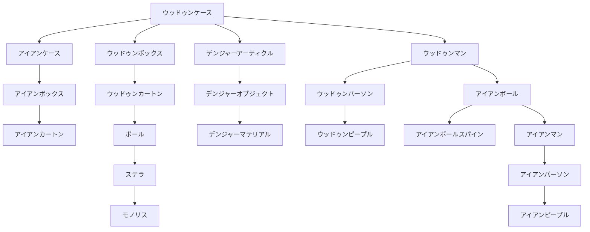

目次

* [錬金天導師の特徴](#錬金天導師の特徴)
* [スキルツリー](#スキルツリー)
    * [ＣＭＤスキル](#ＣＭＤスキル)
    * [錬金精製物ステータス(障害物)](#錬金精製物ステータス障害物)
    * [錬金精製物ステータス(擬似生物)](#錬金精製物ステータス擬似生物)
        * [スキル](#スキル)
    * [スキル入手方法](#スキル入手方法)

## 錬金天導師の特徴
----------

> _『形無き者に形を！命亡き者に命を！』  
> 禁呪がここに破られる！　 戦場のコーディネーター！_

「黒印」が進化したその先にあるのは、より卓越した技術である「錬金召喚」だ。  
想像を創造し、戦場を己の思い通りに変化させる。 それを唯一可能とするのは『錬金天導師』だけである。  
『黒印魔導師』の中でも一握りの者がその道を究めることができる。

「錬金召喚」 の能力を存分に発揮し、戦場を味方に有利に展開しよう！  
だがその力は時に味方に及ぶこともある、慎重に先を見極める必要がある。  
見極める目をもったとき、そこに最強のバトルコーディネーターが誕生する！

下位ジョブ：[黒印魔導師](./black_seal_magician.md)  
サイドジョブ：[精霊魔導師](./spirit_mage.md)　盗賊


## スキルツリー
--------

<table><tbody><tr><td></td><td>ウッドゥンケース</td><td></td><td></td><td></td><td></td></tr><tr><td>┏</td><td>╋</td><td>┳</td><td>┓</td><td></td><td></td></tr><tr><td>アイアンケース</td><td>ウッドゥンボックス</td><td>デンジャーアーティクル</td><td>ウッドゥンマン</td><td></td><td></td></tr><tr><td>┃</td><td>┃</td><td>┃</td><td>┣</td><td>┓</td><td></td></tr><tr><td>アイアンボックス</td><td>ウッドゥンカートン</td><td>デンジャーオブジェクト</td><td>ウッドゥンパーソン</td><td>アイアンボール</td><td></td></tr><tr><td>┃</td><td>┃</td><td>┃</td><td></td><td>┣</td><td>┓</td></tr><tr><td>アイアンカートン</td><td>ポール</td><td>デンジャーマテリアル</td><td>ウッドゥンピープル</td><td>アイアンボールスパイン</td><td>アイアンマン</td></tr><tr><td></td><td>┃</td><td></td><td></td><td></td><td>┃</td></tr><tr><td></td><td>ステラ</td><td></td><td></td><td></td><td>アイアンパーソン</td></tr><tr><td></td><td>┃</td><td></td><td></td><td></td><td>┃</td></tr><tr><td></td><td>モノリス</td><td></td><td></td><td></td><td>アイアンピープル</td></tr></tbody></table>



### ＣＭＤスキル

#### ウッドゥンケース

* AP: 4 (毎ターン-1) | スピード: C
* 妨害値: - | 耐久値: -
* 射程範囲: 上１・下１
```text
口■口
■■■
■↑■

```


* 効果範囲: 選択した1マス
* 入手法: ドラゴニアクエ１、地/空☆

> フィールドにとても壊れやすい木箱を錬金する

#### ウッドゥンボックス

* AP: 6 (毎ターン-1) | スピード: B
* 妨害値: - | 耐久値: -
* 射程範囲: 上１・下１
```text
口口■口口
口■■■口
■■■■■
口■↑■口

```


* 効果範囲: 選択した1マス
* 入手法: 地/空☆(準レア)、[ハバネロ]

> フィールドに壊れやすい木箱を錬金する。

#### ウッドゥンカートン

* AP: 8 (毎ターン-1) | スピード: A
* 妨害値: - | 耐久値: -
* 射程範囲: 上１・下１
```text
口口■口口
口■■■口
■■■■■
口■↑■口

```


* 効果範囲: 選択した1マス
* 入手法: 地/空☆☆、[花]

> フィールドに木箱を錬金する。

#### ポール

* AP: 12 (毎ターン-2) | スピード: D
* 妨害値: - | 耐久値: -
* 射程範囲: 上１・下１
```text
口■口
■■■
■↑■

```


* 効果範囲: 選択した1マス
* 入手法: 地/空☆☆☆(レア)

> フィールドに柱を錬金する。

#### ステラ

* AP: 12 (毎ターン-2) | スピード: D
* 妨害値: - | 耐久値: -
* 射程範囲: 上１・下１
```text
口口■口口
口■■■口
■■■■■
口■↑■口

```


* 効果範囲: 選択した1マス
* 入手法: 地/空☆☆☆☆

> フィールドに壊れにくい柱を錬金する。

#### モノリス

* AP: 12 (毎ターン-2) | スピード: D
* 妨害値: - | 耐久値: -
* 射程範囲: 上１・下１
```text
口口■口口
口■■■口
■■■■■
口■↑■口

```


* 効果範囲: 選択した1マス
* 入手法: 地/空★

> フィールドにとても壊れにくい柱を錬金する。

#### アイアンケース

* AP: 8 (毎ターン-1) | スピード: D
* 妨害値: - | 耐久値: -
* 射程範囲: 上１・下１
```text
口■口
■■■
■↑■

```


* 効果範囲: 選択した1マス
* 入手法: 地/空☆、[ハバネロ]

> フィールドに鉄箱を錬金する。

#### アイアンボックス

* AP: 10 (毎ターン-1) | スピード: D
* 妨害値: - | 耐久値: -
* 射程範囲: 上１・下１
```text
口口■口口
口■■■口
■■■■■
口■↑■口

```


* 効果範囲: 選択した1マス
* 入手法: 地/空☆☆

> フィールドに壊れにくい鉄箱を錬金する。

#### アイアンカートン

* AP: 12 (毎ターン-1) | スピード: D
* 妨害値: - | 耐久値: -
* 射程範囲: 上１・下１
```text
口口■口口
口■■■口
■■■■■
口■↑■口

```


* 効果範囲: 選択した1マス
* 入手法: 地/空☆☆☆(準レア)、[花]

> フィールドにとても壊れにくい鉄箱を錬金する。

#### デンジャーアーティクル

* AP: 12 | スピード: D
* 妨害値: - | 耐久値: -
* 射程範囲: 上１・下１
```text
口■口
■■■
■↑■
(攻撃)
口■口
■■■
口■口

```


* 効果範囲: 選択した1マス
* 入手法: 地/空☆(レア)、[ハバネロ]

> フィールドに消滅時に爆発する物質を錬金する。
> 詳細不明だが炎上確認

#### デンジャーオブジェクト

* AP: 14 (毎ターン0) | スピード: D
* 妨害値: - | 耐久値: -
* 射程範囲: 上１・下１
```text
口口■口口
口■■■口
■■■■■
口■↑■口
(攻撃)
口口■口口
口■■■口
■■■■■
口■■■口
口口■口口

```


* 効果範囲: 選択した1マス
* 入手法: 地/空☆☆(準レア)、[ハバネロ] / [花]

> フィールドに消滅時に大爆発する物質を錬金する。
> 詳細不明だが炎上確認

#### デンジャーマテリアル

* AP: 16 (毎ターン0) | スピード: D
* 妨害値: - | 耐久値: -
* 射程範囲: 上１・下１
```text
口口口■口口口
口口■■■口口
口■■■■■口
口■↑■口
(攻撃)
口口口■口口口
口口■■■口口
口■■■■■口
■■■■■■■
口■■■■■口
口口■■■口口
口口口■口口口

```


* 効果範囲: 選択した1マス
* 入手法: 地/空★

> フィールドに消滅時に極大爆発する物質を錬金する。
> 詳細不明だが炎上確認

#### ウッドゥンマン

* AP: 10 (毎ターン-1) | スピード: D
* 妨害値: - | 耐久値: -
* 射程範囲: 上？・下？
```text
口口口
口■口
口↑口

```


* 効果範囲: 選択した1マス
* 入手法: 地/空☆☆(レア)、[花]

> フィールドに意思を持った木人形を、錬金召喚する。

#### ウッドゥンパーソン

* AP: 10 (毎ターン-1) | スピード: D
* 妨害値: - | 耐久値: -
* 射程範囲: 上？・下？
```text
口口口
口■口
口↑口

```


* 効果範囲: 選択した1マス
* 入手法: 地/空☆☆☆

> フィールドに意思を持った強い木人形を、錬金召喚する

#### ウッドゥンピープル

* AP: 10 (毎ターン-1) | スピード: D
* 妨害値: - | 耐久値: -
* 射程範囲: 上？・下？
```text
口口口
口■口
口↑口

```


* 効果範囲: 選択した1マス
* 入手法: 地/空☆☆☆☆

> フィールドに意思を持ったとても強い木人形を、錬金召喚する

#### アイアンボール

* AP: 14 | スピード: D
* 妨害値: - | 耐久値: -
* 射程範囲: 上１
```text
■■■■■
口■■■口
口口■口口
口口↑口口

```


* 効果範囲: 選択した1マス
* 入手法: 地/空☆☆☆☆

> 鉄の弾を錬金して、対象に向かって飛ばし攻撃する(直射)

#### アイアンボールスパイン

* AP: 22 | スピード: D
* 妨害値: - | 耐久値: -
* 射程範囲: 上１
```text
■■■■■
口■■■口
口口■口口
口口↑口口

```


* 効果範囲: 選択した1マス
* 入手法: 地/空★

> トゲ付きの鉄の弾を錬金して、対象に向かって飛ばし攻撃する(直射)

#### アイアンマン

* AP: 14 | スピード: D
* 妨害値: - | 耐久値: -
* 射程範囲: 上１・下１
* 効果範囲: -
* 入手法: 地/空☆☆☆

> フィールドに意思を持った鉄人形を、錬金召喚する

#### アイアンパーソン

* AP: 14 | スピード: D
* 妨害値: - | 耐久値: -
* 射程範囲: 上１・下１
* 効果範囲: -
* 入手法: 地/空☆☆☆☆

> フィールドに意思を持った強い鉄人形を、錬金召喚する

#### アイアンピープル

* AP: 14 | スピード: D
* 妨害値: - | 耐久値: -
* 射程範囲: 上１・下１
* 効果範囲: -
* 入手法: 地/空★

> フィールドに意思を持ったとても強い鉄人形を、錬金召喚する

### 錬金精製物ステータス(障害物)

| スキル名 | HP | ターン数 | 高さ | 備考 |
| --- | --- | --- | --- | --- |
| ウッドゥンケース | 2 | 2 | 1 |  |
| ウッドゥンボックス | 4 | 3 | 1 |  |
| ウッドゥンカートン | 6 | 4 | 1 |  |
| アイアンケース | 7 | 4 | 1 | 木箱よりダメージを2軽減 |
| アイアンボックス | 11 | 5 | 1 | 木箱よりダメージを2軽減 |
| アイアンカートン | 15 | 6 | 1 | 吹き飛ばしを無効化する・木箱よりダメージを2軽減 |
| ポール | 9 | 3 | 4 | 吹き飛ばしを無効化する・木箱よりダメージを1軽減 |
| ステラ | 15 | 4 | 4 | 吹き飛ばしを無効化する・木箱よりダメージを1軽減 |
| モノリス | 21 | 5 | 4 | 吹き飛ばしを無効化する・木箱よりダメージを1軽減 |
| デンジャーアーティクル | 1 | 6 | 2 | 攻撃で破壊したとき、爆発する。 |
| デンジャーオブジェクト | 1 | 7 | 2 | 攻撃で破壊したとき、爆発する。 |
| デンジャーマテリアル | 1 | 9 | 2 | 攻撃で破壊したとき、爆発する。 |

↑

### 錬金精製物ステータス(擬似生物)

| スキル名 | HP | 備考 |
| --- | --- | --- |
| ウッドゥンマン | 7 | ４ターンで消滅 |
| ウッドゥンパーソン | 11 | ５ターンで消滅 |
| ウッドゥンピープル | 15 | ６ターンで消滅・移動力６？ |
| アイアンマン | 8 | ?ターンで消滅・木箱よりダメージを2軽減 |
| アイアンパーソン | 12 | ?ターンで消滅・木箱よりダメージを2軽減 |
| アイアンピープル | 16 | 7ターンで消滅・吹き飛ばしを無効化する・木箱よりダメージを2軽減 |


#### スキル


##### 木撃

* AP: 10 | スピード: D
* 使用獣: ウッドゥンマン、ウッドゥンパーソン、ウッドゥンピープル
* 範囲: 上?・下?
```text
口■口
■■■
■↑■

```


> 拳を突き出して、対象を攻撃する

##### 木転蹴

* AP: 20 | スピード: D
* 使用獣: ウッドゥンパーソン、ウッドゥンピープル
* 範囲: 上?・下? (自己指定)
```text
■■■
口↑口

```


> 身体を回転させ蹴りを放ち、範囲内の敵にダメージを与える
> 味方も巻き込む

##### 木砲撃

* AP: 30 | スピード: D
* 使用獣: ウッドゥンピープル
* 範囲: 上?・下?
```text
口■口
口↑口

```


> 拳に気合を込めて吹き飛ばし攻撃を行う。(1グリッド飛)

##### 鉄撃

* AP: - | スピード: -
* 使用獣: アイアンマン、アイアンパーソン、アイアンピープル
* 範囲: 上?・下?
```text
口■口
■■■
■↑■

```


##### 鉄転蹴

* AP: - | スピード: -
* 使用獣: アイアンパーソン、アイアンピープル
* 範囲: 上?・下?
```text
■■■
口↑口

```


##### 鉄砲撃

* AP: - | スピード: -
* 使用獣: アイアンピープル
* 範囲: 上?・下?
```text
口■口
口↑口

```

### スキル入手方法

| クエスト | よく出る | 普通 | 準レア | レア |
| --- | --- | --- | --- | --- |
| 地/空☆ | ウッドゥンケース | アイアンケース | ウッドゥンボックス | デンジャーアーティクル |
| 地/空☆☆ | アイアンボックス | ウッドゥンカートン | デンジャーオブジェクト | ウッドゥンマン |
| 地/空☆☆☆ | アイアンマン | ウッドゥンパーソン | アイアンカートン | ポール |
| 地/空☆☆☆☆ | ステラ | アイアンボール | ウッドゥンピープル | アイアンパーソン |
| 地/空★ | アイアンボールスパイン | モノリス | デンジャーマテリアル | アイアンピープル |
| ミニクエ(確率不明) |
| ハバネロ | アイアンケース | ウッドゥンボックス | デンジャーアーティクル | デンジャーオブジェクト |
| 花クエ | ウッドゥンカートン | デンジャーオブジェクト | ウッドゥンマン | アイアンカートン |
| クラゲ | ウッドゥンパーソン | アイアンカートン | ポール | ウッドゥンピープル |
| 迷子 | アイアンボール | ウッドゥンピープル | アイアンパーソン | デンジャーマテリアル |

