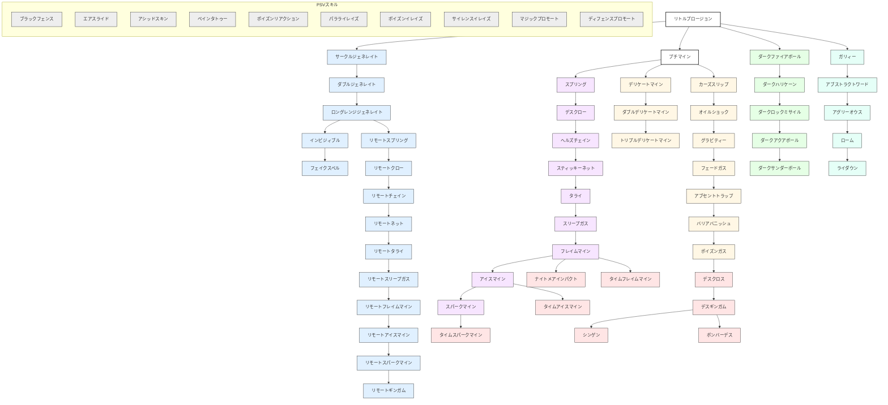

目次

* [黒印魔導師の特徴](#黒印魔導師の特徴)
* [■ スキルツリー ■](#スキルツリー)
* [スキルの説明](#スキルの説明)
    * [基本スキル群](#基本スキル群)
    * [自動黒印](#自動黒印)
    * [デリケートマイン](#デリケートマイン)
    * [特殊自動黒印](#特殊自動黒印)
    * [時限黒印系列](#時限黒印系列)
    * [ジェネレイト](#ジェネレイト)
    * [呪動黒印](#呪動黒印)
    * [サイドスキル(精霊魔導師)](#サイドスキル精霊魔導師)
    * [サイドスキル(盗賊)](#サイドスキル盗賊)
    * [ＰＳＶスキル群](#ＰＳＶスキル群)
* [入手クエスト](#入手クエスト)

## 黒印魔導師の特徴
----------

> 罠を仕掛けて敵を陥れる、  
> 戦場のタクティシャン！

黒印魔導師の「黒印」とは、  
闇の力を利用して戦場に描く魔法陣のことで、  
味方にだけ見える魔法のトラップのようなものです。  
知らずに黒印の上に乗った相手は、  
ダメージや能力弱体化のペナルティを受けることでしょう。

ただしその場から消滅するまで  
描いた者の力を吸収し続けるので、  
他のジョブより戦場での駆け引きが多く要求されます。

黒印にはいくつかの種類が知られている。

- 時限黒印

一定時間（ターン）が経過することにより、自動的に発動する黒印。  
したがって、発動時に誰も乗っていないと空振りになる

- 自動黒印

描いた黒印に、キャラクターが乗ることが刺激になって、自動的に発動する黒印。  
敵、味方を問わず、発動する。移動時に上を通り過ぎただけでは発動しない。

- 呪動黒印

だれかが乗っただけでは発動せず、発動のための呪文を必要とする黒印。  
確実なタイミングで発動させられるが、発動のために1ターン使うことになる。

■サイドジョブ:[精霊魔導師](./spirit_mage.md) 盗賊  
■上位ジョブ:錬金天導師


## ■ スキルツリー ■
------------

*   あるスキルを覚えるには、そのスキルの矢印の上流にあるスキルを覚えていないといけません。  
（例：リモートスプリングを覚えるには、サークルジェネレイトとスプリングの両方を覚えている必要があります。）
*   ダークファイアボールの列とガリィーの列は、それぞれ精霊魔導師と盗賊のサイドジョブのレベルが必要です（詳細は各スキルの説明で）。  
また、メインジョブが盗賊、精霊魔導師のキャラクターが、サイドジョブの黒印魔導師のときには、スキルツリーには、これらの2列はありません。
*   矢印のつながっていないスキル（一番左の列、フェイクスペルなど）を覚えるには、他のスキルを覚えているかどうかは関係がありません。  
ただし、スキルによっては覚えるために、レベル制限がある場合があります。

<table><tbody><tr><td colspan="4"><br class="spacer">　</td><td>　<br class="spacer"><a href="#basic_skills">リトル<br class="spacer">プロージョン</a><br class="spacer">│</td><td colspan="3"><br class="spacer">　</td></tr><tr><td><span style="color:#EEEEEE">─────</span><br class="spacer"><a href="#psv_skills">ブラック<br class="spacer">フェンス</a></td><td colspan="2"><span style="color:#e0f0ff">─────</span>┌─────<br class="spacer"><a href="#circle_generate_branch">サークル<br class="spacer">ジェネレイト</a><br class="spacer">┌──┴──┐</td><td colspan="3">───────┼───────<br class="spacer"><a href="#basic_skills">プチマイン</a><br class="spacer">│<br class="spacer">│</td><td>──┬──<br class="spacer"><a href="#dark_fireball_branch">ダーク<br class="spacer">ファイア<br class="spacer">ボール</a></td><td>──┐<span style="color:#e5fff7">──</span><br class="spacer"><a href="#gally_branch">ガリィー</a><br class="spacer">│<br class="spacer">│</td></tr><tr><td>エア<br class="spacer">スライド</td><td><span style="color:#e0f0ff">──</span>│<span style="color:#e0f0ff">──</span><br class="spacer">ダブル<br class="spacer">ジェネレイト</td><td>│<br class="spacer">│<br class="spacer">│</td><td><span style="color:#f7e5ff">──</span>┌──<br class="spacer"><a href="#spring_branch">スプリング</a><br class="spacer">│</td><td>──┼──<br class="spacer"><a href="#delicate_mine_branch">デリケート<br class="spacer">マイン</a></td><td>──┐<span style="color:#f7ffe5">──</span><br class="spacer"><a href="#curse_slip_branch">カーズ<br class="spacer">スリップ</a></td><td>│<br class="spacer">ダーク<br class="spacer">ハリケーン</td><td>アブスト<br class="spacer">ラクト<br class="spacer">ワード</td></tr><tr><td>アシッド<br class="spacer">スキン</td><td>│<br class="spacer">ロングレンジ<br class="spacer">ジェネレイト</td><td><span style="color:#e5e5ff">──</span>│┌─<br class="spacer"><span style="color:#e5e5ff">─</span><a href="#remote_spring_branch">リモート<br class="spacer">スプリング</a></td><td>──┤<span style="color:#f7e5ff">──</span><br class="spacer">デスクロー<br class="spacer">│</td><td>│<br class="spacer">ダブル<br class="spacer">デリケートマイン</td><td>│<br class="spacer">オイル<br class="spacer">ショック</td><td>│<br class="spacer">ダークロック<br class="spacer">ミサイル</td><td>│<br class="spacer">アグリー<br class="spacer">オウス</td></tr><tr><td>ペイン<br class="spacer">タトゥー</td><td>│<br class="spacer">イン<br class="spacer">ビジィブル</td><td><span style="color:#e5e5ff">──</span>│┌─<br class="spacer"><span style="color:#e5e5ff">─</span>リモート<br class="spacer">クロー</td><td>──┤<span style="color:#f7e5ff">──</span><br class="spacer">ヘルズ<br class="spacer">チェイン</td><td>│<br class="spacer">トリプル<br class="spacer">デリケートマイン</td><td>│<br class="spacer">グラビティー<br class="spacer">│</td><td>｜<br class="spacer">ダーク<br class="spacer">アクアボール</td><td>│<br class="spacer">ローム<br class="spacer">│</td></tr><tr><td>ポイズン<br class="spacer">リアクション</td><td><a href="#basic_skills">フェイク<br class="spacer">スペル</a></td><td><span style="color:#e5e5ff">──</span>│┌─<br class="spacer"><span style="color:#e5e5ff">─</span>リモート<br class="spacer">チェイン</td><td>──┤<span style="color:#f7e5ff">──</span><br class="spacer">スティッキー<br class="spacer">ネット</td><td><br class="spacer">　</td><td>│<br class="spacer">フェード<br class="spacer">ガス</td><td>│<br class="spacer">ダーク<br class="spacer">サンダーボール<br class="spacer">　</td><td>│<br class="spacer">ライダウン<br class="spacer">　</td></tr><tr><td>パララ<br class="spacer">イレイズ</td><td><br class="spacer">　</td><td><span style="color:#e5e5ff">──</span>│┌─<br class="spacer"><span style="color:#e5e5ff">─</span>リモート<br class="spacer">ネット</td><td>──┼──<br class="spacer">タライ<br class="spacer">│</td><td>──┐<span style="color:#f7e5ff">──</span><br class="spacer">スティッキー<br class="spacer">ゾーン</td><td>│<br class="spacer">アブセント<br class="spacer">トラップ</td><td><br class="spacer">　</td><td><br class="spacer">　</td></tr><tr><td>ポイズン<br class="spacer">イレイズ</td><td><br class="spacer">　</td><td><span style="color:#e5e5ff">──</span>│┌─<br class="spacer"><span style="color:#e5e5ff">─</span>リモート<br class="spacer">タライ</td><td>──┤<span style="color:#f7e5ff">──</span><br class="spacer">スリープガス<br class="spacer">│</td><td><br class="spacer">　</td><td>│<br class="spacer">バリア<br class="spacer">バニッシュ</td><td><br class="spacer">　</td><td><br class="spacer">　</td></tr><tr><td>サイレンス<br class="spacer">イレイズ</td><td><br class="spacer">　</td><td><span style="color:#e5e5ff">──</span>│┌─<br class="spacer"><span style="color:#e5e5ff">─</span>リモート<br class="spacer">スリープガス</td><td>──┼──<br class="spacer">フレイム<br class="spacer">マイン</td><td>──┐<span style="color:#f7e5ff">──</span><br class="spacer">ナイトメア<br class="spacer">インパクト</td><td>│<br class="spacer">ポイズン<br class="spacer">ガス</td><td><br class="spacer">　</td><td><br class="spacer">　</td></tr><tr><td>マジック<br class="spacer">プロモート</td><td><br class="spacer">　</td><td><span style="color:#e5e5ff">──</span>│┌─<br class="spacer"><span style="color:#e5e5ff">─</span>リモート<br class="spacer">フレイム<br class="spacer">マイン</td><td>──┼──<br class="spacer">アイスマイン<br class="spacer">│<br class="spacer">│</td><td>──┐<span style="color:#ffe5e5">──</span><br class="spacer"><a href="#time_branch">タイム<br class="spacer">フレイムマイン</a><br class="spacer"><span style="color:#ffe5e5">──</span>└──</td><td>　<br class="spacer">　<br class="spacer">　<br class="spacer">　<br class="spacer">──┐<span style="color:#ffe5e5">──</span></td><td><br class="spacer">　</td><td><br class="spacer">　</td></tr><tr><td>ディフェンス<br class="spacer">プロモート</td><td><span style="color:#e5e5ff">──</span>┌──<br class="spacer">リモート<br class="spacer">ギンガム</td><td>──┤┌─<br class="spacer"><span style="color:#e5e5ff">─</span>リモート<br class="spacer">アイスマイン</td><td>──┼──<br class="spacer">スパーク<br class="spacer">マイン</td><td>──┐<span style="color:#ffe5e5">──</span><br class="spacer">タイム<br class="spacer">アイスマイン</td><td>│<br class="spacer">デスクロス<br class="spacer">│</td><td><br class="spacer">　</td><td><br class="spacer">　</td></tr><tr><td><br class="spacer"></td><td><br class="spacer">　</td><td><span style="color:#e5e5ff">──</span>│┌─<br class="spacer"><span style="color:#e5e5ff">─</span>リモート<br class="spacer">スパークマイン<br class="spacer">　</td><td>──┴──<br class="spacer">　<br class="spacer">　<br class="spacer">　<br class="spacer">　</td><td>──┐<span style="color:#ffe5e5">──</span><br class="spacer">タイム<br class="spacer">スパークマイン<br class="spacer">　</td><td><span style="color:#ffe5e5">──</span>├──<br class="spacer">デスギンガム<br class="spacer">　</td><td>──┬──<br class="spacer">シンゲン<br class="spacer">　</td><td>──┐<span style="color:#ffe5e5">──</span><br class="spacer">ボンバーデス<br class="spacer">　</td></tr></tbody></table>





## スキルの説明
--------


### 基本スキル群

#### リトルプロージョン

* タイプ: CMD | AP: 2 | スピード: D
* 妨害値: - | 耐久値: 3
* 設置範囲:
```text
口口■口口
口■口■口
■口↑口■

```


* 効果範囲:
```text
口■口
■●■
口■口

```


* 入手法: 初期

> 極めて小さな爆発を起こす時限黒印を、フィールドに描く。
> 描かれた黒印は1ターン後に自動的に爆発して、範囲内にいるユニットにダメージを与える。
> 一度効果を発揮すると黒印は消滅する。
> 対象：指定した■1マスを中心とした縦横1マスの十字範囲

#### プチマイン

* タイプ: CMD | AP: 6 | スピード: D
* 妨害値: - | 耐久値: -
* 設置範囲:
```text
口口■口口
口■■■口
■■■■■
口■↑■口

```


* 効果範囲: 印上1マスのみ
* 入手法: 初期、店売り、☆

> 小さな爆発を起こす自動黒印を、フィールドに描く。
> 黒印の上にユニットが乗ると、爆発してダメージを与える。
> １体に与えるダメージの大きさは、リトルプロージョンの1.5倍程度
> 対象のユニットが油まみれだった場合には、そのユニットは炎上することがある。
> 対象：■1マス

#### フェイクスペル

* タイプ: CMD | AP: 0 | スピード: D
* 妨害値: - | 耐久値: -
* 設置範囲: -
* 効果範囲: -
* 入手法: ★ / たこ焼き / 球根 / ハチミツ / 目撃者 / コボルト

> 黒印を描く動作を行うが、実際には描かない


### 自動黒印

*   魔法によって生じる状態異常の詳細については、戦闘を参照


#### スプリング

* タイプ: CMD | AP: 6 | スピード: D
* 妨害値: - | 耐久値: -
* 設置範囲:
```text
口口■口口
口■■■口
■■■■■
口■↑■口

```


* 効果範囲: 印上1マスのみ
* 入手法: [☆☆☆] / DROP:ストームシーカー

> 巨大なバネで対象を３マス吹き飛ばす自動黒印を描く。戦闘開始時の手前へ吹き飛ぶ。
> 対象：■1マス

#### デスクロー

* タイプ: CMD | AP: 6 | スピード: D
* 妨害値: - | 耐久値: -
* 設置範囲:
```text
口口■口口
口■■■口
■■■■■
口■↑■口

```


* 効果範囲: 印上1マスのみ
* 入手法: [☆☆☆☆]

> 巨大鋏を出現させて、対象の移動力を減らす自動黒印を描く。
> 対象：■1マス

#### ヘルズチェイン

* タイプ: CMD | AP: 6 | スピード: D
* 妨害値: - | 耐久値: -
* 設置範囲:
```text
口口■口口
口■■■口
■■■■■
口■↑■口

```


* 効果範囲: 印上1マスのみ
* 入手法: [★]

> 鎖を出現させて対象を麻痺させる自動黒印を描く。
> 魔法が効いたユニットはダメージ+麻痺し、その効果は2ターンの間持続する。
> 麻痺中は一切の行動が取れない。
> 対象：■1マス

#### スティッキーネット

* タイプ: CMD | AP: 6 | スピード: D
* 妨害値: - | 耐久値: -
* 設置範囲:
```text
口口■口口
口■■■口
■■■■■
口■↑■口

```


* 効果範囲: 印上1マスのみ
* 入手法: [★☆]

> 蜘蛛の巣を出して、対象を移動不可にする自動黒印を描く。
> 魔法が効いたユニットは移動、方向転換ができなくなり、その効果は5ターンの間持続する。
> 対象：■1マス

#### タライ

* タイプ: CMD | AP: 6 | スピード: D
* 妨害値: - | 耐久値: -
* 設置範囲:
```text
口口■口口
口■■■口
■■■■■
口■↑■口

```


* 効果範囲: 印上1マスのみ
* 入手法: [☆☆☆☆] / 地竜 / 人形 / パンダ / 種 / 目撃者 / DROP:死神デスレイヌ

> タライを出現させ、対象の頭に落として激怒させる自動黒印を描く。
> 魔法が効いたユニットにダメージ+激怒状態になり、その効果は4ターンの間持続する。
> 激怒したユニットは、デッキ中でもっとも消費APの大きなコマンドしか選べない。
> 対象：■1マス

#### スティッキーゾーン

* タイプ: CMD | AP: 26 | スピード: D
* 妨害値: - | 耐久値: -
* 設置範囲: 自分
```text
口口口■口口口
口口■■■口口
口■■■■■口
■■■↑■■■
口■■■■■口
口口■■■口口
口口口■口口口

```


* 効果範囲: -
* 入手法: [★☆☆]

> 巨大な蜘蛛の巣を出現させて、効果範囲内のユニットを移動不可にする。
> 移動不可は、4ターンの間持続する。
> 対象：自分を除く範囲内のユニット全て

#### スリープガス

* タイプ: CMD | AP: 6 | スピード: D
* 妨害値: - | 耐久値: -
* 設置範囲:
```text
口口■口口
口■■■口
■■■■■
口■↑■口

```


* 効果範囲: 印上1マスのみ
* 入手法: [★☆] / [★★☆☆] / 種 / パンダ / メイド(弱) / 指輪 / 果実 / 海賊

> 対象を眠りへと誘うガスを発生させる自動黒印を描く。
> 魔法が効いたユニットは、眠りに落ち、その効果は3ターンの間持続する。
> 対象：■1マス

#### フレイムマイン

* タイプ: CMD | AP: 18 | スピード: D
* 妨害値: - | 耐久値: -
* 設置範囲:
```text
口口■口口
口■■■口
■■■■■
口■↑■口

```


* 効果範囲: 印上1マスのみ
* 入手法: [★] / メイド(弱) / たこ焼き / 土鍋 / ゴブリン / 指輪

> 爆発を起こして対象にダメージを与える自動黒印を描く。
> 対象のユニットが油まみれだった場合には、そのユニットは炎上することがある。
> 対象：■1マス

#### ナイトメアインパクト

* タイプ: CMD | AP: 15 | スピード: D
* 妨害値: - | 耐久値: -
* 設置範囲:
```text
口口■口口
口■■■口
■■■■■
口■↑■口

```


* 効果範囲: -
* 入手法: [★☆☆☆☆]

> 寝ている対象に悪夢を見せてダメージを与える。
> 対象が睡眠状態でないと発動しない。
> 対象：■1マス

#### アイスマイン

* タイプ: CMD | AP: 18 | スピード: D
* 妨害値: - | 耐久値: -
* 設置範囲:
```text
口口■口口
口■■■口
■■■■■
口■↑■口

```


* 効果範囲: 印上1マスのみ
* 入手法: [★★]

> 氷爆を起こして対象にダメージを与える自動黒印を描く。
> 対象のユニットがびしょぬれだった場合には、そのユニットは凍結することがある。
> 対象：■1マス

#### スパークマイン

* タイプ: CMD | AP: 18 | スピード: D
* 妨害値: - | 耐久値: -
* 設置範囲:
```text
口口■口口
口■■■口
■■■■■
口■↑■口

```


* 効果範囲: 印上1マスのみ
* 入手法: [★★☆]

> 放電を起して対象にダメージを与える自動黒印を描く。
> 対象が麻痺することがある。
> 対象：■1マス

### デリケートマイン

#### デリケートマイン

* タイプ: CMD | AP: 9 | スピード: D
* 妨害値: - | 耐久値: -
* 設置範囲:
```text
口口■口口
口■■■口
口■口■口
口口↑口口

```


* 効果範囲:
```text
口■口
■●■
口■口

```


* 入手法: [★☆☆☆] / メイド(強) / スライム / 指輪 / カエル / 山賊

> 効果範囲内にユニットがいる場合にも発動する自動黒印を描く。
> 十字範囲誘爆

#### ダブルデリケートマイン

* タイプ: CMD | AP: 22 | スピード: D
* 妨害値: - | 耐久値: -
* 設置範囲:
```text
口口■口口
口■■■口
■■口■■
■口↑口■

```


* 効果範囲:
```text
口■口
■●■
口■口

```


* 入手法: [★☆☆☆☆] / ゴーレム / カエル / 滝水

> 爆発を起して対象にダメージを与える自動黒印を２つ描く。
> 対象のユニットが油まみれだった場合には、そのユニットは炎上することがある。
> 十字範囲誘爆

#### トリプルデリケートマイン

* タイプ: CMD | AP: 36 | スピード: D
* 妨害値: - | 耐久値: -
* 設置範囲:
```text
口口■口口
口■■■口
■■■■■
■■口■■
■口↑口■

```


* 効果範囲:
```text
口■口
■●■
口■口

```


* 入手法: [★★] / 絵画 / 踊り子 / ハーブ / DROP:トンガトング(リングランド)

> 爆発を起して対象にダメージを与える自動黒印を３つ描く。
> 対象のユニットが油まみれだった場合には、そのユニットは炎上することがある。
> 十字範囲誘爆

### 特殊自動黒印

*   魔法によって生じる状態異常の詳細については、戦闘を参照


#### カーズスリップ

* タイプ: CMD | AP: 2 | スピード: D
* 妨害値: - | 耐久値: -
* 設置範囲:
```text
口口■口口
口■■■口
■■■■■
■■口■■
■口↑口■

```


* 効果範囲: 印上1マスのみ
* 入手法: [☆] / [★]

> 対象を転倒させる自動黒印をフィールドに描く。
> 転倒したユニットは行動不能になるが、一方、そのターンは、地面指定系スキル以外の攻撃を受けなくなる。
> 転倒したユニットがダメージを受けた場合、そのダメージ量は通常より大きくなる。
> 対象：■1マス

#### オイルショック

* タイプ: CMD | AP: 12 | スピード: D
* 妨害値: - | 耐久値: -
* 設置範囲:
```text
口口■口口
口■■■口
■■■■■
■■口■■
■口↑口■

```


* 効果範囲:
```text
口口■口口
口■■■口
■■●■■
口■■■口
口口■口口

```


* 入手法: [☆☆] / [★☆] / リョマ

> 地中から油を発生させて、対象にダメージを与え油まみれにする自動黒印を描く。
> 対象の油まみれ状態は、3ターンの間持続する。
> また、油まみれのユニットが、炎系攻撃を受けると、炎上することがある（炎上効果は着火スキルにより変動）。
> 指定した■1マスを中心とした半径2マス。
> 発動も■1マスを中心とした半径2マス

#### グラビティー

* タイプ: CMD | AP: 12 | スピード: D
* 妨害値: - | 耐久値: -
* 設置範囲:
```text
口口■口口
口■■■口
■■■■■
■■口■■
■口↑口■

```


* 効果範囲:
```text
口■口
■●■
口■口

```


* 入手法: [☆☆☆] / 蟹 / 地竜 / 人形 / たこ焼き / 仮面 / パンダ / 墓場

> 超重力を発生させて、対象の移動力を減少させる自動黒印を描く。
> 魔法が効いたユニットは、移動力が3.0減少し、その効果は、2ターンの間持続する。
> なお、このスキルではダメージを与えられない。
> 指定した■1マスを中心とした縦横1マスの十字範囲に効果。
> 発動は印の上のみ。

#### フェードガス

* タイプ: CMD | AP: 12 | スピード: D
* 妨害値: - | 耐久値: -
* 設置範囲:
```text
口口■口口
口■■■口
■■■■■
■■口■■
■口↑口■

```


* 効果範囲:
```text
口■口
■●■
口■口

```


* 入手法: [★☆☆☆] / ゴブリン / 果実 / 石碑

> 目に沁みるガスを発生させて、対象に微小ダメージを与え暗闇状態にする自動黒印を描く。
> 暗闇は2ターン持続。
> 指定した■1マスを中心とした縦横1マスの十字範囲
> 発動は印の上のみ。

#### アブセントトラップ

* タイプ: CMD | AP: 12 | スピード: D
* 妨害値: - | 耐久値: -
* 設置範囲:
```text
口口■口口
口■■■口
■■■■■
■■口■■
■口↑口■

```


* 効果範囲:
```text
口■口
■●■
口■口

```


* 入手法: [★☆☆☆☆] / 死神呪い / 山賊 / 踊り子

> 魅惑の雰囲気を発生させて、対象を放心状態にする自動黒印を描く。
> 放心４ターン。
> 指定した■1マスを中心とした縦横1マスの十字範囲
> 発動は印の上のみ。

#### バリアバニッシュ

* タイプ: CMD | AP: 20 | スピード: D
* 妨害値: - | 耐久値: -
* 設置範囲:
```text
口口■口口
口■■■口
■■■■■
口■↑■口

```


* 効果範囲:
```text
口口■口口
口■■■口
■■●■■
口■■■口
口口■口口

```


* 入手法: [★★] / カエル / 滝水 / 石碑

> バリアを張った対象のバリアを無効化する自動黒印を描く。
> 指定した■1マスを中心とした半径2マス

#### ポイズンガス

* タイプ: CMD | AP: 12 | スピード: D
* 妨害値: - | 耐久値: -
* 設置範囲:
```text
口口■口口
口■■■口
■■■■■
■■口■■
■口↑口■

```


* 効果範囲:
```text
口■口
■●■
口■口

```


* 入手法: [★★☆]

> 毒ガスを発生させて、対象を毒状態にする自動黒印を描く。
> 毒７ターン。
> 指定した■1マスを中心とした縦横1マスの十字範囲


### 時限黒印系列


#### タイムフレイムマイン

* タイプ: CMD | AP: 26 | スピード: D
* 妨害値: - | 耐久値: -
* 設置範囲:
```text
口口口■口口口
口口■■■口口
口■■口■■口
■■口口口■■
口口口↑口口口

```


* 効果範囲:
```text
口口■口口
口■■■口
■■●■■
口■■■口
口口■口口

```


* 入手法: [★★☆] / 石碑 / 海賊 / 踊り子

> 爆発を起こして範囲内全ユニットにダメージを与える時限黒印を描く。
> 描かれた黒印は３ターン後に発動。
> 対象のユニットが油まみれだった場合には
> そのユニットは炎上することがある。
> 対象：■１マスを中心とした半径二マス

#### タイムアイスマイン

* タイプ: CMD | AP: 26 | スピード: D
* 妨害値: - | 耐久値: -
* 設置範囲:
```text
口口口■口口口
口口■■■口口
口■■口■■口
■■口口口■■
口口口↑口口口

```


* 効果範囲:
```text
口口■口口
口■■■口
■■●■■
口■■■口
口口■口口

```


* 入手法: [★★☆☆]

> 氷爆を起こして範囲内全ユニットにダメージを与える時限黒印を描く。
> 対象のユニットがびしょぬれだった場合には
> そのユニットは凍結することがある。
> 対象：■１マスを中心とした半径二マス

#### タイムスパークマイン

* タイプ: CMD | AP: 26 | スピード: D
* 妨害値: - | 耐久値: -
* 設置範囲:
```text
口口口■口口口
口口■■■口口
口■■口■■口
■■口口口■■
口口口↑口口口

```


* 効果範囲:
```text
口口■口口
口■■■口
■■●■■
口■■■口
口口■口口

```


* 入手法: [★★☆☆☆☆]

> 放電を起こして範囲内全ユニットにダメージを与える時限黒印を描く。
> 対象が麻痺することがある。
> 対象：■１マスを中心とした半径二マス

#### デスクロス

* タイプ: CMD | AP: 35 | スピード: D
* 妨害値: - | 耐久値: -
* 設置範囲:
```text
口口■口口
口■■■口
口口■口口
口口↑口口

```


* 効果範囲:
```text
口口口口口口口口口口■口口口口口口口口口口
口口口口口口口口口口■口口口口口口口口口口
口口口口口口口口口口■口口口口口口口口口口
口口口口口口口口口口■口口口口口口口口口口
口口口口口口口口口口■口口口口口口口口口口
口口口口口口口口口口■口口口口口口口口口口
口口口口口口口口口口■口口口口口口口口口口
口口口口口口口口口口■口口口口口口口口口口
口口口口口口口口口口■口口口口口口口口口口
口口口口口口口口口口■口口口口口口口口口口
■■■■■■■■■■●■■■■■■■■■■
口口口口口口口口口口■口口口口口口口口口口
口口口口口口口口口口■口口口口口口口口口口
口口口口口口口口口口■口口口口口口口口口口
口口口口口口口口口口■口口口口口口口口口口
口口口口口口口口口口■口口口口口口口口口口
口口口口口口口口口口■口口口口口口口口口口
口口口口口口口口口口■口口口口口口口口口口
口口口口口口口口口口■口口口口口口口口口口
口口口口口口口口口口■口口口口口口口口口口
口口口口口口口口口口■口口口口口口口口口口

```


* 入手法: [★★☆☆]

> 十字型の範囲内にいる全ユニットにダメージを与える時限黒印を描く。
> 対象：印を中心に上下左右10マスに存在する全てのキャラクター

#### デスギンガム

* タイプ: CMD | AP: 42 | スピード: D
* 妨害値: - | 耐久値: -
* 設置範囲:
```text
口口口■口口口
口口■■■口口
口■■口■■口
■■口口口■■
口口口↑口口口

```


* 効果範囲:
```text
口■口■口■口■口■口■口■口■口■口
■口■口■口■口■口■口■口■口■口■
口■口■口■口■口■口■口■口■口■口
■口■口■口■口■口■口■口■口■口■
口■口■口■口■口■口■口■口■口■口
■口■口■口■口■口■口■口■口■口■
口■口■口■口■口■口■口■口■口■口
■口■口■口■口■口■口■口■口■口■
口■口■口■口■口●口■口■口■口■口
■口■口■口■口■口■口■口■口■口■
口■口■口■口■口■口■口■口■口■口
■口■口■口■口■口■口■口■口■口■
口■口■口■口■口■口■口■口■口■口
■口■口■口■口■口■口■口■口■口■
口■口■口■口■口■口■口■口■口■口
■口■口■口■口■口■口■口■口■口■
口■口■口■口■口■口■口■口■口■口

```


* 入手法: [★★☆☆☆]

> 網系の範囲内にいる全ユニットにダメージを与える時限黒印を描く。
> 妨害性能高
> 効果範囲：印を中心に9マス四方の網目状の地点

#### シンゲン

* タイプ: CMD | AP: 26 | スピード: D
* 妨害値: - | 耐久値: -
* 設置範囲:
```text
口口口■口口口
口口■■■口口
口■■口■■口
■■口口口■■
口口口↑口口口

```


* 効果範囲:
```text
口口口口口■口口口口口
口口口口■■■口口口口
口口口■■■■■口口口
口口■■■■■■■口口
口■■■■■■■■■口
■■■■■○■■■■■
口■■■■■■■■■口
口口■■■■■■■口口
口口口■■■■■口口口
口口口口■■■口口口口
口口口口口■口口口口口

```


* 入手法: [★★☆☆☆☆]

> ３ターン後に範囲内の対象を地震により転倒させる、時限黒印を描く。
> 対象：■1マスを中心とした半径五マス(印の中心は対象外)

#### ボンバーデス

* タイプ: CMD | AP: 70 | スピード: D
* 妨害値: - | 耐久値: -
* 設置範囲: -
* 効果範囲: 印上1マスのみ
* 入手法: [★★☆☆☆☆]

> 対象を戦闘不能にする時限黒印を描く　3T後に自動発動するが、その時に上に何も乗っていないと効果なく消滅するだけとなる。
> 対象：■1マス

### ジェネレイト


#### サークルジェネレイト

* タイプ: CMD | AP: 0 | スピード: D
* 妨害値: - | 耐久値: -
* 設置範囲:
```text
口口口■口口口
口口■■■口口
口■■口■■口
■■口↑口■■
口■■口■■口
口口■口■口口

```


* 効果範囲: -
* 入手法: 店売り、☆☆、旅立ちの決意

> 戦場に描かれた呪動黒印を１つ選択して発動させる。
> 対象：■1マスのみ

#### ダブルジェネレイト

* タイプ: CMD | AP: 0 | スピード: D
* 妨害値: - | 耐久値: 1
* 設置範囲:
```text
口口口口口■口口口口口
口口口口■■■口口口口
口口口■■口■■口口口
口口■■口口口■■口口
口■■口口↑口口■■口
口口■■口口口■■口口
口口口■口口口■口口口

```


* 効果範囲: -
* 入手法: [☆☆☆] / フェレット / 球根 / ハチミツ

> 戦場に描かれた呪動黒印を２つ選択して発動させる。
> 対象：■1マス2箇所

#### ロングレンジジェネレイト

* タイプ: CMD | AP: 0 | スピード: D
* 妨害値: - | 耐久値: -
* 設置範囲:
```text
口口口口口口■口口口口口口
口口口口口■■■口口口口口
口口口口■■■■■口口口口
口口口■■■口■■■口口口
口口■■■口口口■■■口口
口■■■口口口口口■■■口
■■■口口口↑口口口■■■
口■■■口口口口口■■■口
口口■■口口口口口■■口口
口口口■口口口口口■口口口

```


* 効果範囲: -
* 入手法: [☆☆☆☆] / ハチミツ / 墓場

> 戦場に描かれた呪動黒印を、離れた場所から選択して発動させる。
> 対象：■1マスのみ

#### インビジィブル

* タイプ: CMD | AP: 24 | スピード: D
* 妨害値: - | 耐久値: -
* 設置範囲:
```text
口口■口口
口■■■口
■■↑■■

```


* 効果範囲: -
* 入手法: [★★☆] / ハーブ

> 対象の周りに結界を出現させて、ユニットを３T透明状態にする。
> 対象：■1マスのみ


### 呪動黒印

*   魔法によって生じる状態異常の詳細については、戦闘を参照


#### リモートスプリング

* タイプ: CMD | AP: 12 | スピード: D
* 妨害値: - | 耐久値: -
* 設置範囲:
```text
口口■口口
口■■■口
■■■■■
■■口■■
■口↑口■

```


* 効果範囲:
```text
口■口
■●■
口■口

```


* 入手法: [☆]

> 巨大なバネで対象を吹き飛ばす、呪動黒印を描く。
> 対象となったユニットにダメージを与えるとともに、3マス飛ばす。
> 対象：指定した■1マスを中心とした縦横1マスの十字範囲

#### リモートクロー

* タイプ: CMD | AP: 12 | スピード: D
* 妨害値: - | 耐久値: -
* 設置範囲:
```text
口口■口口
口■■■口
■■■■■
■■口■■
■口↑口■

```


* 効果範囲:
```text
口■口
■●■
口■口

```


* 入手法: [☆☆]

> 範囲内に巨大鋏を発生させ、対象の移動力を減らす呪動黒印を描く。
> 指定した■1マスを中心とした縦横1マスの十字範囲

#### リモートチェイン

* タイプ: CMD | AP: 12 | スピード: D
* 妨害値: - | 耐久値: -
* 設置範囲:
```text
口口■口口
口■■■口
■■■■■
■■口■■
■口↑口■

```


* 効果範囲:
```text
口■口
■●■
口■口

```


* 入手法: [☆☆☆]

> 範囲内に鎖を出現させて麻痺させる呪動黒印を描く。
> 魔法が効いたユニットは、1ターンの間、一切の行動ができなくなる。
> 指定した■1マスを中心とした縦横1マスの十字範囲

#### リモートネット

* タイプ: CMD | AP: 12 | スピード: D
* 妨害値: - | 耐久値: -
* 設置範囲:
```text
口口■口口
口■■■口
■■■■■
■■口■■
■口↑口■

```


* 効果範囲:
```text
口■口
■●■
口■口

```


* 入手法: [☆☆☆☆] / 蟹

> 範囲内に蜘蛛の巣を発生させ、対象を移動不可にする呪動黒印を描く。
> 魔法が効いたユニットは、3ターンの間、移動・方向転換ができなくなる。
> 対象：指定した■1マスを中心とした縦横1マスの十字範囲

#### リモートタライ

* タイプ: CMD | AP: 12 | スピード: D
* 妨害値: - | 耐久値: -
* 設置範囲:
```text
口口■口口
口■■■口
■■■■■
■■口■■
■口↑口■

```


* 効果範囲:
```text
口■口
■●■
口■口

```


* 入手法: [★☆☆] / メイド(弱) / 指輪 / 絵画 / 滝水 / 山賊 / コボルト / 海賊

> 範囲内にタライを出現させ、対象に落とし激怒させる呪動黒印を描く。
> 魔法が効いたユニットは、2ターンの間、デッキ中でもっとも消費APの大きなコマンドしか選べなくなる。
> 対象：指定した■1マスを中心とした縦横1マスの十字範囲

#### リモートスリープガス

* タイプ: CMD | AP: 12 | スピード: D
* 妨害値: - | 耐久値: -
* 設置範囲:
```text
口口■口口
口■■■口
■■■■■
■■口■■
■口↑口■

```


* 効果範囲:
```text
口■口
■●■
口■口

```


* 入手法: [★☆☆☆☆] / メイド(強) / 絵画 / 石碑

> 範囲内の全ユニットを眠りへと誘うガスを発生させる呪動黒印を描く。
> 魔法が効いたユニットは、2ターンの間、一切の行動ができなくなる。
> 対象：指定した■1マスを中心とした縦横1マスの十字範囲

#### リモートフレイムマイン

* タイプ: CMD | AP: 26 | スピード: D
* 妨害値: - | 耐久値: -
* 設置範囲:
```text
口口■口口
口■■■口
■■■■■
■■口■■
■口↑口■

```


* 効果範囲:
```text
口■口
■●■
口■口

```


* 入手法: [★★] / 果実 / 海賊

> 爆発を起して範囲内の全ユニットにダメージを与える呪動黒印を描く。
> 対象：指定した■1マスを中心とした縦横1マスの十字範囲

#### リモートアイスマイン

* タイプ: CMD | AP: 26 | スピード: D
* 妨害値: - | 耐久値: -
* 設置範囲:
```text
口口■口口
口■■■口
■■■■■
■■口■■
■口↑口■

```


* 効果範囲:
```text
口■口
■●■
口■口

```


* 入手法: [★★☆☆]

> 氷爆を起して範囲内の全ユニットにダメージを与える呪動黒印を描く。
> 対象のユニットがびしょぬれだった場合には、そのユニットは凍結することがある。
> 対象：指定した■1マスを中心とした縦横1マスの十字範囲

#### リモートスパークマイン

* タイプ: CMD | AP: 26 | スピード: D
* 妨害値: - | 耐久値: -
* 設置範囲:
```text
口口■口口
口■■■口
■■■■■
■■口■■
■口↑口■

```


* 効果範囲:
```text
口■口
■●■
口■口

```


* 入手法: [★★☆☆☆] / 海賊

> 放電を起こして範囲内全ユニットにダメージを与える呪動黒印を描く。
> 対象が麻痺することがある。
> 対象：指定した■1マスを中心とした縦横1マスの十字範囲

#### リモートギンガム

* タイプ: CMD | AP: 48 | スピード: -
* 妨害値: - | 耐久値: -
* 設置範囲:
```text
■
■
口
口
口
口
口
↑

```


* 効果範囲:
```text
口口口口■口■口口口口
口口口■口■口■口口口
口口■口■口■口■口口
口■口■口■口■口■口
■口■口■口■口■口■
口■口■口●口■口■口
■口■口■口■口■口■
口■口■口■口■口■口
口口■口■口■口■口口
口口口■口■口■口口口
口口口口■口■口口口口

```


* 入手法: [★★☆☆] / 海賊 / 踊り子

> 網系の範囲内に居る全ユニットにダメージを与える呪動黒印を描く。


### サイドスキル(精霊魔導師)

*   この系列のスキルを覚えるには、サイドジョブ 精霊魔導師が一定レベルになっている必要があります
*   この系列は、黒印魔導師がメインジョブのキャラクターしか覚えられません


#### ダークファイアボール

* タイプ: CMD | AP: 12 | スピード: D
* 妨害値: - | 耐久値: -
* 範囲:
```text
口■■■口
口■■■口
口口■口口
口口■口口
口口↑口口

```


* 入手法: [☆] / 蟹 / 地竜

> 火球を発射して、対象にダメージを与える。
> 火球は直線状の軌道を描き飛んでいく。
> 覚えるには、サイドジョブの経験（精霊、Lv5）が必要
> 対象：■1マス

#### ダークハリケーン

* タイプ: CMD | AP: 16 | スピード: D
* 妨害値: - | 耐久値: -
* 範囲:
```text
■■■■■
口■■■口
口口■口口
口口↑口口

```


* 入手法: [★☆] / 種 / メイド(弱) / 死神呪い / コボルト

> 巨大な竜巻を発生させて、対象にダメージを与える。
> 覚えるには、サイドジョブの経験（精霊、Lv10）が必要
> 対象：■1マス

#### ダークロックミサイル

* タイプ: CMD | AP: 20 | スピード: D
* 妨害値: - | 耐久値: -
* 範囲:
```text
口口■口口
口口■口口
口口■口口
口口■口口
口口■口口
口口↑口口

```


* 入手法: [★☆☆☆] / メイド(強) / ゴーレム / 滝水 / コボルト / ハーブ

> 岩の矢を発射して、対象にダメージを与える。
> 覚えるには、サイドジョブの経験（精霊、Lv15）が必要
> 対象：■1マス

#### ダークアクアボール

* タイプ: CMD | AP: 9 | スピード: D
* 妨害値: - | 耐久値: -
* 範囲:
```text
口口■口口
口■■■口
■■口■■
■口↑口■

```


* 入手法: [★★☆] / 山賊 / 海賊

> 水玉を発射して、対象にダメージを与える。(びしょぬれ3T)
> 覚えるには、サイドジョブの経験（精霊、Lv20）が必要

#### ダークサンダーボール

* タイプ: CMD | AP: 22 | スピード: D
* 妨害値: - | 耐久値: -
* 範囲:
```text
口■■■口
口■■■口
口口■口口
口口■口口
口口↑口口

```


* 入手法: [★★☆☆☆]

> 雷の玉を発射して、対象にダメージを与える。(低確率麻痺１Ｔ)
> 覚えるには、サイドジョブの経験（精霊、Lv25）が必要


### サイドスキル(盗賊)

*   この系列のスキルを覚えるには、サイドジョブ 盗賊が一定レベルになっている必要があります
*   この系列は、黒印魔導師がメインジョブのキャラクターしか覚えられません
*   魔法によって生じる状態異常の詳細については、戦闘を参照


#### ガリィー

* タイプ: CMD | AP: 18 | スピード: C
* 妨害値: - | 耐久値: -
* 範囲:
```text
口■口
■↑■

```


* 入手法: [☆☆] / 蟹 / 地竜 / 焼肉 / 人形 / 球根 / 土鍋

> 驚かして対象を放心させる。
> 覚えるには、サイドジョブの経験（盗賊、Lv5）が必要

#### アブストラクトワード

* タイプ: CMD | AP: 28 | スピード: C
* 妨害値: - | 耐久値: -
* 範囲:
```text
口■口
■↑■

```


* 入手法: [★☆☆] / メイド(強) / スライム / ゴーレム / 果実

> 難解な言葉を連発して対象を混乱させる。
> 覚えるには、サイドジョブの経験（盗賊、Lv10）が必要

#### アグリーオウス

* タイプ: CMD | AP: 30 | スピード: C
* 妨害値: - | 耐久値: -
* 範囲:
```text
口■口
■↑■

```


* 入手法: [★★]

> 暴言を連発して対象を激怒させる。
> 覚えるには、サイドジョブの経験（盗賊、Lv15）が必要

#### ローム

* タイプ: CMD | AP: 22 | スピード: A
* 妨害値: - | 耐久値: -
* 範囲: 自分指定
* 入手法: [★★☆☆☆]

> 行動スピードを犠牲に移動力を高めた状態で身構える。
> 覚えるには、（盗賊、Lv20）が必要

#### ライダウン

* タイプ: CMD | AP: 16 | スピード: B
* 妨害値: - | 耐久値: -
* 範囲: 自分指定
* 入手法: [★★☆☆☆☆]

> 自ら伏せることで投射攻撃の対象にならないようにする。
> 覚えるには、（盗賊、Lv25）が必要


### ＰＳＶスキル群

スキルツリーへ

*   魔法によって生じる状態異常の詳細については、戦闘を参照

| スキル名 | タイプ | AP | スピード | 範囲 | 入手法 |
| --- | --- | --- | --- | --- | --- |
| ブラックフェンス | PSV | − | − | 自分 | ★☆  
ゴブリン/スライム/ゴーレム/絵画 |
| 闇の力を利用し、闇に対しての防御力を少しだけ上昇させる。  
　 |
| エアスライド | PSV | − | − | 攻撃を受けた相手 | ★☆☆  
目撃者/死神呪い/カエル/ハーブ |
| 闇の力を利用し、直接物理攻撃を仕掛けて来た相手を吹き飛ばす。  
レベル10以上で覚えられる。 |
| アシッドスキン | PSV | − | − | 攻撃を受けた相手 | ★☆☆☆ |
| 闇の力を利用し、術者の肉体に触れた者の防御力を減少させる。  
レベル10以上で覚えられる。 |
| ペインタトゥー | PSV | − | − | 自分 | ★☆☆☆☆ |
| 闇の力を利用し、残りhp量に反比例した魔法攻撃力を得る。  
レベル10以上で覚えられる。 |
| ポイズンリアクション | PSV | − | − | 攻撃を受けた相手 | ★  
人形/パンダ/焼肉/仮面/スライム/死神呪い |
| 闇の力を利用し、攻撃を受けた際に相手を毒状態にする。  
レベル25以上で覚えられる。　 |
| パラライレイズ | PSV | − | − | 自分 | ★☆☆☆ |
| 闇の力を利用し、麻痺状態になっても回復する。  
レベル20以上で覚えられる。 |
| ポイズンイレイズ | PSV | − | − | 自分 | ☆  
フェレット/球根 |
| 闇の力を利用し、毒状態になっても回復する。  
レベル20以上で覚えられる。 |
| サイレンスイレイズ | PSV | − | − | 自分 | ☆☆  
リョマ/フェレット/焼肉/仮面/墓場 |
| 闇の力を利用し、沈黙状態になっても回復する。  
レベル20以上で覚えられる。 |
| マジックプロモート | PSV | − | − | 自分 | ☆☆☆  
フェレット/焼肉/仮面/土鍋/目撃者 |
| 闇の力を利用し、魔法攻撃力を少しだけ上昇させる。  
レベル15以上で覚えられる。 |
| ディフェンスプロモート | PSV | − | − | 自分 | ☆☆☆☆  
たこ焼き/土鍋/ゴブリン |
| 闇の力を利用し、防御力を少しだけ上昇させる。  
レベル15以上で覚えられる。 |


入手クエスト
--------

| 権利書 | よく出る | ＜＜＜普通＞＞＞ | 準レア | レア |
| --- | --- | --- | --- | --- |
| ☆ | プチマイン | リモートスプリング | カーズスリップ | ポイズンイレイズ | ダークファイアボール |
| ☆☆ | サークルジェネレイト | リモートクロー | オイルショック | サイレンスイレイズ | ガリィー |
| ☆☆☆ | スプリング | リモートチェイン | ダブルジェネレイト | マジックプロモート | グラビティー |
| ☆☆☆☆ | デスクロー | リモートネット | ロングレンジジェネレイト | ディフェンスプロモート | タライ |
| ★ | カーズスリップ | ヘルズチェイン | ポイズンリアクション | フェイクスペル | フレイムマイン |
| ★☆ | オイルショック | ブラックフェンス | スティッキーネット | スリープガス | ダークハリケーン |
| ★☆☆ | ダブルジェネレイト | スティッキーゾーン | エアスライド | リモートタライ | アブストラクトワード |
| ★☆☆☆ | フェードガス | パラライレイズ | アシッドスキン | ダークロックミサイル | デリケートマイン |
| ★☆☆☆☆ | ペインタトゥー | ナイトメアインパクト | アブセントトラップ | ダブルデリケートマイン | リモートスリープガス |
| ★★ | アイスマイン | アグリーオウス | バリアバニッシュ | リモートフレイムマイン | トリプルデリケートマイン |
| ★★☆ | ポイズンガス | スパークマイン | ダークアクアボール | タイムフレイムマイン | インビジィブル |
| ★★☆☆ | スリープガス | タイムアイスマイン | リモートアイスマイン | リモートギンガム | デスクロス |
| ★★☆☆☆ | ローム | リモートタライ | ダークサンダーボール | リモートスパークマイン | デスギンガム |
| ★★☆☆☆☆ | タイムフレイムマイン | ライダウン | シンゲン | タイムスパークマイン | ボンバーデス |
| ミニクエ(確率不明) |
| 決意 | サークルジェネレイト |  |  |  |  |
| リョマ | オイルショック | サイレンスイレイズ |  |  |  |
| 蟹 | リモートネット | グラビティー | ダークファイアボール | ガリィー |  |
| ネギ | ダブルジェネレイト | サイレンスイレイズ | マジックプロモート | ポイズンイレイズ |  |
| 地竜 | ダークファイアボール | グラビティー | ガリィー | タライ |  |
| 焼肉 | ガリィー | マジックプロモート | ボイズンリアクション | サイレンスイレイズ |  |
| 球根 | フェイクスペル | ガリィー | ポイズンイレイズ | ダブルジェネレイト |  |
| 人形 | ガリィー | グラビティー | タライ | ポイズンリアクション |  |
| 仮面 | サイレンスイレイズ | ポイズンリアクション | マジックプロモート | グラビティー |  |
| 土鍋 | マジックプロモート | ディフェンスプロモート | ガリィ | フレイムマイン |  |
| パンダ | グラビティー | ポイズンリアクション | タライ | スリープガス |  |
| たこ焼き | フェイクスペル | グラビティー | フレイムマイン | ディフェンスプロモート |  |
| 種 | タライ | スリープガス | ダークハリケーン |  |  |
| メイド(弱) | フレイムマイン | ダークハリケーン | スリープガス | リモートタライ |  |
| メイド(強) | ダークロックミサイル | アブストラクトワード | デリケートマイン | リモートスリープガス |  |
| コボルト | フェイクスペル | ダークハリケーン | リモートタライ | ダークロックミサイル |  |
| ハチミツ | ダブルジェネレイト | ロングレンジジェネレイト | フェイクスペル |  |  |
| 墓場 | ロングレンジジェネレイト | サイレンスレイズ |  |  |  |
| 呪い | ダークハリケーン | ポイズンリアクション | エアスライド | アブセントトラップ |  |
| ゴーレム | ダブルデリケートマイン | アブストラクトワード | ブラックフェンス | ダークロックミサイル |  |
| スライム | ブラックフェンス | ポイズンリアクション | デリケートマイン |  |  |
| 指輪 | デリケートマイン | リモートタライ | スリープガス | フレイムマイン |  |
| 果実 | スリープガス | リモートフレイムマイン | アブストラクトワード |  |  |
| カエル | エアスライド | デリケートマイン | ダブルデリケートマイン |  |  |
| 絵画 | ブラックフェンス | リモートタライ | リモートスリープガス | トリプルデリケートマイン |  |
| 山賊 | デリケートマイン | アブセントトラップ | リモートタライ | ダークアクアボール |  |
| 石碑 | フェードガス | リモートスリープガス | バリアバニッシュ |  |  |
| 海賊 | ダークアクアボール | リモートスパークマイン | スリープガス | リモートギンガム | リモートフレイムマイン |
| リモートタライ |  |  |  |  |
| 踊り子 | アブセントトラップ | トリプルデリケートマイン | タイムフレイムマイン | リモートギンガム |  |
| ハーブ | エアスライド | ダークロックミサイル | トリプルデリケートマイン | インビジィブル |  |
| 復讐 | ダークロックミサイル | リモートスリープガス | リモートフレイムマイン | リモートギンガム |  |
| 王家の墓 | フェードガス | ダブルデリケートマイン | インビジィブル | デスクロス |  |
| 邪教 | ダブルデリケートマイン | トリプルデリケートマイン | ダークアクアボール | リモートスパークマイン |  |

