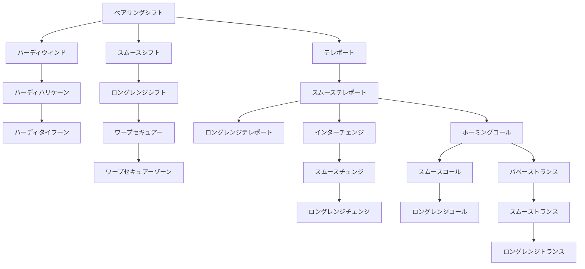

目次

* [次元天導師の特徴](#次元天導師の特徴)
* [スキルツリー](#スキルツリー)
    * [CMD](#CMD)
    * [スキル入手方法](#スキル入手方法)

## 次元天導師の特徴
----------

> _空間を歪ませ『飛ばす・回す・入れ替える』  
> 攻撃しないで勝利を掴む！　慈愛のワープマジシャン！_

次元を操作する能力を会得した『守護魔導師』が『次元天導師』へとステップアップできる。  
回復や補助など『守護魔導師』時代に培ったスキルに加え、味方をワープさせたり、方向を  
かえることにより、サポート能力が格段に向上している。

敵にはワープ先がいったいどこなのか検討もつかないだろう。  
次元操作をきわめ、神出鬼没な戦法で味方を勝利に導け！

■サイドジョブ：[格闘士](./fighter.md)・[精霊魔導師](./spirit_mage.md)  
■下級職：[守護魔導師](./guardian_mage.md)


## スキルツリー
--------

<table><tbody><tr><td></td><td>ベアリングシフト</td><td></td><td></td><td></td><td></td></tr><tr><td>┏</td><td>╋</td><td>┓</td><td></td><td></td><td></td></tr><tr><td>ハーディウィンド</td><td>スムースシフト</td><td>テレポート</td><td></td><td></td><td></td></tr><tr><td>┃</td><td>┃</td><td>┃</td><td></td><td></td><td></td></tr><tr><td>ハーディハリケーン</td><td>ロングレンジシフト</td><td>スムーステレポート</td><td></td><td></td><td></td></tr><tr><td>┃</td><td>┃</td><td>┣</td><td>┳</td><td>┓</td><td></td></tr><tr><td>ハーディタイフーン</td><td>ワープセキュアー</td><td>ロングレンジテレポート</td><td>インターチェンジ</td><td>ホーミングコール</td><td></td></tr><tr><td></td><td>┃</td><td></td><td>┃</td><td>┣</td><td>┓</td></tr><tr><td></td><td>ワープセキュアーゾーン</td><td></td><td>スムースチェンジ</td><td>スムースコール</td><td>バベーストランス</td></tr><tr><td></td><td></td><td></td><td>┃</td><td>┃</td><td>┃</td></tr><tr><td></td><td></td><td></td><td>ロングレンジチェンジ</td><td>ロングレンジコール</td><td>スムーストランス</td></tr><tr><td></td><td></td><td></td><td></td><td></td><td>┃</td></tr><tr><td></td><td></td><td></td><td></td><td></td><td>ロングレンジトランス</td></tr></tbody></table>




### CMD

##### ベアリングシフト

* 消費AP: 12
* スピード: D
* 行動属性: 魔法
* 射程範囲: 上１・下１
```text
口口■口口
口■■■口
■■↑■■

```


* 効果範囲: 選択対象のみ
* 入手法: ドラクエ1、地/空☆

> 対象の向いている方向を自分と同じにする。

##### スムースシフト

* 消費AP: 15
* スピード: C
* 行動属性: 魔法
* 射程範囲: 上１・下１
```text
口■口
■↑■
口■口

```


* 効果範囲: 選択対象のみ
* 入手法: 地/空☆、[ハバネロ]

> 対象の向いている方向を自分と同じにする。スキル発動が少し早い。

##### ロングレンジシフト

* 消費AP: 26
* スピード: D
* 行動属性: 魔法
* 射程範囲: 上１・下１
```text
口口■口口
口■■■口
■■口■■
■口↑口■

```


* 効果範囲: 選択対象のみ
* 入手法: 地/空☆☆、[花]

> 対象の向いている方向を自分と同じにする。射程範囲が少し広い。

##### ワープセキュアー

* 消費AP: 14
* スピード: D
* 行動属性: 魔法
* 射程範囲: 上１・下１
```text
口口■口口
口■■■口
■■↑■■

```


* 効果範囲: 選択対象のみ
* 入手法: 地/空☆☆☆

> 対象にワープの効果を無効化するバリアを張ります。

##### ワープセキュアーゾーン

* 消費AP: 26
* スピード: D
* 行動属性: 魔法
* 射程範囲: 上１・下１
```text
口口■口口
口■■■口
■■↑■■

```


* 効果範囲:
```text
口■口
■★■
口■口

```


* 入手法: 地/空★

> 範囲内にいる対象にワープの効果を無効化するバリアを張ります。

##### ハーディウィンド

* 消費AP: 24
* スピード: D
* 行動属性: 魔法
* 射程範囲: 地面指定
```text
口口口■口口口
口口口■口口口
口口口口口口口
■■口↑口■■

```


* 効果範囲: ■+左右or上下1マス
* 入手法: 地/空☆(準レア)、[ハバネロ]

> 自分を中心に異世界の突風を吹かせて、少しだけ吹き飛ばす。
> (吹き飛ばし1グリッド)

##### ハーディハリケーン

* 消費AP: 32
* スピード: D
* 行動属性: 魔法
* 射程範囲: 地面指定
```text
口口口■口口口
口口口■口口口
口口口口口口口
■■口↑口■■

```


* 効果範囲: ■+左右or上下1マス
* 入手法: 地/空☆☆

> 自分を中心に異世界の突風を吹かせて、吹き飛ばす。
> (吹き飛ばし2グリッド)

##### ハーディタイフーン

* 消費AP: 40
* スピード: D
* 行動属性: 魔法
* 射程範囲: 地面指定
```text
口口口■口口口
口口口■口口口
口口口口口口口
■■口↑口■■

```


* 効果範囲: ■+左右or上下1マス
* 入手法: 地/空☆☆☆

> 異世界の突風を吹かせて、強烈に吹き飛ばす。
> (吹き飛ばし4グリッド)

##### テレポート

* 消費AP: 42
* スピード: D
* 行動属性: 魔法
* 射程範囲: 選択対象のみ
```text
<対象>
口■口
■↑■
自分含む
<ワープ先>
口口■口口
口■■■口
■■口■■
■口↑口■

```


* 効果範囲: 選択対象のみ
* 入手法: 地/空☆(レア)、[ハバネロ]

> 対象を選択したグリッドにワープさせる。

##### スムーステレポート

* 消費AP: 50
* スピード: D
* 行動属性: 魔法
* 射程範囲: 選択対象のみ
```text
<対象>
口■口
■↑■
自分含む
<ワープ先>
口口■口口
口■口■口
■口↑口■

```


* 効果範囲: 選択対象のみ
* 入手法: 地/空☆☆(準レア)、[ハバネロ] / [花]

> 対象を選択したグリッドにワープさせる。スキル発動が少し早い。

##### ロングレンジテレポート

* 消費AP: 58
* スピード: D
* 行動属性: 魔法
* 射程範囲: 選択対象のみ
```text
<対象>
口■口
■↑■
自分含む
<ワープ先>
口口■口口
口■■■口
■■■■■
■■口■■
■口↑口■

```


* 効果範囲: 選択対象のみ
* 入手法: 地/空☆☆☆(準レア)、[花]

> 対象を選択したグリッドにワープさせる。射程範囲が少し広い。

##### インターチェンジ

* 消費AP: 42
* スピード: D
* 行動属性: 魔法
* 射程範囲: 自分含む
```text
口口■口口
口■■■口
口■↑■口

```


* 効果範囲: 選択対象(2体)のみ
* 入手法: 地/空☆☆(レア)、[花]

> 対象の2体を選び、その位置を入れ替えます。

##### スムースチェンジ

* 消費AP: 50
* スピード: D
* 行動属性: 魔法
* 射程範囲: 自分含む
```text
口■■■口
口■↑■口
口■口■口

```


* 効果範囲: 選択対象(2体)のみ
* 入手法: 地/空☆☆☆(レア)

> 対象の2体を選び、その位置を入れ替えます。スキル発動が少し早い。

##### ロングレンジチェンジ

* 消費AP: 58
* スピード: D
* 行動属性: 魔法
* 射程範囲: 自分含む
```text
口口■口口
口■■■口
■■口■■
■口↑口■

```


* 効果範囲: 選択対象(2体)のみ
* 入手法: 地/空☆☆☆☆(レア)

##### ホーミングコール

* 消費AP: 10
* スピード: D
* 行動属性: 魔法
* 射程範囲: 仲間のみ
```text
口口■口口
口■■■口
■■口■■
■口↑口■

```


* 効果範囲: 選択対象のみ
* 入手法: 地/空☆☆☆☆

> 選択した仲間を、自分の前にワープさせます。

##### スムースコール

* 消費AP: 18
* スピード: B
* 行動属性: 魔法
* 射程範囲: 仲間のみ
```text
口口■口口
口■■■口
■■口■■
■口↑口■

```


* 効果範囲: 選択対象のみ
* 入手法: 地/空☆☆☆☆(準レア)

> 選択した仲間を、自分の前にワープさせます。スキル発動が少し速い。

##### ロングレンジコール

* 消費AP: 22
* スピード: D
* 行動属性: 魔法
* 射程範囲:
```text
口口口■口口口
口口■■■口口
口■■■■■口
■■■口■■■
■■口口口■■
■口口↑口口■

```


* 効果範囲:
* 入手法: 地/空★

> 選択した仲間を、自分の前にワープさせます。射程範囲が少し広い。

##### バベーストランス

* 消費AP: 8
* スピード: B
* 行動属性: 魔法
* 射程範囲: 自分含む 仲間のみ
```text
口口■口口
口■■■口
■■↑■■
口■口■口

```


* 効果範囲: 選択対象(2体)のみ
* 入手法: 地/空☆☆☆☆

> 最初に選んだ仲間のhpを、他の仲間にワープさせます。
> (対象の最大HPの50%)

##### スムーストランス

* 消費AP: 14
* スピード: S
* 行動属性: 魔法
* 射程範囲: 自分含む 仲間のみ
```text
口口■口口
口■■■口
■■↑■■
口■口■口

```


* 効果範囲: 選択対象(2体)のみ
* 入手法: 地/空★

> 最初に選んだ仲間のhpを、他の仲間にワープさせます。スキル発動が少し速い。
> (対象の最大HPの50%)

##### ロングレンジトランス

* 消費AP: 12
* スピード: B
* 行動属性: 魔法
* 射程範囲: 自分含む 仲間のみ
```text
口口口■口口口
口口■■■口口
口■■口■■口
■■口↑口■■
口■■口■■口
口口■口■口口

```


* 効果範囲: 選択対象(2体)のみ
* 入手法: 地/空★

> 最初に選んだ仲間のhpを、他の仲間にワープさせます。射程範囲が少し広い。
> (対象の最大HPの50%)


### スキル入手方法

| クエスト | よく出る | 普通 | 準レア | レア |
| --- | --- | --- | --- | --- |
| 地/空☆ | ベアリングシフト | スムースシフト | ハーディウィンド | テレポート |
| 地/空☆☆ | ハーディハリケーン | ロングレンジシフト | スムーステレポート | インターチェンジ |
| 地/空☆☆☆ | ハーディタイフーン | ワープセキュアー | ロングレンジテレポート | スムースチェンジ |
| 地/空☆☆☆☆ | ホーミングコール | バベーストランス | スムースコール | ロングレンジチェンジ |
| 地/空★ | ワープセキュアーゾーン | スムーストランス | ロングレンジコール | ロングレンジトランス |
| ミニクエ(確率不明) |
| ハバネロ | スムースシフト | ハーディウィンド | テレポート | スムーステレポート |
| 花クエ | ロングレンジシフト | スムーステレポート | インターチェンジ | ロングレンジテレポート |
| クラゲ | ワープセキュアー | ロングレンジテレポート | スムースチェンジ | スムースコール |
| 迷子 | バベーストランス | スムースコール | ロングレンジチェンジ | ロングレンジコール |

