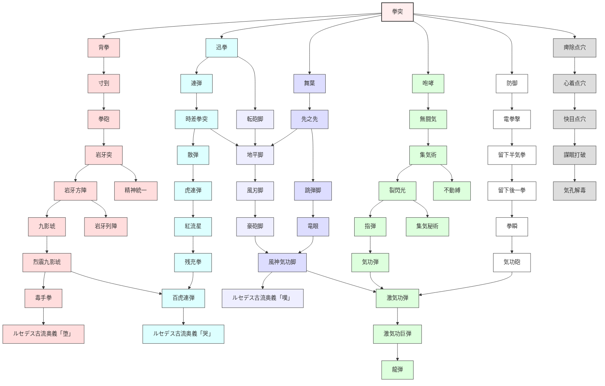

目次

* [格闘士の特徴](#格闘士の特徴)
  * [武器と防具](#武器と防具)
* [スキル](#スキル)
  * [スキルツリー](#スキルツリー)
  * [CMDスキル](#CMDスキル)
    * [拳突ライン](#拳突ライン)
    * [迅拳ライン](#迅拳ライン)
    * [足技](#足技)
    * [回避・カウンター系](#回避カウンター系)
    * [状態異常・補助系列](#状態異常補助系列)
    * [気功・遠距離攻撃](#気功遠距離攻撃)
    * [サイド戦士](#サイド戦士)
    * [サイド守護](#サイド守護)
  * [PSVスキル](#PSVスキル)
  * [入手クエスト](#入手クエスト)
* [豆知識？](#豆知識？)


## 格闘士の特徴
--------

> 殴る！蹴る！  
> 圧倒的な破壊力で敵を粉砕する、最強の職業

装備可能な武器に制限があるものの、  
その物理攻撃力の高さは他の追随を許しません。  
さらに、成長すると気功の放出による  
遠距離攻撃を修得することができます。

ただし防御力の高い防具を装備できないため、  
攻撃が飛び交う最前線では、常に危険が付きまとう  
職業でもあります。

■サイドジョブ:[戦士](./warrior.md) 守護魔導師  
■上位ジョブ:[幻闘士](./illusionary_fighter.md)


### 武器と防具

<table><tbody><tr><td>防具　</td><td>胴衣<br class="spacer">（軽装備）</td><td>衝撃服<br class="spacer">（中装備）</td><td>幻格忍盗兼用<br class="spacer">（重装備）</td><td>説明</td></tr><tr><td>特徴</td><td>移動力が最高<br class="spacer">上下一体型</td><td>攻撃補正が付く</td><td>防御が最も高い</td><td>防御力は、兼用＞胴衣＞専用</td></tr><tr><td>服(上)</td><td>重さ：92<br class="spacer">移動力：7.0(前進６歩)</td><td>重さ：88<br class="spacer">移動力：6.0(前進５歩)</td><td>重さ：98<br class="spacer">移動力：6.0(前進５歩)</td><td>移動力（歩数）に影響する</td></tr><tr><td>服(下)</td><td>重さ：−<br class="spacer">上３段<br class="spacer">下４段</td><td>重さ：38<br class="spacer">上３段<br class="spacer">下３段</td><td>重さ：48<br class="spacer">上３段<br class="spacer">下３段</td><td>移動できる段数に影響する</td></tr><tr><td>帽子</td><td colspan="3">重さ：15</td><td>　</td></tr><tr><td>手袋</td><td>重さ：15</td><td>重さ：20</td><td>重さ：25</td><td>敵への攻撃命中率に影響する（？）<br class="spacer">軽量の物ほど命中率が高い</td></tr><tr><td>靴</td><td>重さ：15</td><td>重さ：20</td><td>重さ：25</td><td>自分への攻撃回避率に影響する（？）<br class="spacer">軽量の物ほど回避率が高い</td></tr></tbody></table>

<table><tbody><tr><td>武器<br class="spacer">（爪）</td><td>斬タイプ</td><td>衝タイプ</td><td>貫タイプ</td></tr><tr><td>特徴</td><td>ナイフナックルなど<br class="spacer">重量52</td><td>セスタスなど<br class="spacer">重量52</td><td>ブレードナックルなど<br class="spacer">重量52</td></tr><tr><td>武器<br class="spacer">（爪）</td><td>衝特化タイプ</td><td>衝+貫特化タイプ</td><td></td></tr><tr><td>特徴</td><td>ニューボーイガードなど<br class="spacer">衝タイプよりも<br class="spacer">さらに衝が高い<br class="spacer">重量54</td><td>クローガントレットなど<br class="spacer">衝特化タイプと貫タイプの<br class="spacer">特長を併せ持つ<br class="spacer">重量55</td><td></td></tr></tbody></table>


## スキル
-----


### スキルツリー

<table><tbody><tr><td></td><td></td><td>拳突</td><td></td><td></td><td></td><td></td><td></td><td></td><td></td></tr><tr><td></td><td></td><td>┣</td><td>┳</td><td>━</td><td>┳</td><td>┳</td><td>━</td><td>┳</td><td>┓</td></tr><tr><td>鉄身</td><td></td><td>背拳</td><td>迅拳</td><td>┓</td><td>舞葉</td><td>咆哮</td><td></td><td>防御</td><td>痺除点穴</td></tr><tr><td>浮身</td><td></td><td>寸剄</td><td>連弾</td><td>転砲脚</td><td>先之先</td><td>無闘気</td><td>┓</td><td>電拳撃</td><td>心着点穴</td></tr><tr><td>鋼身</td><td></td><td>拳砲</td><td>時差拳突</td><td><span style="color:#EEEEFF">┛</span>┃┗</td><td>┫</td><td>集気術</td><td>不動縛</td><td>留下半気拳</td><td>快目点穴</td></tr><tr><td>心頭滅却</td><td></td><td>岩牙突</td><td>散弾</td><td>地平脚</td><td>跳弾脚</td><td>┣</td><td>┓</td><td>留下後一拳</td><td>謀眠打破</td></tr><tr><td>精神統一</td><td>┏</td><td>┫</td><td>虎連弾</td><td>風刃脚</td><td>竜眼</td><td>裂閃光</td><td>集気秘術</td><td>拳瞬</td><td>気孔解毒</td></tr><tr><td>狙身捉体</td><td>岩牙列陣</td><td>岩牙方陣</td><td>紅流星</td><td>豪砲脚</td><td></td><td>指弾</td><td></td><td></td><td></td></tr><tr><td>避身柔体</td><td>地砕崩</td><td>九影琥</td><td>残充拳</td><td>┃</td><td></td><td>気功弾</td><td></td><td></td><td></td></tr><tr><td>功身撃体</td><td>天裂崩</td><td>烈震九影琥</td><td>┃</td><td>┣</td><td>┓┏</td><td>╋</td><td>┓</td><td></td><td></td></tr><tr><td>防身剛体</td><td></td><td>┏</td><td>┫</td><td>┃</td><td>風神気功脚</td><td>激気功弾</td><td>気功砲</td><td></td><td></td></tr><tr><td>速身軽体</td><td></td><td>毒手拳</td><td>百虎連弾</td><td>┃</td><td></td><td>┣</td><td>┓</td><td></td><td></td></tr><tr><td></td><td></td><td>┏</td><td>┛┃┗</td><td>┫</td><td></td><td>激気功巨弾</td><td>気功炸裂弾</td><td></td><td></td></tr><tr><td></td><td></td><td>ルセデス古流奥義「堕」</td><td>ルセデス古流奥義「哭」</td><td>ルセデス古流奥義「嘆」</td><td></td><td>龍弾</td><td></td><td></td><td></td></tr></tbody></table>





### CMDスキル


#### 拳突ライン

##### 拳突 (けんとつ)

* AP: 3 | スピード: B
* 妨害値: 1 | 耐久値: 10
* 射程: 上1・下1
```
■■■
■↑■

```


* 効果範囲: 指定対象のみ
* 入手法: 初期所持

> 握った拳を突き出して、対象を攻撃する格闘士の基本攻撃。

##### 背拳 (はいけん)

* AP: 12 | スピード: B
* 妨害値: 1 | 耐久値: 6
* 射程: 上1・下1
```
口↑口
■■■

```


* 効果範囲: 指定対象のみ
* 入手法: ☆

> 背後に拳を突き出して、対象にダメージを与える。

##### 寸剄 (すんけい)

* AP: 18 | スピード: D
* 妨害値: 6 | 耐久値: 6
* 射程: 上1・下1
```
口■口
■↑■

```


* 効果範囲: 指定対象のみ
* 入手法: ☆☆ / リョマ

> 拳を当てる瞬間に爆発的に気合を込めて吹き飛ばし攻撃を行う。(1グリッド飛)

##### 拳砲 (けんほう)

* AP: 32 | スピード: D
* 妨害値: 12 | 耐久値: 10
* 射程: 上1・下1
```
■
↑

```


* 効果範囲: 指定対象のみ
* 入手法: ☆☆☆ / フェレット / 球根 / ハチミツ

> 拳に気合を込めて突き出し、吹き飛ばし攻撃を行う。(3グリッド飛)

##### 岩牙突 (がんがとつ)

* AP: 30 | スピード: D
* 妨害値: 1 | 耐久値: 10
* 射程: 上2・下2
```
口口■口口
口■口■口
■口↑口■
口■口■口

```


* 効果範囲: 指定対象のみ
* 入手法: ☆☆☆☆ / 墓場 / ハチミツ

> 地面を突き石柱を出現させて、対象にダメージを与える。転倒HIT

##### 岩牙方陣 (がんがほうじん)

* AP: 30 | スピード: D
* 妨害値: 1 | 耐久値: 6
* 射程: 自己
* 効果範囲: 上2・下2
```
■■■
■↑■
■■■

```


* 入手法: ★ / たこ焼き / 球根 / コボルト / 目撃者

> 地面を突き石柱を出現させて、範囲内の敵ユニットを攻撃する。転倒HIT

##### 九影琥 (くえいく)

* AP: 49 | スピード: D
* 妨害値: 12 | 耐久値: 6
* 射程: 自己
* 効果範囲: 上2・下2
```
口口口■口口口
口口■■■口口
口■■■■■口
■■■↑■■■
口■■■■■口
口口■■■口口
口口口■口口口

```


* 入手法: ★☆ / ★★☆ / ゴーレム / スライム / 墓場 / 絵画 (DROP: ペングィン / ダンディウサギ等)

> 拳で衝撃波を打ち、範囲内の全ユニットを攻撃し転倒させる。(高確率転倒状態0T)

##### 烈震九影琥 (れっしんくえいく)

* AP: 56 | スピード: D
* 妨害値: 12 | 耐久値: 6
* 射程: 自己
* 効果範囲: 上2・下2
```
口口■口口
口■■■口
■■↑■■
口■■■口
口口■口口

```


* 入手法: ★☆☆☆ / ★★☆☆ / 石碑 / 海賊 / ゴブリン / 果実

> 地面を突き大地を揺らして、範囲内の全ユニットを攻撃し転倒させる。(高確率転倒状態0T)

##### 岩牙列陣 (がんがれつじん)

* AP: 45 | スピード: D
* 妨害値: 1 | 耐久値: 6
* 射程: 自己
* 効果範囲:
```
■
■
■
■
■
■
■
■
↑

```


* 入手法: ★☆ / メイド(弱) / コボルト / 死神呪い

> 地面を突き石柱を出現させて、範囲内の全ユニットを攻撃する。

##### 地砕崩 (ちさいほう)

* AP: 30 | スピード: C
* 妨害値: 12 | 耐久値: 6
* 射程: 上1・下1
```
口■口
■↑■

```


* 効果範囲: 指定対象のみ
* 入手法: ★☆☆ / ★★☆ / 死神呪い / カエル / 目撃者 / ハーブ (DROP: グラスマージ)

> 地面に叩き付ける投げ技で、対象にダメージを与えて転倒させる。(高確率転倒状態0T)

##### 天裂崩 (てんれつほう)

* AP: 85 | スピード: C
* 妨害値: 12 | 耐久値: 4
* 射程: 上1・下1
```
■
↑

```


* 効果範囲: 指定対象のみ
* 入手法: ★★ / ★★☆☆☆ / メイド(弱) / 石碑 / 海賊 / カエル

> 天を切り裂く投げ技で、対象にダメージを与えて吹き飛ばす。(5グリッド飛)


#### 迅拳ライン

##### 迅拳 (じんけん)

* AP: 6 | スピード: A
* 妨害値: 1 | 耐久値: 10
* 射程: 上1・下1
```
口■口
■↑■

```


* 効果範囲: 指定対象のみ
* 入手法: 初期所持 / 店売り:300 / ☆

> 拳を疾風の如き速さで突き出して、目標を攻撃する。

##### 連弾 (れんだん)

* AP: 12 | スピード: B
* 妨害値: 1*2 | 耐久値: 10
* 射程: 上1・下1
```
■■■
■↑■

```


* 効果範囲: 指定対象のみ
* 入手法: 店売り:600 / ☆☆ / 旅立ちの決意

> 連続で拳を突き出して、対象に2回ダメージを与える。
> (二連続攻撃、判定：毎回)

##### 時差拳突 (じさけんとつ)

* AP: 7 | スピード: C
* 妨害値: 1 | 耐久値: 10
* 射程: 上1・下1
```
■■■
■↑■

```


* 効果範囲: 指定対象のみ
* 入手法: ☆☆☆

> 攻撃に対して身構えている対象に、効果を発揮する攻撃。
> (フェイント攻撃)

##### 散弾 (さんだん)

* AP: 16 | スピード: C
* 妨害値: 1 | 耐久値: 6
* 射程: 上1・下1
```
■■■
口↑口

```


* 効果範囲: 自己
* 入手法: ☆☆☆☆ / フェレット

> 拳で衝撃波を放ち、範囲内の全ユニットにダメージを与える。

##### 虎連弾 (これんだん)

* AP: 24 | スピード: C
* 妨害値: 1*3 | 耐久値: 6
* 射程: 上1・下1
```
口■口
■↑■

```


* 効果範囲: 指定対象のみ
* 入手法: ★ / DROP:ウッディーリード / ミノゴブロスなど / 一部ゴブリン

> 連続で拳を突き出して、対象に3回ダメージを与える。
> (三連続攻撃、判定：毎回、特殊：威力の変動)

##### 紅流星 (こうりゅうせい)

* AP: 28 | スピード: D
* 妨害値: 1 | 耐久値: 10
* 射程: 上1・下1
```
■
■
■
↑

```


* 効果範囲: 指定対象まで
* 入手法: ★☆

> 拳で衝撃波を放ち、対象と対象までの全ユニットを攻撃する。

##### 残充拳 (ざんてつけん)

* AP: 18 | スピード: S
* 妨害値: 1 | 耐久値: 6
* 射程: 上1・下1
```
■
↑

```


* 効果範囲: 指定対象のみ
* 入手法: ★☆☆

> 拳を雷鳴の如き速さで突き出して、目標を攻撃する。

##### 毒手拳 (どくしゅけん)

* AP: 25 | スピード: D
* 妨害値: 1 | 耐久値: 10
* 射程: 上1・下1
```
口■口
■↑■

```


* 効果範囲: 指定対象のみ
* 入手法: ★☆☆☆☆ / ★★☆☆ / 死神呪い / 山賊 / 踊り子

> 自ら毒に冒され、対象にダメージを与え毒状態にする。
> (自己毒状態1T、対象高確率毒状態5T？)

##### 百虎連弾 (びゃっこれんだん)

* AP: 42 | スピード: C
* 妨害値: 1*5 | 耐久値: 6
* 射程: 上1・下1
```
■
↑

```


* 効果範囲: 指定対象のみ
* 入手法: ★★レア / 絵画 / 踊り子 / ハーブ

> 連続で拳を突き出して、対象に5回ダメージを与える。
> (五連続攻撃、判定：毎回、特殊：威力の変動)

##### ルセデス古流奥義「堕」 (ルセデスこりゅうおうぎ「だ」)

* AP: 100 | スピード: D
* 妨害値: 12 | 耐久値: 4
* 射程: 上0・下0
```
口口■口口
口■口■口
■口↑口■

```


* 効果範囲: 指定対象のみ
* 入手法: ★★☆☆☆レア

> 宙に舞い上がり、拳を突き出して対象目掛けて急降下して攻撃する。
> (三連続攻撃、判定：初回)

##### ルセデス古流奥義「哭」 (ルセデスこりゅうおうぎ「こく」)

* AP: 100 | スピード: D
* 妨害値: 12 | 耐久値: 4
* 射程: 上1・下0
```
■■■
口↑口

```


* 効果範囲: 指定対象のみ
* 入手法: ★★☆☆レア / 王家の墓

> 目にも止まらぬ連続高速攻撃で、対象にダメージを与える。
> (八連続攻撃、判定：初回)

##### ルセデス古流奥義「嘆」 (ルセデスこりゅうおうぎ「たん」)

* AP: 100 | スピード: D
* 妨害値: | 耐久値:
* 射程: 上0・下0
```
口■口
■↑■

```


* 効果範囲: 指定対象のみ
* 入手法: ★★☆☆☆☆レア

> 宙に舞い上がり、空中で何度も対象を踏みつけてダメージを与える。
> (六連続攻撃、判定：初回、1グリッド飛)

#### 足技

##### 転砲脚 (てんぽうきゃく)

* AP: 22 | スピード: D
* 妨害値: 4 | 耐久値: 6
* 射程: 上1・下1
```
口■口
口■口
■↑■

```


* 効果範囲: 指定対象のみ
* 入手法: ★☆☆レア / 種 / メイド(強) / 果実 / スライム / ゴーレム

> 身体を回転させ蹴りを放ち、対象にダメージを与える。
> (1グリッド飛)

##### 地平脚 (ちへいきゃく)

* AP: 25 | スピード: C
* 妨害値: 12 | 耐久値: 6
* 射程: 上0?・下0?
```
口■口
■↑■

```


* 効果範囲: 指定対象のみ
* 入手法: ★☆☆☆ / メイド(強) / コボルト / ゴーレム / 復讐 / 滝水 / ハーブ

> 地を這う蹴りを放ち、対象にダメージを与えて転倒させる。
> (高確率転倒状態0T)転倒HIT

##### 風刃脚 (ふうじんきゃく)

* AP: 25 | スピード: C
* 妨害値: 1 | 耐久値: 6
* 射程: 上2・下2
```
口■口
■■■
■口■
口↑口

```


* 効果範囲: 指定対象のみ
* 入手法: ★★

> 高速で蹴りを放ち真空を発生させて、対象にダメージを与える。
> (曲射)

##### 豪砲脚 (ごうほうきゃく)

* AP: 36 | スピード: D
* 妨害値: 12 | 耐久値: 4
* 射程: 上1・下1
```
口■口
■↑■

```


* 効果範囲: 指定対象のみ
* 入手法: ★★☆ / 海賊 / 山賊

> 強力な蹴りを放ち、対象にダメージを与えて吹き飛ばす。
> (4グリッド飛)

##### 風神気功脚 (ふうじんきこうきゃく)

* AP: 55 | スピード: D
* 妨害値: 1 | 耐久値: 6
* 射程: 上2?・下∞
```
■■■■■
口■■■口
口口■口口
口口↑口口

```


* 効果範囲: 指定対象のみ
* 入手法: ★★☆☆☆

> 気功をかまいたちのように鋭く放ち、対象にダメージを与える。
> (直射)

#### 回避・カウンター系

##### 舞葉 (ぶよう)

* AP: 7 | スピード: A
* 妨害値: - | 耐久値: 10
* 射程: 自己
* 効果範囲: 自分のみ
* 入手法: ☆準レア / フェレット / 球根

> 相手の動きを凝視し先読みして高確率で回避できる体勢で身構える。
> (見切り状態0T)

##### 先之先 (せんのせん)

* AP: 18 | スピード: B
* 妨害値: - | 耐久値: 10
* 射程: 自己
* 効果範囲: 自分のみ
* 入手法: ☆レア / 蟹 / 地竜 / 球根

> 相手の挙動を読み、攻撃に合わせ自分のみ攻撃できる体勢で身構える。
> (カウンター状態0T)

##### 跳弾脚 (ちょうだんきゃく)

* AP: 18 | スピード: B
* 妨害値: - | 耐久値: 6
* 射程: 自己
* 効果範囲: 自分のみ
* 入手法: ★☆☆ / メイド(弱) / コボルト / ハチミツ / 指輪 / 絵画 / 滝水 / 山賊

> 投射攻撃を見切って蹴り返すことができる体勢で身構える。
> (投射攻撃反射状態0T)

##### 竜眼 (りゅうがん)

* AP: 16 | スピード: A
* 妨害値: - | 耐久値: 10
* 射程: 自己
* 効果範囲: 自分のみ
* 入手法: ★★☆レア / ハーブ

> 相手の攻撃を大気から察知して高確率で回避できる体勢で身構える。
> (超見切り状態0T)

#### 状態異常・補助系列

##### 咆哮 (ほうこう)

* AP: 38 | スピード: B
* 妨害値: 12 | 耐久値: 6
* 射程: 自己
* 効果範囲: 上2・下2
```
■■■■■■■
口■■■■■口
口口■■■口口
口口口■口口口
口口口↑口口口

```


* 入手法: ☆☆ / リョマ / フェレット / 焼肉 / 仮面 / 土鍋 / 墓場

> 戦いの叫び声を上げ、範囲内の全ユニットの行動を妨害します。

##### 無闘気 (むとうき)

* AP: 35 | スピード: B
* 妨害値: - | 耐久値: 6
* 射程: 自己
* 効果範囲: 自分のみ
* 入手法: ☆☆☆ / フェレット / 焼肉 / 土鍋 / ハチミツ / 目撃者

> 気を自然と同化させて、周囲に気付かれない透明状態になります。
> (透明状態2T)

##### 不動縛 (ふどうばく)

* AP: 35 | スピード: D
* 妨害値: - | 耐久値: 6
* 射程: 上3・下3
```
口口■口口
口口口口口
■口↑口■

```


* 効果範囲: 指定対象のみ
* 入手法: ★☆☆☆☆ / ゴーレム / カエル / 滝水

> 戦いの叫び声を上げ、対象のユニットを麻痺状態にする。
> (高確率麻痺状態2T)

##### 集気術 (しゅうきじゅつ)

* AP: 20 | スピード: C
* 妨害値: - | 耐久値: 6
* 射程: 自己
* 効果範囲: 自分のみ
* 入手法: ☆☆☆☆ / たこ焼き / 仮面 / 土鍋 / ゴブリン

> 気功と自然の力を融合して、HPを少しだけ回復します。
> (HP少量回復)

##### 集気秘術 (しゅうきひじゅつ)

* AP: 38 | スピード: C
* 妨害値: - | 耐久値: 6
* 射程: 自己
* 効果範囲: 自分のみ
* 入手法: ★★☆☆☆ / 海賊

> 気功と自然の力を融合して、HPを回復します。
> (HP多量回復)

##### 裂閃光 (れっせんこう)

* AP: 35 | スピード: D
* 妨害値: - | 耐久値: 6
* 射程: 自己
* 効果範囲: 上3?・下3?
```
■■■■■
口■■■口
口口■口口
口口↑口口

```


* 入手法: ★準レア / 人形 / パンダ / 種 / 焼肉 / 仮面 / 死神呪い / スライム

> 気功で身体を発光させて、範囲内の全ユニットを暗闇状態にする。
> (高確率暗闇状態4T)

#### 気功・遠距離攻撃

##### 指弾 (しだん)

* AP: 12 | スピード: C
* 妨害値: 1 | 耐久値: 6
* 射程: 上1・下∞
```
■■■
■■■
口■口
口■口
口↑口

```


* 効果範囲: 指定対象のみ
* 入手法: ★☆ / パンダ / 種 / メイド(弱) / 指輪 / 果実

> 気功を小さい弾に換えて発射、対象にダメージを与える。(直射)

##### 気功弾 (きこうだん)

* AP: 32 | スピード: D
* 妨害値: 1 | 耐久値: 6
* 射程: 上1・下∞
```
■■■
■■■
口■口
口■口
口↑口

```


* 効果範囲: 指定対象のみ
* 入手法: ★☆☆☆ / メイド(強) / 指輪 / スライム / カエル / 山賊 / DROP:エンサインオーク・ウォーラントオークなど一部オーク

> 体内で発生させた気功を弾に換えて発射、対象にダメージを与える。(直射)

##### 激気功弾 (げききこうだん)

* AP: 45 | スピード: D
* 妨害値: 1 | 耐久値: 4
* 射程: 上1・下∞
```
■■■
■■■
口■口
口■口
口↑口

```


* 効果範囲: 指定対象のみ
* 入手法: ★★☆ / 石碑 / 滝水 / 踊り子

> 体内で発生させた気功を大きな弾に換えて発射、対象を攻撃する。(直射)

##### 激気功巨弾 (げききこうきょだん)

* AP: 63 | スピード: E
* 妨害値: - | 耐久値: -
* 射程: 上1・下∞
```
■■■
■■■
口■口
口■口
口↑口

```


* 効果範囲: 指定対象のみ
* 入手法: ★★ / 海賊 / 果実

> 気功を巨大な弾に換えて発射、対象にダメージを与える。(直射)

##### 龍弾 (りゅうだん)

* AP: 90 | スピード: E
* 妨害値: - | 耐久値: -
* 射程: 上1・下∞
```
■
■
■
■
■
↑

```


* 効果範囲: 指定対象まで
* 入手法: ★★☆☆☆☆

> 気功を龍に変えて発射、対象と対象までの全ユニットを攻撃する。(直射)

##### 気功砲 (きこうほう)

* AP: 42 | スピード: D
* 妨害値: 1 | 耐久値: 6
* 射程: 上1・下∞
```
■
■
■
■
■
↑

```


* 効果範囲: 指定対象まで
* 入手法: ★☆☆☆☆ / メイド(強) / 石碑 / 復讐 / 絵画

> 気功弾に回転を加え発射し、対象と対象までの全ユニットを攻撃する。(直射)

##### 気功炸裂弾 (きこうさくれつだん)

* AP: 55 | スピード: D
* 妨害値: 1 | 耐久値: 4
* 射程: 上2・下∞
```
口口■口口
口■口■口
■口口口■
口口↑口口

```


* 効果範囲:
```
口■口
■■■
口■口

```


* 入手法: ★★☆☆☆☆ / 海賊

> 気功を爆発する弾に換えて発射、範囲内の全ユニットを攻撃する。(曲射)

#### サイド戦士

##### 防御 (ぼうぎょ)

* AP: 2 | スピード: A
* 妨害値: - | 耐久値: 10
* 射程: 自己
* 効果範囲: 自分のみ
* 入手法: ☆☆ / 蟹 / 地竜 / 焼肉 / 人形 / 球根

> 攻撃に対してダメージを軽減できる体勢で身構える。(防御状態0T)
> (サイド戦士レベル5以上)

##### 電拳撃 (でんけんげき)

* AP: 42 | スピード: D
* 妨害値: 1 | 耐久値: 10
* 射程: 上1・下1
```
口■口
■↑■

```


* 効果範囲: 指定対象のみ
* 入手法: ☆☆☆☆ / 地竜 / 人形 / 種 / パンダ / 目撃者

> 雷を落すと同時に拳を突き出し、対象を攻撃します。(低確率麻痺状態1T)
> (サイド戦士レベル10以上)

##### 留下半気拳 (るかはんきけん)

* AP: 47 | スピード: D
* 妨害値: - | 耐久値: -
* 射程: 上1・下1
```
■
↑

```


* 効果範囲: 指定対象のみ
* 入手法: ★★☆☆ / 海賊 / 踊り子 / 復讐

> 急所を狙い拳を突き出す。成功すれば対象のHPは残り1/2になる。
> (特殊：固定ダメージ残HP50%)
> (サイド戦士レベル15以上)

##### 留下後一拳 (るかこういつけん)

* AP: 77 | スピード: D
* 妨害値: - | 耐久値: -
* 射程: 上1・下1
```
■
↑

```


* 効果範囲: 指定対象のみ
* 入手法: ★☆☆☆☆

> 急所を狙い拳を突き出す。成功すれば対象のHPは残り1になる。
> (特殊：固定ダメージ残HP-1)
> (サイド戦士レベル20以上)

##### 拳瞬 (けんしゃく)

* AP: 48 | スピード: S
* 妨害値: - | 耐久値: 10
* 射程: 上1・下1
```
■
↑

```


* 効果範囲: 指定対象のみ
* 入手法: ★★☆☆☆

> 超高速の踏み込みで拳を繰り出し、対象にダメージを与える。
> (サイド戦士レベル25以上)

#### サイド守護

##### 痺除点穴 (ひじょてんけつ)

* AP: 3 | スピード: D
* 妨害値: - | 耐久値: -
* 射程: 上?・下?
```
口■口
■↑■

```


* 効果範囲: 指定対象のみ
* 入手法: ☆☆☆ / 蟹 / 地竜 / 人形 / パンダ / たこ焼き / 仮面 / 墓場

> 守護魔法と気功を融合したツボ療法で、対象の麻痺を治療する。
> (麻痺状態解除)
> (サイド守護レベル5以上)

##### 心着点穴 (しんちゃくてんけつ)

* AP: 4 | スピード: D
* 妨害値: - | 耐久値: -
* 射程: 上?・下?
* 効果範囲: 指定対象のみ
* 入手法: ★レア / メイド(弱) / たこ焼き / 土鍋 / 指輪 / ゴブリン

> 守護魔法と気功を融合したツボ療法で、対象の心を落ち着かせる。
> (放心・混乱・激怒状態解除)
> (サイド守護レベル10以上)

##### 快目点穴 (かいもくてんけつ)

* AP: 3 | スピード: D
* 妨害値: - | 耐久値: -
* 射程: 上?・下?
* 効果範囲: 指定対象のみ
* 入手法: ★☆☆☆

> 守護魔法と気功を融合したツボ療法で、対象の暗闇を治療する。
> (暗闇状態解除)
> (サイド守護レベル15以上)

##### 謀眠打破 (ぼうみんだは)

* タイプ: PSV (パッシブ)
* 入手法: ★★☆☆

> 天使の加護で、寝てしまっても目が覚めます。
> (サイド守護レベル20以上)

##### 気孔解毒 (きこうげどく)

* タイプ: PSV (パッシブ)
* 入手法: ★★☆☆☆☆

> (毒状態自動解除)
> (サイド守護レベル25以上)

### PSVスキル

| スキル名 | 説明 | 発生効果 | 入手法 |
| --- | --- | --- | --- |
| 鉄身(てっしん) | 常時肉体に気合を込め、斬撃に対しての防御力を少しだけ上昇させる。 | 斬撃防御力上昇状態 | ☆ |
| 浮身(ふしん) | 常時肉体に気合を込め、衝撃に対しての防御力を少しだけ上昇させる。 | 衝撃防御力上昇状態 | ☆☆ |
| 鋼身(こうしん) | 常時肉体に気合を込め、貫通に対しての防御力を少しだけ上昇させる。 | 貫通防御力上昇状態 | ☆☆☆  
蟹 |
| 心頭滅却(しんとうめっきゃく) | 常時肉体に気合を込め、炎熱に対しての防御力を少しだけ上昇させる。 | 炎熱防御力上昇状態 | ☆☆☆☆ |
| 精神統一(せいしんとういつ) | 常時肉体に気合を込め、心に対しての防御力を少しだけ上昇させる。 | 精神防御力上昇状態 | ★ |
| 狙身捉体(そしんそくたい) | 常時肉体に気合を込め、命中力を少しだけ上昇させる。（格闘レベル10以上） | 命中力上昇状態 | ★☆ |
| 避身柔体(ひしんじゅうたい) | 常時肉体に気合を込め、回避力を少しだけ上昇させる。（格闘レベル10以上） | 回避力上昇状態 | ★☆☆ |
| 功身撃体(こうしんげきたい) | 常時肉体に気合を込め、攻撃力を少しだけ上昇させる。（格闘レベル10以上） | 物理攻撃力上昇状態 | ★☆☆☆ |
| 防身剛体(ぼうしんごうたい) | 常時肉体に気合を込め、防御力を少しだけ上昇させる。（格闘レベル10以上） | 防御力上昇状態 | ★☆☆☆☆ |
| 速身軽体(そくしんけいたい) | 常時肉体に気合を込め、行動スピードを少しだけ上昇させる。（格闘レベル10以上） | 行動スピード上昇状態(重さ-50相当） | ★★ |
| 謀眠打破(ぼうみんだは) | 天使の加護で、寝てしまっても目が覚めます。 | \-(睡眠状態自動解除) | ★★☆☆ |
| 気孔解毒(きこうげどく) | 天使の加護で、毒になっても回復します。 | \-(毒状態自動解除) | ★★☆☆☆☆ |


### 入手クエスト

| 権利書 | よく出る | ＜＜＜普通＞＞＞ | 準レア | レア |
| --- | --- | --- | --- | --- |
| ☆ | 迅拳 | 背拳 | 鉄身 | 舞葉 | 先之先 |
| ☆☆ | 連弾 | 寸剄 | 浮身 | 咆哮 | 防御 |
| ☆☆☆ | 鋼身 | 時差拳突 | 拳砲 | 無闘気 | 痺除点穴 |
| ☆☆☆☆ | 散弾 | 心頭滅却 | 岩牙突 | 集気術 | 電拳撃 |
| ★ | 虎連弾 | 精神統一 | 岩牙方陣 | 裂閃光 | 心着点穴 |
| ★☆ | 紅流星 | 狙身捉体 | 九影琥 | 指弾 | 岩牙列陣 |
| ★☆☆ | 地砕崩 | 避身柔体 | 残充拳 | 跳弾脚 | 転砲脚 |
| ★☆☆☆ | 快目点穴 | 功身撃体 | 烈震九影琥 | 地平脚 | 気功弾 |
| ★☆☆☆☆ | 防身剛体 | 毒手拳 | 留下後一拳 | 不動縛 | 気功砲 |
| ★★ | 風刃脚 | 速身軽体 | 天裂崩 | 激気功巨弾 | 百虎連弾 |
| ★★☆ | 九影琥 | 地砕崩 | 豪砲脚 | 激気功弾 | 竜眼 |
| ★★☆☆ | 謀眠打破 | 毒手拳 | 烈震九影琥 | 留下半気拳 | ルセデス古流奥義「哭」 |
| ★★☆☆☆ | 天裂崩 | 拳瞬 | 集気秘術 | 風神気功脚 | ルセデス古流奥義「堕」 |
| ★★☆☆☆☆ | 激気功巨弾 | 気孔解毒 | 気功炸裂弾 | 龍弾 | ルセデス古流奥義「嘆」 |

<table><tbody><tr><td colspan="5">ミニクエ<span style="font-size:10px;display:inline-block;line-height:130%;text-indent:0px">(確率不明)</span></td></tr></tbody></table>

<table><tbody><tr><td><a href="/%E3%82%AF%E3%82%A8%E3%82%B9%E3%83%88/%E3%83%9F%E3%83%8B%E3%82%AF%E3%82%A8%E3%82%B9%E3%83%88/%E6%97%85%E7%AB%8B%E3%81%A1%E3%81%AE%E6%B1%BA%E6%84%8F" title="クエスト/ミニクエスト/旅立ちの決意 (2163d)">決意</a></td><td>連弾</td><td></td><td></td><td></td><td></td></tr><tr><td><a href="/%E3%82%AF%E3%82%A8%E3%82%B9%E3%83%88/%E3%83%9F%E3%83%8B%E3%82%AF%E3%82%A8%E3%82%B9%E3%83%88/%EF%BC%93%E5%8C%B9%E8%A8%8E%E4%BC%90%EF%BC%88%E3%83%AA%E3%83%A7%E3%83%9E%EF%BC%89" title="クエスト/ミニクエスト/３匹討伐（リョマ） (2163d)">リョマ</a></td><td>寸剄</td><td>咆哮</td><td></td><td></td><td></td></tr><tr><td><a href="/%E3%82%AF%E3%82%A8%E3%82%B9%E3%83%88/%E3%83%9F%E3%83%8B%E3%82%AF%E3%82%A8%E3%82%B9%E3%83%88/%E8%9F%B9" title="クエスト/ミニクエスト/蟹 (1953d)">蟹</a></td><td>防御</td><td>痺除点穴</td><td>先之先</td><td>鋼身</td><td></td></tr><tr><td><a href="/%E3%82%AF%E3%82%A8%E3%82%B9%E3%83%88/%E3%83%9F%E3%83%8B%E3%82%AF%E3%82%A8%E3%82%B9%E3%83%88/%E3%83%95%E3%82%A7%E3%83%AC%E3%83%83%E3%83%88%EF%BC%88%E3%83%8D%E3%82%AE%EF%BC%89" title="クエスト/ミニクエスト/フェレット（ネギ） (2163d)">ネギ</a></td><td>拳砲</td><td>咆哮</td><td>無闘気</td><td>舞葉</td><td>散弾</td></tr><tr><td><a href="/%E3%82%AF%E3%82%A8%E3%82%B9%E3%83%88/%E3%83%9F%E3%83%8B%E3%82%AF%E3%82%A8%E3%82%B9%E3%83%88/%E5%9C%B0%E7%AB%9C%28%E6%B3%A5%29" title="クエスト/ミニクエスト/地竜(泥) (2163d)">地竜</a></td><td>電拳撃</td><td>先之先</td><td>痺除点穴</td><td>防御</td><td></td></tr><tr><td><a href="/%E3%82%AF%E3%82%A8%E3%82%B9%E3%83%88/%E3%83%9F%E3%83%8B%E3%82%AF%E3%82%A8%E3%82%B9%E3%83%88/%E7%84%BC%E3%81%8D%E8%82%89%28%E6%AD%BB%E7%A5%9E%29" title="クエスト/ミニクエスト/焼き肉(死神) (2163d)">焼肉</a></td><td>裂閃光</td><td>無闘気</td><td>咆哮</td><td>防御</td><td></td></tr><tr><td><a href="/%E3%82%AF%E3%82%A8%E3%82%B9%E3%83%88/%E3%83%9F%E3%83%8B%E3%82%AF%E3%82%A8%E3%82%B9%E3%83%88/%E7%90%83%E6%A0%B9" title="クエスト/ミニクエスト/球根 (2163d)">球根</a></td><td>舞葉</td><td>防御</td><td>拳砲</td><td>岩牙方陣</td><td>先之先</td></tr><tr><td><a href="/%E3%82%AF%E3%82%A8%E3%82%B9%E3%83%88/%E3%83%9F%E3%83%8B%E3%82%AF%E3%82%A8%E3%82%B9%E3%83%88/%E4%BA%BA%E5%BD%A2" title="クエスト/ミニクエスト/人形 (2163d)">人形</a></td><td>電拳撃</td><td>防御</td><td>痺除点穴</td><td>裂閃光</td><td></td></tr><tr><td><a href="/%E3%82%AF%E3%82%A8%E3%82%B9%E3%83%88/%E3%83%9F%E3%83%8B%E3%82%AF%E3%82%A8%E3%82%B9%E3%83%88/%E4%BB%AE%E9%9D%A2%28%E3%82%A8%E3%83%B3%E3%83%81%E3%83%A3%E6%97%8F%29" title="クエスト/ミニクエスト/仮面(エンチャ族) (2163d)">仮面</a></td><td>集気術</td><td>裂閃光</td><td>痺除点穴</td><td></td><td></td></tr><tr><td><a href="/%E3%82%AF%E3%82%A8%E3%82%B9%E3%83%88/%E3%83%9F%E3%83%8B%E3%82%AF%E3%82%A8%E3%82%B9%E3%83%88/%E5%9C%9F%E9%8D%8B" title="クエスト/ミニクエスト/土鍋 (1949d)">土鍋</a></td><td>無闘気</td><td>咆哮</td><td>心着点穴</td><td></td><td></td></tr><tr><td><a href="/%E3%82%AF%E3%82%A8%E3%82%B9%E3%83%88/%E3%83%9F%E3%83%8B%E3%82%AF%E3%82%A8%E3%82%B9%E3%83%88/%E3%83%91%E3%83%B3%E3%83%80" title="クエスト/ミニクエスト/パンダ (2163d)">パンダ</a></td><td>裂閃光</td><td>痺除点穴</td><td>電拳撃</td><td>指弾</td><td></td></tr><tr><td><a href="/%E3%82%AF%E3%82%A8%E3%82%B9%E3%83%88/%E3%83%9F%E3%83%8B%E3%82%AF%E3%82%A8%E3%82%B9%E3%83%88/%E3%81%9F%E3%81%93%E7%84%BC%E3%81%8D%E3%82%AF%E3%82%A8%E3%82%B9%E3%83%88" title="クエスト/ミニクエスト/たこ焼きクエスト (2163d)">たこ焼き</a></td><td>痺除点穴</td><td>岩牙方陣</td><td>心着点穴</td><td>集気術</td><td></td></tr><tr><td><a href="/%E3%82%AF%E3%82%A8%E3%82%B9%E3%83%88/%E3%83%9F%E3%83%8B%E3%82%AF%E3%82%A8%E3%82%B9%E3%83%88/%E7%A8%AE" title="クエスト/ミニクエスト/種 (1502d)">種</a></td><td>指弾</td><td>裂閃光</td><td>電拳撃</td><td>転砲脚</td><td></td></tr><tr><td><a href="/%E3%82%AF%E3%82%A8%E3%82%B9%E3%83%88/%E3%83%9F%E3%83%8B%E3%82%AF%E3%82%A8%E3%82%B9%E3%83%88/%E3%83%A1%E3%82%A4%E3%83%89" title="クエスト/ミニクエスト/メイド (2163d)">メイド(弱)</a></td><td>心着点穴</td><td>岩牙列陣</td><td>指弾</td><td>跳弾脚</td><td></td></tr><tr><td><a href="/%E3%82%AF%E3%82%A8%E3%82%B9%E3%83%88/%E3%83%9F%E3%83%8B%E3%82%AF%E3%82%A8%E3%82%B9%E3%83%88/%E3%83%A1%E3%82%A4%E3%83%89" title="クエスト/ミニクエスト/メイド (2163d)">メイド(強)</a></td><td>転砲脚</td><td>地平脚</td><td>気功弾</td><td>気功砲</td><td></td></tr><tr><td><a href="/%E3%82%AF%E3%82%A8%E3%82%B9%E3%83%88/%E3%83%9F%E3%83%8B%E3%82%AF%E3%82%A8%E3%82%B9%E3%83%88/%E3%82%B3%E3%83%9C%E3%83%AB%E3%83%88" title="クエスト/ミニクエスト/コボルト (2082d)">コボルト</a></td><td>岩牙方陣</td><td>地平脚</td><td>跳弾脚</td><td>岩牙列陣</td><td></td></tr><tr><td><a href="/%E3%82%AF%E3%82%A8%E3%82%B9%E3%83%88/%E3%83%9F%E3%83%8B%E3%82%AF%E3%82%A8%E3%82%B9%E3%83%88/%E3%83%8F%E3%83%81%E3%83%9F%E3%83%84%E3%82%AF%E3%82%A8%E3%82%B9%E3%83%88" title="クエスト/ミニクエスト/ハチミツクエスト (1502d)">ハチミツ</a></td><td>無闘気</td><td>拳砲</td><td>跳弾脚</td><td></td><td></td></tr><tr><td><a href="/%E3%82%AF%E3%82%A8%E3%82%B9%E3%83%88/%E3%83%9F%E3%83%8B%E3%82%AF%E3%82%A8%E3%82%B9%E3%83%88/%E5%A2%93%E5%A0%B4%E3%82%AF%E3%82%A8" title="クエスト/ミニクエスト/墓場クエ (2163d)">墓場</a></td><td>痺除点穴</td><td>九影琥</td><td>岩牙突</td><td></td><td></td></tr><tr><td><a href="/%E5%9B%BD/%E3%82%A2%E3%83%AB%E3%82%AB%E3%83%9E%E3%82%A4%E3%83%A4%E5%85%AC%E5%9B%BD/%E3%83%9F%E3%83%8B%E3%82%AF%E3%82%A8%E3%82%B9%E3%83%88%23noroi_quest" title="国/アルカマイヤ公国/ミニクエスト (2163d)">呪い</a></td><td>裂閃光</td><td>地砕崩</td><td>岩牙列陣</td><td>毒手拳</td><td></td></tr><tr><td><a href="/%E3%82%AF%E3%82%A8%E3%82%B9%E3%83%88/%E3%83%9F%E3%83%8B%E3%82%AF%E3%82%A8%E3%82%B9%E3%83%88/%E3%82%B4%E3%83%BC%E3%83%AC%E3%83%A0%E3%82%AF%E3%82%A8%E3%82%B9%E3%83%88" title="クエスト/ミニクエスト/ゴーレムクエスト (775d)">ゴーレム</a></td><td>不動縛</td><td>九影琥</td><td>地平脚</td><td></td><td></td></tr><tr><td><a href="/%E3%82%AF%E3%82%A8%E3%82%B9%E3%83%88/%E3%83%9F%E3%83%8B%E3%82%AF%E3%82%A8%E3%82%B9%E3%83%88/%E3%82%B9%E3%83%A9%E3%82%A4%E3%83%A0%E3%82%AF%E3%82%A8%E3%82%B9%E3%83%88" title="クエスト/ミニクエスト/スライムクエスト (1932d)">スライム</a></td><td>裂閃光</td><td>烈震九影琥</td><td>九影琥</td><td>転砲脚</td><td>気功弾</td></tr><tr><td><a href="/%E3%82%AF%E3%82%A8%E3%82%B9%E3%83%88/%E3%83%9F%E3%83%8B%E3%82%AF%E3%82%A8%E3%82%B9%E3%83%88/%E6%8C%87%E8%BC%AA%E3%82%AF%E3%82%A8%E3%82%B9%E3%83%88" title="クエスト/ミニクエスト/指輪クエスト (2057d)">指輪</a></td><td>心着点穴</td><td>指弾</td><td>跳弾脚</td><td>気功弾</td><td></td></tr><tr><td><a href="/%E3%82%AF%E3%82%A8%E3%82%B9%E3%83%88/%E3%83%9F%E3%83%8B%E3%82%AF%E3%82%A8%E3%82%B9%E3%83%88/%E6%9E%9C%E5%AE%9F%E3%82%AF%E3%82%A8%E3%82%B9%E3%83%88" title="クエスト/ミニクエスト/果実クエスト (2163d)">果実</a></td><td>指弾</td><td>転砲脚</td><td></td><td></td><td></td></tr><tr><td><a href="/%E3%82%AF%E3%82%A8%E3%82%B9%E3%83%88/%E3%83%9F%E3%83%8B%E3%82%AF%E3%82%A8%E3%82%B9%E3%83%88/%E3%82%AB%E3%82%A8%E3%83%AB%E3%82%AF%E3%82%A8%E3%82%B9%E3%83%88" title="クエスト/ミニクエスト/カエルクエスト (1449d)">カエル</a></td><td>地砕崩</td><td>気功弾</td><td>不動縛</td><td>天裂崩</td><td></td></tr><tr><td><a href="/%E3%82%AF%E3%82%A8%E3%82%B9%E3%83%88/%E3%83%9F%E3%83%8B%E3%82%AF%E3%82%A8%E3%82%B9%E3%83%88/%E7%B5%B5%E7%94%BB%E3%82%AF%E3%82%A8%E3%82%B9%E3%83%88" title="クエスト/ミニクエスト/絵画クエスト (1449d)">絵画</a></td><td>九影琥</td><td>気功砲</td><td>跳弾脚</td><td>百虎連弾</td><td></td></tr><tr><td><a href="/%E3%82%AF%E3%82%A8%E3%82%B9%E3%83%88/%E3%83%9F%E3%83%8B%E3%82%AF%E3%82%A8%E3%82%B9%E3%83%88/%E5%B1%B1%E8%B3%8A%E3%82%AF%E3%82%A8%E3%82%B9%E3%83%88" title="クエスト/ミニクエスト/山賊クエスト (1014d)">山賊</a></td><td>毒手拳</td><td>跳弾脚</td><td>気功弾</td><td>豪砲脚</td><td></td></tr><tr><td><a href="/%E3%82%AF%E3%82%A8%E3%82%B9%E3%83%88/%E3%83%9F%E3%83%8B%E3%82%AF%E3%82%A8%E3%82%B9%E3%83%88/%E5%87%8D%E3%81%A6%E3%81%A4%E3%81%84%E3%81%9F%E7%9F%B3%E7%A2%91%E3%82%AF%E3%82%A8%E3%82%B9%E3%83%88" title="クエスト/ミニクエスト/凍てついた石碑クエスト (827d)">石碑</a></td><td>烈震九影琥</td><td>激気功弾</td><td>天裂崩</td><td>気功砲</td><td></td></tr><tr><td rowspan="2"><a href="/%E3%82%AF%E3%82%A8%E3%82%B9%E3%83%88/%E3%83%9F%E3%83%8B%E3%82%AF%E3%82%A8%E3%82%B9%E3%83%88/%E6%B5%B7%E8%B3%8A%E3%82%AF%E3%82%A8%E3%82%B9%E3%83%88" title="クエスト/ミニクエスト/海賊クエスト (2163d)">海賊</a></td><td>気功炸裂弾</td><td>激気功巨弾</td><td>豪砲脚</td><td>集気秘術</td><td>烈震九影琥</td></tr><tr><td>天裂崩</td><td></td><td></td><td></td><td></td></tr><tr><td><a href="/%E3%82%AF%E3%82%A8%E3%82%B9%E3%83%88/%E3%83%9F%E3%83%8B%E3%82%AF%E3%82%A8%E3%82%B9%E3%83%88/%E8%B8%8A%E3%82%8A%E5%AD%90%E3%82%AF%E3%82%A8" title="クエスト/ミニクエスト/踊り子クエ (1800d)">踊り子</a></td><td>毒手拳</td><td>百虎連弾</td><td>激気功弾</td><td>留下半気拳</td><td></td></tr><tr><td><a href="/%E3%82%AF%E3%82%A8%E3%82%B9%E3%83%88/%E3%83%9F%E3%83%8B%E3%82%AF%E3%82%A8%E3%82%B9%E3%83%88/%E3%83%8F%E3%83%BC%E3%83%96%E3%82%AF%E3%82%A8%E3%82%B9%E3%83%88" title="クエスト/ミニクエスト/ハーブクエスト (1678d)">ハーブ</a></td><td>地砕崩</td><td>地平脚</td><td>百虎連弾</td><td>竜眼</td><td></td></tr><tr><td><a href="/%E3%82%AF%E3%82%A8%E3%82%B9%E3%83%88/%E3%83%9F%E3%83%8B%E3%82%AF%E3%82%A8%E3%82%B9%E3%83%88/%E5%BE%A9%E8%AE%90%E3%82%AF%E3%82%A8%E3%82%B9%E3%83%88" title="クエスト/ミニクエスト/復讐クエスト (1120d)">復讐</a></td><td>地平脚</td><td>気功砲</td><td>留下半気拳</td><td></td><td></td></tr><tr><td><a href="/%E3%82%AF%E3%82%A8%E3%82%B9%E3%83%88/%E3%83%9F%E3%83%8B%E3%82%AF%E3%82%A8%E3%82%B9%E3%83%88/%E7%8E%8B%E5%AE%B6%E3%81%AE%E5%A2%93%E3%82%AF%E3%82%A8%E3%82%B9%E3%83%88" title="クエスト/ミニクエスト/王家の墓クエスト (807d)">王家の墓</a></td><td>烈震九影琥</td><td>不動縛</td><td>竜眼</td><td>ルセデス古流奥義「哭」</td><td></td></tr><tr><td><a href="/%E3%82%AF%E3%82%A8%E3%82%B9%E3%83%88/%E3%83%9F%E3%83%8B%E3%82%AF%E3%82%A8%E3%82%B9%E3%83%88/%E9%82%AA%E6%95%99%E3%82%AF%E3%82%A8%E3%82%B9%E3%83%88" title="クエスト/ミニクエスト/邪教クエスト (2163d)">邪教</a></td><td>不動縛</td><td>百虎連弾</td><td>豪砲脚</td><td>集気秘術</td><td></td></tr></tbody></table>


## 豆知識？
------

*   技の基本
    *   一撃のダメージ 　寸剄＞背拳＞残充拳＞迅拳＝拳突＞連弾(拳突の約8割)＞虎連弾＞百虎連弾
    *   大技の威力　天裂崩＞百虎連弾≧地砕崩＞激気功弾
    *   転倒状態はほぼ全てのエネミーに有効
    *   小竜系のブレス、ポンポコビート等は物理なので、先之先が反応する　
    *   激気功巨弾、スキルツリーでの表示絵は曲射になってますが、実際は直射スキルです
    *   不動縛は経路が存在する
    *   我業拳-復讐-はハイリカバー(守護)より速い
    *   対象が直接攻撃反撃状態でも、放つスキルにより転倒状態に出来れば反撃の発動を妨害出来る
    *   対象がカウンター状態でも貫通するスキル(時差拳突、連弾系、投射系除く)。咆哮、裂閃光、不動縛、岩牙突、岩牙列陣、岩牙方陣、九影琥、烈震九影琥。
    *   対象が転倒状態の場合も発動可能なスキル。岩牙突、岩牙列陣、岩牙方陣、九影琥、烈震九影琥。
    *   技名の読み方はよく確認しよう。

*   格闘・幻闘の限界に挑戦

    *   移動力を生かし、腕を鍛えれば、呪い、埋蔵金、☆6、地2を除くほぼ全ての酒場・ミニクエストをソロでクリアー可能(但し最低Lv34は必要)。
    *   メイド(Lv35あればスキル次第)。無闘気、先之先、転砲脚、大技(気功弾系統・集気術あるならばもう少し楽)があれば可能。範囲攻撃は転砲脚で妨害できる。

    *   メインクエスト後半はキャップがあるため初期段階ではほぼソロ不可能。Lv45あればウィズニアム連邦のものならば5まで可能。  

