目次

* [守護魔導師の特徴](#守護魔導師の特徴)
* [装備](#装備)
    * [武器](#武器)
    * [防具](#防具)
* [スキル](#スキル)
    * [スキルツリー](#スキルツリー)
    * [CMD](#CMD)
        * [基本](#基本)
        * [リカバー系](#リカバー系)
        * [トリート系](#トリート系)
        * [アセント系](#アセント系)
        * [バリア系](#バリア系)
        * [ホーリー系](#ホーリー系)
        * [サイドスキル(格闘士)](#サイドスキル格闘士)
        * [サイドスキル(精霊魔導師)](#サイドスキル精霊魔導師)
* [PSV](#PSV)
* [入手クエスト](#入手クエスト)

## 守護魔導師の特徴

---

> 回復と治療を行い仲間達を後方から支援する、
> 戦場の癒し系キャラ

回復・治療・能力上昇・バリアなど

多彩なスキルでパーティを援護する、守り役の要です。

他の魔導師系ジョブと異なり、

防御力の高い防具も若干装備可能という特徴もあります。

しかし攻撃の手段が少ないため、

単独での冒険は非常に困難であることは確かです。

■サイドジョブ:[格闘士](./fighter.md) [精霊魔導師](./spirit_mage.md)

■上級職:[次元天導師](./dimensional_archon.md)

## 装備

---

### 武器

装備できる武器

| 種別 | 強さ | 重さ(軽いほど速い) |
| --- | --- | --- |
| 魔法(回復とほぼ全ての攻撃) | 杖 | 22 |
| 物理(ホーリークロスのみ) | 棍棒 | 26 |

※F武器やG武器、趣味武器は種別に関係なく装備できる。

※初めから持っている「シビルメイス」は棍棒。

どちらがいいのか 通常戦闘と対人戦闘のほぼ全ての場面において杖のほうが高い能力を発揮する。

残念ながら棍棒が日の目を見ることはない。

### 防具

装備できる防具

| 部位 | 必須 | 自由 |
| --- | --- | --- |
| 頭 | 帽子 | — |
| 腕 | 手袋 | 盾 |
| 胴(上) | 服 / ローブ | — |
| 胴(下) | 靴 / ローブ | — |
| 脚 | — | — |

※必須の部位を装備しないでいると、その部位に攻撃が命中した際に非常な大ダメージを受ける。

腕・胴(上)・胴(下)の装備選択

| 選択肢 | 各個の重さ | 重さ | 移動可能量 | 物理防御 | 属性防御 |
| --- | --- | --- | --- | --- | --- |
| 手袋+服 | 58+20 | 78 | 4(3歩) | △ | ○ |
| ローブ(軽) | 72 | 72 | 5(4歩) | × | ○ |
| ローブ(重/守護限定) | 78 | 78 | 4(3歩) | ○ | × |

「手袋+服」の2種を組み合わせて装備するか、「ローブ」を1種装備するかは自由。

盾は魔法職のうちで守護のみが装備できる防具で、これにより僅かながら防御力が優遇されている。是非装備すべき。

どれがいいのか 対人戦闘では、ほぼ全てのプレイヤーが4歩装備（ローブ軽）を使っている。後衛職の場合、多少の防御力の高さよりも移動量が重要になる。

通常戦闘は場合によりけり。ボス戦などはマップが広大で、仲間のサポートに走り回る必要があるため、4歩がベターであることが多い。

スキル発動 守護は重さ20の盾を装備できるが、スピードは盾を装備していない場合の表記。

盾を装備した状態ではリザーブリライブ(D)とセントサンダーボール(D)も2ターン発動になる。

## スキルツリー

---



```mermaid
graph TD
    %% --- 基本・ルート ---
    LittleBreath[リトルブレス]

    %% --- アセント系（独立列） ---
    GuardAscent[ガードアセント] --> HitAscent[ヒットアセント]
    HitAscent --> SpeedAscent[スピードアセント]
    SpeedAscent --> AttackAscent[アタックアセント]
    AttackAscent --> AvoidAscent[アボイドアセント]
    AvoidAscent --> MoveAscent[ムーブアセント]
    MoveAscent --> MagicAscent[マジックアセント]

    %% --- ホーリークロスからの派生（バリア・ホーリー） ---
    HolyCross[ホーリークロス]
    
    %% 左バリア列
    HolyCross --> Silence[サイレンス]
    Silence --> SilenceZone[サイレンスゾーン]
    SilenceZone --> Inversus[インヴァルス]
    Inversus --> Amulet[アミュレット]
    Amulet --> Naterua[ナテルアサンクチュアリ]

    %% 中央バリア列（吸収・反射）
    HolyCross --> Absorbus[アブソルス]
    Absorbus --> Reflex[リフレクス]

    %% 右バリア列（対魔法）
    HolyCross --> Absoluth[アブソルト]
    Absoluth --> Reflect[リフレクト]
    Reflect --> Invert[インヴァルト]
    Invert --> AngelBreath[エンジェルブレス]
    AngelBreath --> Notoria[ノートリアサンクチュアリ]

    %% ホーリー攻撃列
    HolyCross --> Holy[ホーリー]
    Holy --> HolyArrow[ホーリーアロー]
    HolyArrow --> HolySpiral[ホーリースパイラル]

    %% --- プチリカバーからの派生（回復・治療） ---
    PetitRecover[プチリカバー]

    %% トリート列
    PetitRecover --> PoisonTreat[ポイズントリート]
    PoisonTreat --> FadeTreat[フェードトリート]
    FadeTreat --> PararaTreat[パララトリート]
    PararaTreat --> MentalTreat[メンタルトリート]
    MentalTreat --> StoneTreat[ストーントリート]
    StoneTreat --> CircleClean[サークルクリーン]
    CircleClean --> CircleRemove[サークルリムーブ]

    %% 単体回復列
    PetitRecover --> Recover[リカバー]
    Recover --> HighRecover[ハイリカバー]
    HighRecover --> Gradual[グラジュル]
    Gradual --> QuickRelive[クイックリライブ]
    QuickRelive --> SoundRelive[サウンドリライブ]

    %% 範囲回復列
    PetitRecover --> PetitRecSquare[プチリカバースクエア]
    PetitRecSquare --> RecSquare[リカバースクエア]
    RecSquare --> HighRecSquare[ハイリカバースクエア]
    HighRecSquare --> GradualSquare[グラジュルスクエア]
    GradualSquare --> ReserveRelive[リザーブリライブ]

    %% ボール回復列
    HighRecSquare --> RecBall[リカバーボール]
    RecBall --> HighRecBall[ハイリカバーボール]
    HighRecBall --> ReliveBall[リライブボール]

    %% --- サイドジョブ ---
    subgraph SideFighter [サイド格闘]
        HolyShout[L5:ホーリーシャウト] --> LittleDragon[L10:リトルドラゴンアイズ]
        LittleDragon --> Oneness[L15:ワンネス]
        Oneness --> JusticeBind[L20:ジャスティスバインド]
        JusticeBind --> Shining[L25:シャイニング]
    end

    subgraph SideSpirit [サイド精霊]
        StFire[L5:セントファイアボール] --> StHurricane[L10:セントハリケーン]
        StHurricane --> StRock[L15:セントロックミサイル]
        StRock --> StAqua[L20:セントアクアボール]
        StAqua --> StThunder[L25:セントサンダーボール]
    end

```

## CMD

### 基本

##### リトルブレス

* AP: 3 | スピード: B (800)
* 属性: 魔法・召喚
* 射程:
```text
口■口
■■■
■↑■

```


* 入手: 初期会得

> 強い信仰心を実体化した聖なる力で、対象を攻撃する。

### リカバー系

※リライブ系の戦闘不能回復スキルを使用すれば、デスペナは7割まで減少する。

##### プチリカバー

* AP: 8 | スピード: B (800)
* 属性: 魔法
* 射程:
```text
口口■口口
口■■■口
■■↑■■
口■口■口

```


* 入手: 初期所持 / ☆

> 聖なる祈りで、対象のHPを少しだけ回復する。

##### リカバー

* AP: 16 | スピード: D (1400)
* 属性: 魔法
* 射程:
```text
口口■口口
口■■■口
■■↑■■
口■口■口

```


* 入手: ☆☆☆

> 聖なる祈りで、対象のHPを回復する。

##### ハイリカバー

* AP: 26 | スピード: D (2000)
* 属性: 魔法
* 射程:
```text
口口■口口
口■■■口
■■↑■■
口■口■口

```


* 入手: ★★ / ★★☆☆ / 海賊 / 復讐

> 聖なる祈りで、対象のHPをかなり回復する。

##### グラジュル

* AP: 24 | スピード: E
* 属性: 魔法
* 射程:
```text
口口■口口
口■■■口
■■↑■■
口■口■口

```


* 入手: ★★☆ / 山賊 / 海賊

> 聖なる祈りで、対象ユニットのHPを徐々に回復する。(グラジュル状態7T)

##### クイックリライブ

* AP: 28 | スピード: D (1900)
* 属性: 魔法
* 射程:
```text
口■口
■↑■

```


* 入手: ★★☆レア / ハーブ

> 聖なる祈りで、戦闘不能の対象を回復する。

##### サウンドリライブ

* AP: 52 | スピード: D
* 属性: 魔法
* 射程:
```text
口■口
■↑■

```


* 入手: ★★☆☆レア

> 聖なる祈りで、戦闘不能の対象を回復する。

##### プチリカバースクエア

* AP: 20 | スピード: D (1400)
* 属性: 魔法
* 射程:
```text
口口口■口口口
口口■口■口口
口■口口口■口
■口口↑口口■
口■口口口■口

```


* 範囲: 自キャラも指定可（・■＋縦横1マス）
* 入手: ★☆レア / 種 / メイド(弱) / コボルト / 死神呪い

> 聖なる祈りで、範囲内の全ユニットのHPを少しだけ回復する。

##### リカバースクエア

* AP: 26 | スピード: D (2000)
* 属性: 魔法
* 射程:
```text
口口口■口口口
口口■口■口口
口■口口口■口
■口口↑口口■
口■口口口■口

```


* 範囲: 自キャラも指定可（・■＋縦横1マス）
* 入手: ★☆☆☆☆レア / メイド(強) / 絵画 / 石碑 / 復讐

> 聖なる祈りで、範囲内の全ユニットのHPを回復する。

##### ハイリカバースクエア

* AP: 32 | スピード: D (2400)
* 属性: 魔法
* 射程:
```text
口口口■口口口
口口■口■口口
口■口口口■口
■口口↑口口■
口■口口口■口

```


* 範囲: 自キャラも指定可（・■＋縦横1マス）
* 入手: ★★☆☆準レア / 海賊 / 踊り子

> 聖なる祈りで、範囲内の全ユニットのHPをかなり回復する。

##### グラジュルスクエア

* AP: 36 | スピード: E
* 属性: 魔法
* 射程:
```text
口口口■口口口
口口■口■口口
口■口口口■口
■口口↑口口■
口■口口口■口

```


* 範囲: 自キャラも指定可（・■＋縦横1マス）
* 入手: ★★☆☆☆

> 聖なる祈りで、範囲内の全ユニットのHPを徐々に回復する。(グラジュル状態7T)

##### リザーブリライブ

* AP: 60 | スピード: D
* 属性: 魔法
* 射程:
```text
口■口
■↑■

```


* 範囲: 自キャラも含む（ファミリア・召喚獣・錬金物・相手パーティは不可）
* 入手: ★★☆☆☆ / 海賊

> 対象が戦闘不能になった場合に、自動で戦闘不能から回復出来る状態にする。
> (リザーブリライブ状態∞T)

##### リカバーボール

* AP: 26 | スピード: D (2000)
* 属性: 魔法・曲線
* 射程:
```text
口口口■口口口
口口■■■口口
口■■■■■口
■■■口■■■
■■口口口■■
■口口↑口口■

```


* 入手: ★★準レア / カエル / 石碑 / 滝水

> 聖なる祈りで発生した光玉を飛ばし、対象のHPを回復する。

##### ハイリカバーボール

* AP: 35 | スピード: D (2400)
* 属性: 魔法・曲線
* 射程:
```text
口口口■口口口
口口■■■口口
口■■■■■口
■■■口■■■
■■口口口■■
■口口↑口口■

```


* 入手: ★★☆☆☆☆準レア

> 聖なる祈りで発生した光玉を飛ばし、対象のHPをかなり回復する。

##### リライブボール

* AP: 42 | スピード: D (2300)
* 属性: 魔法
* 射程:
```text
口口■口口
口■■■口
■■口■■
■口↑口■

```


* 入手: ★★☆☆☆☆レア

> 聖なる祈りで発生した光弾を放ち、戦闘不能の対象を回復する。

### トリート系

##### ポイズントリート

* AP: 3 | スピード: C (1300)
* 属性: 魔法
* 射程:
```text
口口■口口
口■■■口
■■↑■■
口■口■口

```


* 入手: 道具屋(600z) / ☆☆ / 決意

> 聖なる祈りで、対象の毒状態を無効化する。

##### フェードトリート

* AP: 3 | スピード: C (1300)
* 属性: 魔法
* 射程:
```text
口口■口口
口■■■口
■■↑■■
口■口■口

```


* 入手: ☆☆☆☆

> 聖なる祈りで、対象の暗闇状態を無効化する。

##### パララトリート

* AP: 5 | スピード: C (1300)
* 属性: 魔法
* 射程:
```text
口口■口口
口■■■口
■■↑■■
口■口■口

```


* 入手: ★

> 聖なる祈りで、対象の麻痺状態を無効化する。

##### メンタルトリート

* AP: 5 | スピード: C (1300)
* 属性: 魔法
* 射程:
```text
口口■口口
口■■■口
■■↑■■
口■口■口

```


* 入手: ★☆

> 聖なる祈りで、対象の混乱・激怒・放心状態を無効化する。

##### ストーントリート

* AP: 5 | スピード: C (1300)
* 属性: 魔法
* 射程:
```text
口口■口口
口■■■口
■■↑■■
口■口■口

```


* 入手: ★☆☆

> 聖なる祈りで、対象の石化状態を無効化する。

##### サークルクリーン

* AP: 5 | スピード: D (2000)
* 属性: 魔法
* 射程:
```text
口口■口口
口■■■口
■■↑■■

```


* 入手: ★★

> 聖なる祈りで、指定した場所の黒印を消滅させる。

##### サークルリムーブ

* AP: 14 | スピード: D (2100)
* 属性: 魔法
* 射程:
```text
口口■口口
口■■■口
■■↑■■

```


* 範囲: ・■＋縦横1マス
* 入手: ★★☆☆

> 聖なる祈りで、指定した範囲の黒印を消滅させる。

### アセント系

##### ガードアセント

* AP: 14 | スピード: D (1500)
* 属性: 魔法
* 射程:
```text
口口■口口
口■■■口
■■↑■■

```


* 入手: ☆☆

> 聖なる祈りで、対象の防御力を上昇させる。（約３割程度軽減？）(防御力上昇状態5T)

##### ヒットアセント

* AP: 6 | スピード: D (1500)
* 属性: 魔法
* 射程:
```text
口口■口口
口■■■口
■■↑■■

```


* 入手: ☆☆☆ / 蟹

> 聖なる祈りで、対象の命中力を上昇させる。(命中率上昇状態3T)

##### スピードアセント

* AP: 16 | スピード: D (1500)
* 属性: 魔法
* 射程:
```text
口口■口口
口■■■口
■■↑■■

```


* 入手: ☆☆☆☆

> 聖なる祈りで、対象のスピードを上昇させる。(行動スピード上昇状態5T)(行動速度-150)

##### アタックアセント

* AP: 8 | スピード: D (1500)
* 属性: 魔法
* 射程:
```text
口口■口口
口■■■口
■■↑■■

```


* 入手: ★

> 聖なる祈りで、対象の物理攻撃力を上昇させる。(物理攻撃力上昇状態3T)

##### アボイドアセント

* AP: 6 | スピード: D (1500)
* 属性: 魔法
* 射程:
```text
口口■口口
口■■■口
■■↑■■

```


* 入手: ☆

> 聖なる祈りで、対象の回避力を上昇させる。(回避力上昇状態3T)

##### ムーブアセント

* AP: 16 | スピード: D (1500)
* 属性: 魔法
* 射程:
```text
口口■口口
口■■■口
■■↑■■

```


* 入手: ☆☆ / リョマ / 土鍋

> 聖なる祈りで、対象の移動力を上昇させる。(移動量増加状態5T)

##### マジックアセント

* AP: 8 | スピード: D (1500)
* 属性: 魔法
* 射程:
```text
口口■口口
口■■■口
■■↑■■

```


* 入手: ☆☆☆ / フェレット / 球根 / 土鍋 / ハチミツ

> 聖なる祈りで、対象の魔法攻撃力を上昇させる。(魔法攻撃力上昇状態3T)

### バリア系

※バリアは１度効果を発揮するとともに消滅。また、バリア中はいかなるバリアも重ね掛けする事はできない。

##### アブソルス

* AP: 26 | スピード: C (1100)
* 属性: 魔法
* 射程:
```text
口口■口口
口■■■口
■■↑■■

```


* 入手: ★☆

> 対象に物理攻撃をHPに換えて吸収するバリアを張る。
> (物理攻撃吸収バリア持続2T)

##### リフレクス

* AP: 34 | スピード: C (1100)
* 属性: 魔法
* 射程:
```text
口口■口口
口■■■口
■■↑■■

```


* 入手: ★☆☆準レア

> 対象に物理攻撃を攻撃者に反射するバリアを張る。
> (物理攻撃反射バリア持続2T)

##### インヴァルス

* AP: 16 | スピード: D (2100)
* 属性: 魔法
* 射程:
```text
口口■口口
口■■■口
■■↑■■

```


* 入手: ★☆☆☆

> 対象に物理攻撃を無効化するバリアを張る。
> (物理攻撃無効バリア状態10T)

##### アミュレット

* AP: 16 | スピード: D (2100)
* 属性: 魔法
* 射程:
```text
口口■口口
口■■■口
■■↑■■

```


* 入手: ★☆☆☆☆ / ★★☆☆☆ / 死神呪い / 山賊 / 踊り子

> 対象に状態異常を無効化するバリアを張る。
> (状態異常無効バリア状態10T)

##### ナテルアサンクチュアリ

* AP: 70 | スピード: S
* 属性: 魔法
* 射程: 自分
* 入手: ★★☆☆☆準レア / 海賊

> 聖なる力で、そのターンに起こる全ての物理攻撃行動を無効化する。
> (物理攻撃無効エリア状態0T)

##### アブソルト

* AP: 26 | スピード: D (1450)
* 属性: 魔法
* 射程:
```text
口口■口口
口■■■口
■■↑■■

```


* 入手: ☆☆☆☆ / 墓場 / ハチミツ

> 対象に魔法攻撃をHPに換えて吸収するバリアを張る。
> (魔法攻撃吸収バリア状態2T)

##### リフレクト

* AP: 34 | スピード: D (1450)
* 属性: 魔法
* 射程:
```text
口口■口口
口■■■口
■■↑■■

```


* 入手: ★準レア / ★★☆ / 焼肉 / 球根 / 人形 / パンダ / 種 / コボルト / ハチミツ / 目撃者

> 対象に魔法攻撃を攻撃者に反射するバリアを張る。
> (魔法攻撃反射バリア状態2T)

##### インヴァルト

* AP: 16 | スピード: D (2100)
* 属性: 魔法
* 射程:
```text
口口■口口
口■■■口
■■↑■■

```


* 入手: ★☆ / 死神呪い / スライム / ゴブリン / 絵画 / 墓場 / ゴーレム

> 対象に魔法攻撃を無効化するバリアを張る。
> (魔法攻撃無効バリア状態10T)

##### エンジェルブレス

* AP: 12 | スピード: D (2100)
* 属性: 魔法
* 射程:
```text
口口■口口
口■■■口
■■↑■■

```


* 入手: ★☆☆☆ / メイド(強) / スライム / 指輪 / カエル / 山賊

> 対象に投射系の攻撃を無効化するバリアを張る。
> (投射攻撃無効バリア状態10T)

##### ノートリアサンクチュアリ

* AP: 70 | スピード: S (0)
* 属性: 魔法
* 射程: 自分
* 入手: ★★☆☆☆レア

> 聖なる力で、そのターンに起こる全ての魔法攻撃行動を無効化する。
> (魔法攻撃無効エリア状態0T)

##### サイレンス

* AP: 28 | スピード: C (900)
* 属性: 魔法
* 射程:
```text
口口■口口
口■■■口
■■↑■■

```


* 入手: ★☆☆☆レア / メイド(強) / コボルト / ゴーレム / カエル / ハーブ / 復讐 / 滝水

> 聖なる祈りで、対象を魔法が使えない状態にする。
> (沈黙状態3T)

##### サイレンスゾーン

* AP: 42 | スピード: C
* 属性: 魔法
* 射程:
```text
口口口■口口口
口口■■■口口
口■■■■■口
■■■↑■■■
口■■■■■口
口口■■■口口
口口口■口口口

```


* 範囲: 自分も範囲
* 入手: ★☆☆☆☆

> 聖なる祈りで、範囲内の全ユニットを魔法が使えない状態にする。
> (沈黙状態3T)

### ホーリー系

##### ホーリークロス

* AP: 5 | スピード: C (900)
* 属性: 物理・直接
* 射程:
```text
■■■
■↑■

```


* 入手: 道具屋(300z) / ☆

> 手にした武器を十字に振って、対象を攻撃する。

##### ホーリー

* AP: 24 | スピード: D (1600)
* 属性: 魔法・召喚
* 射程:
```text
口口■口口
口■■■口
■■↑■■

```


* 入手: ★☆☆☆準レア / ★★☆ / 果実 / 石碑 / ゴブリン

> 輝く聖なる力で、対象にダメージを与える。

##### ホーリーアロー

* AP: 36 | スピード: D
* 属性: 魔法・曲線
* 射程:
```text
口■口
■■■
■口■
口↑口

```


* 入手: ★☆☆☆☆準レア / ★★☆☆☆☆ / ゴーレム / カエル / 滝水

> 聖なる力で輝く矢を発生させて、それを発射して対象を攻撃する。

##### ホーリースパイラル

* AP: 48 | スピード: D
* 属性: 魔法・召喚
* 射程:
```text
口口■口口
口■口■口
■口口口■
口口↑口口

```


* 範囲: ・■＋縦横1マス
* 入手: ★★レア / 絵画 / 踊り子 / ハーブ

> 聖なる力で爆発を発生させて、範囲内の全ユニットを攻撃する。

### サイドスキル(格闘士)

* 会得にはサイドジョブ格闘のレベルが一定以上必要です。
* サイドジョブの守護は会得できません。

##### ホーリーシャウト

* AP: 42 | スピード: D (1400)
* 属性: 物理
* 射程:
```text
■■■■■
口■■■口
口口■口口
口口↑口口

```


* 範囲: 自分指定
* 条件: サイド格闘レベル5以上
* 入手: ☆☆レア / 蟹 / 地竜 / 焼肉 / 球根 / 人形

> 戦いの叫び声を上げ、範囲内の全ユニットの行動を妨害する。

##### リトルドラゴンアイズ

* AP: 10 | スピード: A
* 属性: 物理
* 射程: 自分
* 条件: サイド格闘レベル10以上
* 入手: ☆☆☆☆レア / 地竜 / 人形 / パンダ / 種 / 目撃者

> 相手の動きを凝視し先読みして回避できる体勢で身構える。(見切り状態0T)

##### ワンネス

* AP: 38 | スピード: A
* 属性: 物理
* 射程: 自分
* 条件: サイド格闘レベル15以上
* 入手: ★☆☆レア / メイド(強) / ゴーレム / スライム / 果実

> 体内の気を自然と同化させて、敵に気付かれない状態になる。(透明状態3T)

##### ジャスティスバインド

* AP: 26 | スピード: D
* 属性: 物理
* 射程:
```text
口口■口口
口口口口口
■口↑口■

```


* 条件: サイド格闘レベル20以上
* 入手: ★★☆準レア / 石碑 / 踊り子 / DROP:ジュエル

> 聖なる力と気功のコラボレーションで、対象を麻痺状態にする。(麻痺状態2T)

##### シャイニング

* AP: 25 | スピード: D
* 属性: 物理
* 射程:
```text
口口■口口
口■■■口
■■↑■■
口■■■口
口口■口口

```


* 範囲: 自分指定
* 条件: サイド格闘レベル25以上
* 入手: ★★☆☆☆☆

> 気功で身体を発光させて、範囲内の全ユニットの視界を遮る。(暗闇状態2T)

### サイドスキル(精霊魔導師)

* 会得にはサイドジョブ精霊のレベルが一定以上必要です。
* サイドジョブの守護は会得できません。

##### セントファイアボール

* AP: 12 | スピード: D (2300)
* 属性: 魔法・直線
* 射程:
```text
■■■
■■■
口■口
口■口
口↑口

```


* 条件: サイド精霊レベル5以上
* 入手: ☆レア / 蟹 / 地竜

> 火球を発射して、対象にダメージを与える。(油まみれ状態で炎上状態4T)

##### セントハリケーン

* AP: 16 | スピード: D (2500)
* 属性: 魔法・召喚
* 射程:
```text
■■■■■
口■■■口
口口■口口
口口↑口口

```


* 条件: サイド精霊レベル10以上
* 入手: ☆☆☆レア / 蟹 / 地竜 / 人形 / 仮面 / パンダ / たこ焼き / 墓場

> 巨大な竜巻を発生させて、対象にダメージを与える。

##### セントロックミサイル

* AP: 20 | スピード: D (2700)
* 属性: 魔法・直線
* 射程:
```text
■
■
■
■
■
↑

```


* 条件: サイド精霊レベル15以上
* 入手: ★レア / 土鍋 / たこ焼き / メイド(弱) / ゴブリン / 指輪

> 岩の矢を発射して、対象にダメージを与える。

##### セントアクアボール

* AP: 24 | スピード: D (2700)
* 属性: 魔法・曲線
* 射程:
```text
口口■口口
口■■■口
■■口■■
■口↑口■

```


* 範囲: 地面指定
* 条件: サイド精霊レベル20以上
* 入手: ★★☆☆ / 海賊

> 水玉を発射して、対象にダメージを与える。(びしょぬれ状態2T)

##### セントサンダーボール

* AP: 28 | スピード: D (2750)
* 属性: 魔法・直線
* 射程:
```text
■■■
■■■
口■口
口■口
口↑口

```


* 条件: サイド精霊レベル25以上
* 入手: ★★☆☆☆☆ / 海賊

> 雷の玉を発射して、対象にダメージを与える。（低確率麻痺１T)

## PSV

* 一部は会得にレベルが一定以上必要です。
* PSVをセットできるデッキが必要です。
* 戦闘開始から発動し一部の状態異常にならない限り戦闘終了まで発動し続けます。
* APは必要ありません。

##### サンダーレジスト

* 入手: ☆準レア / フェレット / 球根 / 死神呪い / カエル / ハーブ / 目撃者

> 神の加護で、電撃に対しての防御力を少しだけ上昇させる。(雷撃防御力上昇状態)

##### ポイズンレジスト

* 入手: ☆☆ / リョマ / フェレット / 焼肉 / 仮面 / 墓場

> 神の加護で、毒に対しての防御力を少しだけ上昇させる。(毒防御力上昇状態)

##### マインドレジスト

* 入手: ☆☆☆ / フェレット / 焼肉 / 目撃者

> 神の加護で、心に対しての防御力を少しだけ上昇させる。(精神防御力上昇状態)

##### ホワイトレジスト

* 入手: ☆☆☆☆ / 仮面 / たこ焼き / ゴブリン

> 神の加護で、光に対しての防御力を少しだけ上昇させる。(神聖防御力上昇状態)

##### ブラックレジスト

* 入手: ★ / たこ焼き / 死神呪い / スライム

> 神の加護で、闇に対しての防御力を少しだけ上昇させる。(暗黒防御力上昇状態)

##### コーズストーム

* 入手: ★☆ / 土鍋 / パンダ / 種 / メイド(弱) / 指輪 / 果実

> 神の加護で、攻撃を受けた場合に雷が自動で罰を与える。リトルドラゴンアイズとの併用不可。（発動しない）
> (直接攻撃反撃状態) (要:守護レベル20)
> (詠唱したターンは発動しない。)

##### アンジェリックウィスパー

* 入手: ★☆☆ / メイド(弱) / コボルト / ハチミツ / 指輪 / 山賊 / 絵画 / 滝水

> 天使の加護で、範囲内の敵サークルが見えるようになる。
> (トラップスコープ状態) (要:守護レベル?)

##### アンジェリックアラーム

* 入手: ★☆☆☆☆

> 天使の加護で、睡眠状態になっても自動的に回復する。(要:守護レベル15)

##### アンジェリックアイズ

* 入手: ★☆☆☆

> 天使の加護で、暗闇状態になっても自動的に回復する。(要:守護レベル15)

##### アンジェリッククリーン

* 入手: ★★

> 天使の加護で、毒状態になっても自動的に回復する。(要:守護レベル15)

## 入手クエスト

| 権利書 | よく出る | ＜＜＜普通＞＞＞ | 準レア | レア |
| --- | --- | --- | --- | --- |
| ☆ | プチリカバー | ホーリークロス | アボイドアセント | サンダーレジスト / セントファイアボール |
| ☆☆ | ポイズントリート | ガードアセント | ムーブアセント | ポイズンレジスト / ホーリーシャウト |
| ☆☆☆ | ヒットアセント | リカバー | マジックアセント | マインドレジスト / セントハリケーン |
| ☆☆☆☆ | フェードトリート | アブソルト | スピードアセント | ホワイトレジスト / リトルドラゴンアイズ |
| ★ | パララトリート | アタックアセント | ブラックレジスト | リフレクト / セントロックミサイル |
| ★☆ | メンタルトリート | インヴァルト | アブソルス | コーズストーム / プチリカバースクエア |
| ★☆☆ | ストーントリート | サンダーレジスト | アンジェリックウィスパー | リフレクス / ワンネス |
| ★☆☆☆ | アンジェリックアイズ | インヴァルス | ホーリー | サイレンス / エンジェルブレス |
| ★☆☆☆☆ | アンジェリックアラーム | サイレンスゾーン | アミュレット | ホーリーアロー / リカバースクエア |
| ★★ | アンジェリッククリーン | サークルクリーン | ハイリカバー | リカバーボール / ホーリースパイラル |
| ★★☆ | リフレクト | ホーリー | グラジュル | ジャスティスバインド / クイックリライブ |
| ★★☆☆ | サークルリムーブ | ハイリカバー | セントアクアボール | ハイリカバースクエア / サウンドリライブ |
| ★★☆☆☆ | アミュレット | グラジュルスクエア | リザーブリライブ | ナテルアサンクチュアリ / ノートリアサンクチュアリ |
| ★★☆☆☆☆ | シャイニング | ホーリーアロー | セントサンダーボール | ハイリカバーボール / リライブボール |

| ミニクエスト | 報酬 |
| --- | --- |
| 決意 | ポイズントリート |
| リョマ | ポイズンレジスト / ムーブアセント |
| 蟹 | ヒットアセント / セントハリケーン / セントファイアボール / ホーリーシャウト |
| ネギ | マインドレジスト / マジックアセント / サンダーレジスト / ポイズンレジスト |
| 地竜 | セントファイアボール / セントハリケーン / ホーリーシャウト / リトルドラゴンアイズ |
| 焼肉 | ポイズンレジスト / ホーリーシャウト / マインドレジスト / リフレクト |
| 球根 | サンダーレジスト / マジックアセント / ホーリーシャウト / リフレクト |
| 人形 | セントハリケーン / ホーリーシャウト / リフレクト / リトルドラゴンアイズ |
| 仮面 | ポイズンレジスト / ホワイトレジスト / セントハリケーン |
| 土鍋 | マジックアセント / ムーブアセント / セントロックミサイル / コーズストーム |
| パンダ | セントハリケーン / リフレクト / リトルドラゴンアイズ / コーズストーム |
| たこ焼き | セントハリケーン / セントロックミサイル / ホワイトレジスト / ブラックレジスト |
| 墓場 | ポイズンレジスト / アブソルト / セントハリケーン |
| 種 | コーズストーム / リトルドラゴンアイズ / プチリカバースクエア / リフレクト |
| メイド(弱) | セントロックミサイル / プチリカバースクエア / アンジェリックウィスパー / コーズストーム |
| メイド(強) | エンジェルブレス / ワンネス / リカバースクエア / サイレンス |
| コボルト | リフレクト / プチリカバースクエア / サイレンス / アンジェリックウィスパー |
| ハチミツ | マジックアセント / リフレクト / アンジェリックウィスパー |
| 呪い | サンダーレジスト / ブラックレジスト / プチリカバースクエア / アミュレット |
| ゴーレム | サイレンス / ワンネス / ホーリーアロー / インヴァルト |
| スライム | ワンネス / インヴァルト / ブラックレジスト |
| ゴブリン | ホワイトレジスト / セントロックミサイル / インヴァルト |
| 指輪 | エンジェルブレス / アンジェリックウィスパー / セントロックミサイル / コーズストーム |
| 果実 | ホーリー / コーズストーム |
| カエル | サンダーレジスト / サイレンス / エンジェルブレス / リカバーボール |
| 絵画 | インヴァルト / アンジェリックウィスパー / リカバースクエア / ホーリースパイラル |
| 山賊 | エンジェルブレス / アンジェリックウィスパー / アミュレット / グラジュル |
| 石碑 | ホーリー / リカバースクエア / ジャスティスバインド / リカバーボール |
| 海賊 | ナテルアサンクチュアリ / グラジュル / セントアクアボール / ハイリカバー / セントサンダーボール / ハイリカバースクエア / リザーブリライブ |
| 踊り子 | アミュレット / ホーリースパイラル / ジャスティスバインド / ハイリカバースクエア |
| ハーブ | サンダーレジスト / サイレンス / ホーリースパイラル / クイックリライブ |
| 復讐 | サイレンス / リカバースクエア / ハイリカバー |
| 邪教 | ホーリーアロー / ホーリースパイラル / グラジュル / リザーブリライブ |