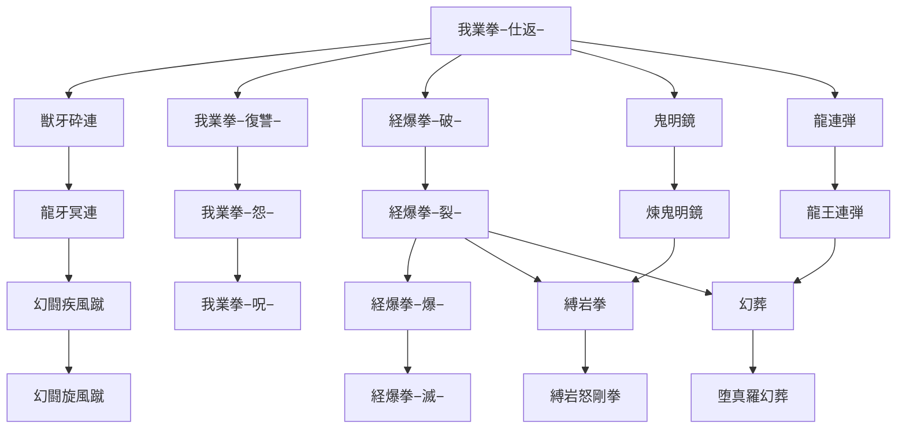

目次

*   [幻闘士の特徴](#幻闘士の特徴)
*   [スキルツリー](#スキルツリー)
    *   [ＣＭＤスキル](#ＣＭＤスキル)
        *   [復讐](#復讐)
        *   [連撃](#連撃)
        *   [状態異常・爆弾系](#状態異常爆弾系)
        *   [反撃](#反撃)
        *   [気功](#気功)
    *   [スキル入手方法](#スキル入手方法)

## 幻闘士の特徴
--------

> _『連続攻撃・連携攻撃』  
> 無限の可能性を秘めた打撃！  
> 肉弾戦のスペシャリスト！_

ただの打撃ではなく、そこに修練された技を組み入れた『幻闘士』 。  
攻撃力は相変わらず、さらに多彩なスキルを取り入れ、より強力になったといえるだろう。  
蝶のように舞い、蜂のように刺す。そして時には渾身の一撃で立ちふさがる敵を破壊する。

彼らと戦う相手は、幻のような攻撃に翻弄され、ただ倒されるのみとなる。  
拳を頼りに闘う『格闘士』がさらに上の位置に立ったとき、誰もが恐れる存在として  
君臨することになるかもしれない。

下位ジョブ：[格闘士](./fighter.md)  
サイドジョブ：[戦士](./warrior.md)　[守護魔導師](./guardian_mage.md)


## スキルツリー
--------

<table><tbody><tr><td></td><td>我業拳−仕返−</td><td></td><td></td><td></td></tr><tr><td>┏</td><td>╋</td><td>┳</td><td>┳</td><td>┓</td></tr><tr><td>獣牙砕連</td><td>我業拳−復讐−</td><td>経爆拳−破−</td><td>鬼明鏡</td><td>龍連弾</td></tr><tr><td>┃</td><td>┃</td><td>┃</td><td>┃</td><td>┃</td></tr><tr><td>龍牙冥連</td><td>我業拳−怨−</td><td>経爆拳−裂−</td><td>煉鬼明鏡</td><td>龍王連弾</td></tr><tr><td>┃</td><td>┃</td><td>┣</td><td>┳</td><td>┓</td></tr><tr><td>幻闘疾風蹴</td><td>我業拳−呪−</td><td>経爆拳−爆−</td><td>縛岩拳</td><td>幻葬</td></tr><tr><td>┃</td><td></td><td>┃</td><td>┃</td><td>┃</td></tr><tr><td>幻闘旋風蹴</td><td></td><td>経爆拳−滅−</td><td>縛岩怒剛拳</td><td>堕真羅幻葬</td></tr></tbody></table>




### ＣＭＤスキル


#### 復讐

##### <ruby><rb>我業拳−仕返−</rb><rp>(</rp><rt>がごうけん−しかえし−</rt><rp>)</rp></ruby>

* 消費AP: 18
* スピード: D
* 妨害値: 1 | 耐久値: 10
* 射程範囲: 上0・下0
```text
口■口
口↑口

```


* 効果範囲: 選択対象のみ
* 入手法: ドラクエ１、地/空☆

> 減少HPの約37.5%を防御状態・方向等に関係なく固定ダメージとして与える。(対人時25%)

##### <ruby><rb>我業拳−復讐−</rb><rp>(</rp><rt>がごうけん−ふくしゅう−</rt><rp>)</rp></ruby>

* 消費AP: 36
* スピード: D
* 妨害値: 1 | 耐久値: 10
* 射程範囲: 上0・下0
```text
口■口
口↑口

```


* 効果範囲: 選択対象のみ
* 入手法: 地/空☆、[ハバネロ]

> 減少HPの約75%を防御状態・方向等に関係なく固定ダメージとして与える。(対人時50%)

##### <ruby><rb>我業拳−怨−</rb><rp>(</rp><rt>がごうけん−うらみ−</rt><rp>)</rp></ruby>

* 消費AP: 54
* スピード: D
* 妨害値: 1 | 耐久値: 10
* 射程範囲: 上0・下0
```text
口■口
口↑口

```


* 効果範囲: 選択対象のみ
* 入手法: 地/空☆☆☆、[花]

> 減少HPの100%を防御状態・方向等に関係なく固定ダメージとして与える。(対人時65%)

##### <ruby><rb>我業拳−呪−</rb><rp>(</rp><rt>がごうけん−のろい−</rt><rp>)</rp></ruby>

* 消費AP: 72
* スピード: D
* 妨害値: 1 | 耐久値: 10
* 射程範囲: 上0・下0
```text
口■口
口↑口

```


* 効果範囲: 選択対象のみ
* 入手法: 地/空☆☆☆☆

> 減少HPの150%を防御状態・方向等に関係なく固定ダメージとして与える。(対人時80%)

#### 連撃

##### <ruby><rb>獣牙砕連</rb><rp>(</rp><rt>じゅうがさいれん</rt><rp>)</rp></ruby>

* 消費AP: 24
* スピード: D
* 妨害値: 6*3 | 耐久値: 4
* 射程範囲: 上１・下１
```text
口■口
口↑口

```


* 効果範囲: 選択対象のみ
* 入手法: 地/空☆(準レア)、[ハバネロ]

> ３連撃、それぞれの攻撃がダメ＋吹き飛ばし
> 命中判定は１回ごと黒印・床のダメージは終了後判定

##### <ruby><rb>龍牙冥連</rb><rp>(</rp><rt>りゅうがめいれん</rt><rp>)</rp></ruby>

* 消費AP: 38
* スピード: D
* 妨害値: 6*5 | 耐久値: 4
* 射程範囲: 上１・下１
```text
口■口
口↑口

```


* 効果範囲: 選択対象のみ
* 入手法: 地/空☆☆(準レア)、[ハバネロ] / [花]

> ５連撃、ダメ＋吹き飛ばし

##### <ruby><rb>幻闘疾風蹴</rb><rp>(</rp><rt>げんとうしっぷうしゅう</rt><rp>)</rp></ruby>

* 消費AP: 35
* スピード: D
* 妨害値: 6 | 耐久値: 6
* 射程範囲: 自分指定
* 効果範囲: 上1・下1
```text
■■■
■↑■
■■■

```


* 入手法: 地/空☆☆☆

> ダメ＋１グリッド飛

##### <ruby><rb>幻闘旋風蹴</rb><rp>(</rp><rt>げんとうせんぷうしゅう</rt><rp>)</rp></ruby>

* 消費AP: 45
* スピード: D
* 妨害値: 12 | 耐久値: 6
* 射程範囲: 自分指定
* 効果範囲: 上1・下1
```text
■■■
■↑■
■■■

```


* 入手法: 地/空★

> ダメ＋３グリッド飛

#### 状態異常・爆弾系

##### <ruby><rb>経爆拳−破−</rb><rp>(</rp><rt>けいばくけん−は−</rt><rp>)</rp></ruby>

* 消費AP: 25
* スピード: D
* 妨害値: - | 耐久値: -
* 射程範囲: 上１・下１
```text
口■口
口↑口

```


* 効果範囲:
```text
口■口
■■■
口■口

```


* 入手法: 地/空☆(レア)、[ハバネロ]

> 2T後に小爆発、爆発状態ユニットと周囲に爆発ダメージ
> （ダメージは爆弾状態ユニットの最大HP依存約1/8）

##### 経爆拳−裂−

* 消費AP: 30
* スピード: D
* 妨害値: - | 耐久値: -
* 射程範囲: 上１・下１
```text
口■口
口↑口

```


* 効果範囲:
```text
口口■口口
口■■■口
■■■■■
口■■■口
口口■口口

```


* 入手法: 地/空☆☆、[花]

> 4T後に中爆発、爆発状態ユニットと周囲に爆発ダメージ
> （ダメージは爆弾状態ユニットの最大HP依存約1/6）

##### 経爆拳−爆−

* 消費AP: 35
* スピード: D
* 妨害値: - | 耐久値: -
* 射程範囲: 上１・下１
```text
口■口
口↑口

```


* 効果範囲:
```text
口口口■口口口
口口■■■口口
口■■■■■口
■■■■■■■
口■■■■■口
口口■■■口口
口口口■口口口

```


* 入手法: 地/空☆☆☆

> 6T後に大爆発、爆発状態ユニットと周囲に爆発ダメージ
> （ダメージは爆弾状態ユニットの最大HP依存約1/4）

##### 経爆拳−滅−

* 消費AP: 40
* スピード: D
* 妨害値: - | 耐久値: -
* 射程範囲: 上１・下１
```text
口■口
口↑口

```


* 効果範囲:
```text
口口口口■口口口口
口口口■■■口口口
口口■■■■■口口
口■■■■■■■口
■■■■■■■■■
口■■■■■■■口
口口■■■■■口口
口口口■■■口口口
口口口口■口口口口

```


* 入手法: 地/空★

> 8T後に極大爆発、爆発状態ユニットと周囲に爆発ダメージ
> （ダメージは爆弾状態ユニットの最大HP依存約1/2）

##### <ruby><rb>縛岩拳</rb><rp>(</rp><rt>ばくがんけん</rt><rp>)</rp></ruby>

* 消費AP: 18
* スピード: D
* 妨害値: 1 | 耐久値: 6
* 射程範囲: 上1・下1
```text
■■■
■↑■

```


* 効果範囲: 選択対象のみ
* 入手法: 地/空☆☆☆☆

> 成功率50%程度で石化
> （石化状態2T）

##### 縛岩怒剛拳

* 消費AP: 28
* スピード: D
* 妨害値: ？？ | 耐久値: ？？
* 射程範囲: 上1・下1
```text
■■■
■↑■

```


* 効果範囲: 選択対象のみ
* 入手法: 地/空★(レア)

> 縛岩拳より成功率が高い
> （石化状態2T）

##### 幻葬

* 消費AP: 8
* スピード: D
* 妨害値: 1 | 耐久値: 10
* 射程範囲: 上1・下1
```text
■■■
■↑■

```


* 効果範囲: 選択対象のみ
* 入手法: 地/空☆☆☆☆

> 威力は拳突程度　これでHPが0になると即消滅する。（カウントダウンなし）

##### 堕真羅幻葬

* 消費AP: 22
* スピード: D
* 妨害値: 1 | 耐久値: 10
* 射程範囲: 上1・下1
```text
口■口
口↑口

```


* 効果範囲: 選択対象のみ
* 入手法: 地/空★

> 闘気を込めた一撃で戦闘不能と同時にユニットを葬り去る。威力が高い

#### 反撃

##### 鬼明鏡

* 消費AP: 20
* スピード: B
* 妨害値: 6 | 耐久値: -
* 射程範囲: 自分指定
* 効果範囲: 自己
* 入手法: 地/空☆☆(レア)、[花]

> 直接攻撃反撃状態(0T)、
> 反撃の際に相手を吹き飛ばす状態で身構える(ダメージ小＋１グリット飛ばし)

##### 煉鬼明鏡

* 消費AP: 24
* スピード: A
* 妨害値: 12 | 耐久値: -
* 射程範囲: 自分指定
* 効果範囲: 自己
* 入手法: 地/空☆☆☆(レア)

> 直接攻撃反撃状態(0T)、
> 反撃の際に相手を吹き飛ばす状態で身構える
> (命中率減少の追加効果(２T)＋ダメージ中＋３グリット飛ばし)


#### 気功

##### 龍連弾

* 消費AP: 92
* スピード: E
* 妨害値: - | 耐久値: -
* 射程範囲: 上２・下∞(?)
```text
口■口
口■口
口■口
口■口
口■口
口↑口

```


* 効果範囲: 選択対象のみ
* 入手法: 地/空☆☆

> 龍の形をした気を飛ばして対象２体を攻撃する(曲射)

##### 龍王連弾

* 消費AP: 94
* スピード: E
* 妨害値: - | 耐久値: -
* 射程範囲: 上２・下∞(?)
```text
口■口
口■口
口■口
口■口
口■口
口↑口

```


* 効果範囲: 選択対象のみ
* 入手法: 地/空☆☆☆☆

> 龍の形をした気を飛ばして対象３体を攻撃する(曲射)

### スキル入手方法

| クエスト | よく出る | 普通 | 準レア | レア |
| --- | --- | --- | --- | --- |
| 地/空☆ | 我業拳-仕返- | 我業拳-復讐- | 獣牙砕連 | 経爆拳-破- |
| 地/空☆☆ | 龍連弾 | 経爆拳-裂- | 龍牙冥連 | 鬼明鏡 |
| 地/空☆☆☆ | 幻闘疾風蹴 | 経爆拳-爆- | 我業拳-怨- | 煉鬼明鏡 |
| 地/空☆☆☆☆ | 我業拳−呪− | 龍王連弾 | 縛岩拳 | 幻葬 |
| 地/空★ | 幻闘旋風蹴 | 経爆拳-滅- | 堕真羅幻葬 | 縛岩怒剛拳 |
| ミニクエ(確率不明) |
| ハバネロ | 我業拳-復讐- | 獣牙砕連 | 経爆拳-破- | 龍牙冥連 |
| 花クエ | 経爆拳-裂- | 龍牙冥連 | 鬼明鏡 | 我業拳-怨- |
| クラゲ | 経爆拳-爆- | 我業拳-怨- | 煉鬼明鏡 | 縛岩拳 |
| 迷子 | 龍王連弾 | 縛岩拳 | 幻葬 | 堕真羅幻葬 |

