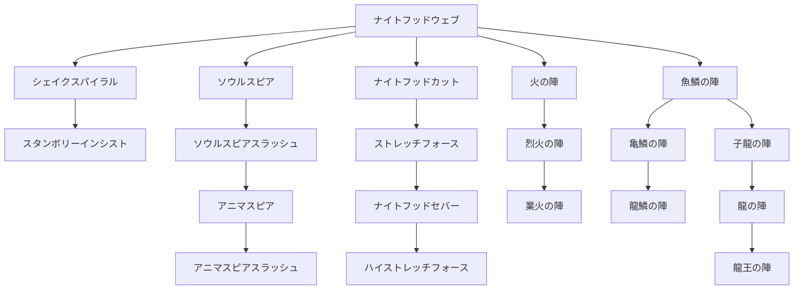

目次

* [騎士の特徴](#騎士の特徴)
* [スキルツリー](#スキルツリー)
  * [CMDスキル](#CMDスキル)
  * [スキル入手法](#スキル入手法)

## 騎士の特徴
-------

> _『陣形』を巧みに操りパーティの力を引き上げる！  
> 戦場の指揮官！_

『戦士』の発展系である『騎士』はやはり見た目どおりに、防御力にさらに磨きをかけたジョブのようだ。  
だがそれだけではなく、『陣形』によって味方の攻撃や防御をサポートし、最大限に能力を引き出すことができる。  
自分の采配次第で、PTの仲間が危機に陥ったり、逆に劣勢を挽回することだって十分にありえる。

今まで以上により慎重なキャラクター操作が必要になってくる。ぜひ今からでもプレイヤースキルを  
磨いて、味方から信頼を、敵には恐れられる戦場の指揮官を目指せ！！

下位ジョブ：[戦士](./warrior.md)  
サイドジョブ：盗賊　[格闘士](./fighter.md)


## スキルツリー
--------

<table><tbody><tr><td></td><td></td><td>ナイトフッドウェブ</td><td></td><td></td><td></td></tr><tr><td>┏</td><td>┳</td><td>╋</td><td>┳</td><td>┓</td><td></td></tr><tr><td>シェイクスパイラル</td><td>ソウルスピア</td><td>ナイトフッドカット</td><td>火の陣</td><td>魚鱗の陣</td><td></td></tr><tr><td>┃</td><td>┃</td><td>┃</td><td>┃</td><td>┣</td><td>┓</td></tr><tr><td>スタンボリーインシスト</td><td>ソウルスピアスラッシュ</td><td>ストレッチフォース</td><td>烈火の陣</td><td>亀鱗の陣</td><td>子龍の陣</td></tr><tr><td></td><td>┃</td><td>┃</td><td>┃</td><td>┃</td><td>┃</td></tr><tr><td></td><td>アニマスピア</td><td>ナイトフッドセバー</td><td>業火の陣</td><td>龍鱗の陣</td><td>龍の陣</td></tr><tr><td></td><td>┃</td><td>┃</td><td></td><td></td><td>┃</td></tr><tr><td></td><td>アニマスピアスラッシュ</td><td>ハイストレッチフォース</td><td></td><td></td><td>龍王の陣</td></tr></tbody></table>





### CMDスキル

### ナイトフッドウェブ

* 消費AP: 8
* スピード: D
* 妨害値: 0 | 耐久値: 10
* 射程: 上1・下1
```
■
↑

```


* 効果範囲: 指定対象のみ
* 入手法: [ドラ１] / 地/空☆

> 敵を正面から攻撃した時に最も大きいダメージを与えることが出来る。

### ナイトフッドカット

* 消費AP: 24
* スピード: C
* 妨害値: 0 | 耐久値: 10
* 射程: 上1・下1
```
■
↑

```


* 効果範囲: 指定対象のみ
* 入手法: 地/空☆ / [ハバネロ]

> ナイトフッドウェブの強力版。正面からの攻撃が最大ダメージ。

### ナイトフッドセバー

* 消費AP: 42
* スピード: B
* 妨害値: 0 | 耐久値: 10
* 射程: 上1・下1
```
■
↑

```


* 効果範囲: 指定対象のみ
* 入手法: 地☆☆☆☆

> ナイトフッドカットの強化版。正面からの攻撃が最大ダメージ。

### シェイクスパイラル

* 消費AP: 28
* スピード: D
* 妨害値: 0 | 耐久値: 10
* 射程: 上1・下1
```
■
↑

```


* 効果範囲: 指定対象のみ
* 入手法: 地/空☆(レア) / [ハバネロ]

> 横回転をしながら切りかかり、対象にダメージを与える。（2回連続攻撃：判定初回）

### スタンボリーインシスト

* 消費AP: 90
* スピード: D
* 妨害値: 0 | 耐久値: 10
* 射程: 上1・下1
```
■
↑

```


* 効果範囲: 指定対象のみ
* 入手法: 地/空☆☆☆(レア)

> 目にも止まらぬ連続攻撃で、対象にダメージを与える（10回連続攻撃：判定初回）

### ストレッチフォース

* 消費AP: 14
* スピード: C
* 妨害値: - | 耐久値: 1
* 射程: 上2・下2
```
■■↑■■
口■■■口
口口■口口

```


* 効果範囲: 指定対象のみ
* 入手法: 地☆☆(準レア) / [ハバネロ] / [花]

> 騎士道精神で、仲間に自分のHPを少しだけ分け与える。(自分のHP30%)

### ハイストレッチフォース

* 消費AP: 24
* スピード: B
* 妨害値: - | 耐久値: 1
* 射程: 上2・下2
```
■■↑■■
■■■■■
口■■■口

```


* 効果範囲: 指定対象のみ
* 入手法: 地★

> 騎士道精神で、仲間に自分のHPを分け与える。(自分のHP35%)

### ソウルスピア

* 消費AP: 28
* スピード: C
* 妨害値: 1 | 耐久値: 6
* 射程: 上1・下∞
```
■
■
■
■
↑

```


* 効果範囲: 指定対象まで
* 入手法: 地☆☆

> 精神力を槍の形に変化させて、対象に目掛けて飛ばして攻撃する。(直射)

### ソウルスピアスラッシュ

* 消費AP: 32
* スピード: C
* 妨害値: 1 | 耐久値: 6
* 射程: 上3・下∞
```
口■口
■■■
■口■
口↑口

```


* 効果範囲: 指定対象のみ
* 入手法: 地☆☆(レア) / [花]

> 精神力を槍の形に変化、高軌道で投射して対象を攻撃する。(曲射)

### アニマスピア

* 消費AP: 32
* スピード: D
* 妨害値: 1 | 耐久値: 6
* 射程: 上1・下∞
```
■
■
■
■
■
↑

```


* 効果範囲: 指定対象まで
* 入手法: 地☆☆☆

> 精神力を巨大な槍の形に変化させて、対象目掛けて飛ばして攻撃する。(直射・貫通)

### アニマスピアスラッシュ

* 消費AP: 42
* スピード: D
* 妨害値: 1 | 耐久値: 6
* 射程: 上3・下∞
```
口■口
■■■
■口■
口↑口

```


* 効果範囲:
```
口■口
■★■
口■口

```


* 入手法: 地☆☆☆☆

> 精神力を巨大な槍の形に変化、高軌道で投射して対象を攻撃する。(曲射)

### 火の陣

* 消費AP: 5
* スピード: A
* 妨害値: - | 耐久値: -
* 射程:
```
仲口仲
口↑口

```


* 効果範囲: 陣形を崩すと効果は消える
* 入手法: 地/空☆(準レア) / [ハバネロ]

> 3人用陣形スキル。陣形形成時に与えるダメージが増加する。
> 陣形内攻撃力上昇効果(2ターン後終了時まで10%UP)

### 烈火の陣

* 消費AP: 6
* スピード: A
* 妨害値: - | 耐久値: -
* 射程:
```
仲口仲
口↑口
口仲口

```


* 効果範囲: 陣形を崩すと効果は消える
* 入手法: 地☆☆☆

> 4人用陣形スキル。陣形形成時に与えるダメージが増加する。
> 陣形内攻撃力上昇効果(3ターン後終了時まで20%UP)

### 業火の陣

* 消費AP: 7
* スピード: A
* 妨害値: - | 耐久値: -
* 射程:
```
仲口口口仲
口口↑口口
口仲口仲口

```


* 効果範囲: 陣形を崩すと効果は消える
* 入手法: 地★

> 5人用陣形スキル。陣形形成時に与えるダメージが増加する。
> 陣形内攻撃力上昇効果(30%UP)

### 魚鱗の陣

* 消費AP: 5
* スピード: A
* 妨害値: - | 耐久値: -
* 射程:
```
口↑口
仲口仲

```


* 効果範囲: 陣形を崩すと効果は消える
* 入手法: 地☆☆ / [花]

> 3人用陣形スキル。陣形形成時に受けるダメージが減少する。
> 陣形内防御力上昇効果(2ターン後終了時まで10%軽減)

### 亀鱗の陣

* 消費AP: 6
* スピード: C
* 妨害値: - | 耐久値: -
* 射程:
```
仲↑仲
口仲口

```


* 効果範囲: 陣形を崩すと効果は消える
* 入手法: 地☆☆☆(準レア) / [花]

> 4人用陣形スキル。陣形形成時に受けるダメージが減少する。
> 陣形内防御力上昇効果(20%軽減)

### 龍鱗の陣

* 消費AP: 7
* スピード: A
* 妨害値: - | 耐久値: -
* 射程:
```
口仲口仲口
口口↑口口
仲口口口仲

```


* 効果範囲: 陣形を崩すと効果は消える
* 入手法: 地☆☆☆☆

> 5人用陣形スキル。陣形形成時に受けるダメージが減少する。
> 陣形内防御力上昇効果(30%軽減)

### 子龍の陣

* 消費AP: 5
* スピード: A
* 妨害値: - | 耐久値: -
* 射程:
```
仲↑仲

```


* 効果範囲: 陣形を崩すと効果は消える
* 入手法: 地☆☆☆☆

> 3人用陣形スキル。陣形形成時に状態異常になりにくくなる。(陣形内レジスト率上昇効果)

### 龍の陣

* 消費AP: 6
* スピード: A
* 妨害値: - | 耐久値: -
* 射程:
```
仲↑仲
口口口
口仲口

```


* 効果範囲: 陣形を崩すと効果は消える
* 入手法: 地★

> 4人用陣形スキル。陣形形成時に状態異常になりにくくなる。(陣形内レジスト率上昇効果)

### 龍王の陣

* 消費AP: 7
* スピード: A
* 妨害値: - | 耐久値: -
* 射程: ？？
* 効果範囲: 陣形を崩すと効果は消える
* 入手法: 地★

> 5人用陣形スキル。陣形形成時に状態異常になりにくくなる。(陣形内レジスト率上昇効果)

### スキル入手方法

| クエスト | よく出る | 普通 | 準レア | レア |
| --- | --- | --- | --- | --- |
| 地/空☆ | ナイトフッドウェブ | ナイトフッドカット | 火の陣 | シェイクスパイラル |
| 地/空☆☆ | ソウルスピア | 魚鱗の陣 | ストレッチフォース | ソウルスピアスラッシュ |
| 地/空☆☆☆ | アニマスピア | 烈火の陣 | 亀鱗の陣 | スタンボリーインシスト |
| 地/空☆☆☆☆ | 龍鱗の陣 | ナイトフッドセバー | アニマスピアスラッシュ | 子龍の陣 |
| 地/空★ | 龍の陣 | ハイストレッチフォース | 業火の陣 | 龍王の陣 |
| ミニクエ(確率不明) |
| ハバネロ | ナイトフッドカット | 火の陣 | シェイクスパイラル | ストレッチフォース |
| 花クエ | 魚鱗の陣 | ストレッチフォース | ソウルスピアスラッシュ | 亀鱗の陣 |
| クラゲ | 烈火の陣 | 亀鱗の陣 | スタンボリーインシスト | アニマスピアスラッシュ |
| 迷子 | ナイトフッドセバー | アニマスピアスラッシュ | 子龍の陣 | 龍の陣 |
