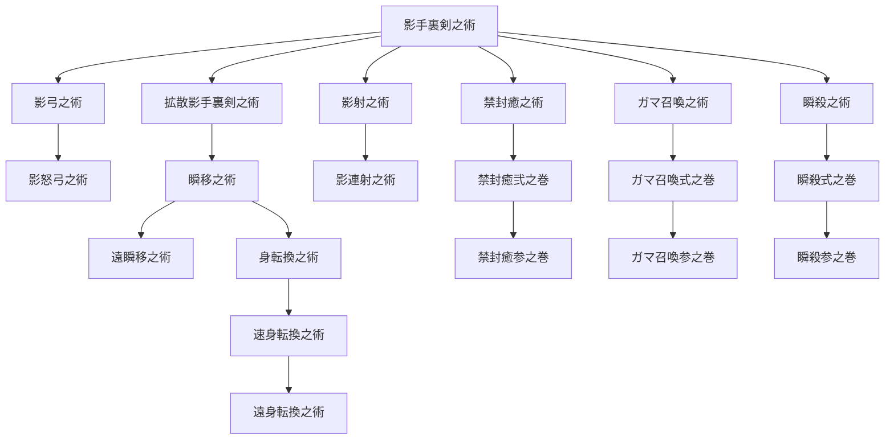

目次

* [忍者の特徴](#忍者の特徴)
* [スキルツリー](#スキルツリー)
    * [スキル説明](#スキル説明)
        * [基本系列スキル](#基本系列スキル)
        * [弓・ボウガンスキル](#弓ボウガンスキル)
        * [銃・ボウガンスキル](#銃ボウガンスキル)
        * [封印スキル](#封印スキル)
        * [召喚スキル](#召喚スキル)
        * [瞬撃スキル](#瞬撃スキル)
    * [スキル入手方法](#スキル入手方法)

## 忍者の特徴
-------

> _天をも欺く『忍術』パレード！  
> 一瞬の瞬きさえ許さない！　忍ぶトリックスター！_

忍術を修めた『盗賊』がなることができる『忍者』。盗賊時代のトリッキーな長所はそのまま  
変幻自在、予想不可能な忍術で相手を翻弄する。

フィールドを縦横無尽に駆け回り、得意の忍術で敵の裏をかき、惑わし、そして倒せ！  
手裏剣、忍術が飛び交う戦場は、彼らの独壇場になることだろう。  
戦局を支配するのは他の誰でもない『忍者』である。にんにん。

下位ジョブ：[盗賊](./thief.md)  
サイドジョブ：[黒印魔導師](./black_seal_magician.md) [戦士](./warrior.md)


## スキルツリー
--------

<table><tbody><tr><td></td><td>影手裏剣之術</td><td></td><td></td><td></td><td></td></tr><tr><td>┏</td><td>╋</td><td>┳</td><td>┳</td><td>┳</td><td>┓</td></tr><tr><td>影弓之術</td><td>拡散影手裏剣之術</td><td>影射之術</td><td>禁封癒之術</td><td>ガマ召喚之術</td><td>瞬殺之術</td></tr><tr><td>┃</td><td>┃</td><td>┃</td><td>┃</td><td>┃</td><td>┃</td></tr><tr><td>影怒弓之術</td><td>瞬移之術</td><td>影連射之術</td><td>禁封癒弐之巻</td><td>ガマ召喚弐之巻</td><td>瞬殺弐之巻</td></tr><tr><td></td><td>┣</td><td>┓</td><td>┃</td><td>┃</td><td>┃</td></tr><tr><td></td><td>遠瞬移之術</td><td>身転換之術</td><td>禁封癒参之巻</td><td>ガマ召喚参之巻</td><td>瞬殺参之巻</td></tr><tr><td></td><td></td><td>┃</td><td></td><td></td><td></td></tr><tr><td></td><td></td><td>速身転換之術</td><td></td><td></td><td></td></tr><tr><td></td><td></td><td>┃</td><td></td><td></td><td></td></tr><tr><td></td><td></td><td>遠身転換之術</td><td></td><td></td><td></td></tr></tbody></table>



### スキル説明

#### 基本系列スキル

##### <ruby><rb>影手裏剣之術</rb><rp>(</rp><rt>かげしゅりけんのじゅつ</rt><rp>)</rp></ruby>

* 消費AP: 6 | スピード: C
* 妨害値: 1 | 耐久値: 10 | 必須装備: 無し
* 射程範囲: 上×・下○
```text
口■■■■■■■口
口口■■■■■口口
口口口■■■口口口
口口口口■口口口口
口口口口↑口口口口

```


* タイプ＆範囲: 召喚、選択対象のみ
* 入手法: 忍者初期スキル、地☆1

> バリア・カウンター系スキルを無視して攻撃できる
> 攻撃力は武器に依存する。アローシュートの約65%
> ※攻撃属性：貫通

##### <ruby><rb>拡散影手裏剣之術</rb><rp>(</rp><rt>かくさんかげしゅりけんのじゅつ</rt><rp>)</rp></ruby>

* 消費AP: 14 | スピード: C
* 妨害値: 1 | 耐久値: 10 | 必須装備: 無し
* 射程範囲: 上×・下○
```text
口■■■■■■■口
口口■■■■■口口
口口口■■■口口口
口口口口■口口口口
口口口口↑口口口口

```


* タイプ＆範囲: 召喚、上1下1
```text
■■★■■

```


* 入手法: 地☆1、[ハバネロ]

> 死角から強力に手裏剣を投げて対象を攻撃。反射などを無効化する。

##### <ruby><rb>瞬移之術</rb><rp>(</rp><rt>またたきうつりのじゅつ</rt><rp>)</rp></ruby>

* 消費AP: 24 | スピード: C
* 妨害値: - | 耐久値: 6 | 必須装備: 無し
* 射程範囲: 上1下1
```text
口■口
■↑■

```


* タイプ＆範囲: -
* 入手法: 地☆2(準レア)、[ハバネロ] / [花]

> 自分がいる場所を一瞬で移動する。

##### <ruby><rb>遠瞬移之術</rb><rp>(</rp><rt>おとまたたきうつりのじゅつ</rt><rp>)</rp></ruby>

* 消費AP: 50 | スピード: D
* 妨害値: - | 耐久値: 6 | 必須装備: 無し
* 射程範囲: 上1下1
```text
口口■口口
口■■■口
■■↑■■

```


* タイプ＆範囲: -
* 入手法: 地☆4

> 自分がいる場所を一瞬で移動する射程範囲が少し長い。

##### <ruby><rb>身転換之術</rb><rp>(</rp><rt>むくろうたたかのじゅつ</rt><rp>)</rp></ruby>

* 消費AP: 48 | スピード: D
* 妨害値: - | 耐久値: 10 | 必須装備: 無し
* 射程範囲: 上1下1
```text
口■口
■↑■

```


* タイプ＆範囲: -
* 入手法: 地☆4（準レア）

> 周囲にいる対象との位置を入れ替える。

##### <ruby><rb>速身転換之術</rb><rp>(</rp><rt>はやむくろうたたかのじゅつ</rt><rp>)</rp></ruby>

* 消費AP: 54 | スピード: C
* 妨害値: - | 耐久値: 6 | 必須装備: 無し
* 射程範囲: 上1下1
```text
口■口
口↑口

```


* タイプ＆範囲: -
* 入手法: 地☆5

> 周囲にいる対象との位置を入れ替える。速度が少し速い。

##### <ruby><rb>遠身転換之術</rb><rp>(</rp><rt>おとむくろうたたかのじゅつ</rt><rp>)</rp></ruby>

* 消費AP: 58 | スピード: D
* 妨害値: - | 耐久値: 6 | 必須装備: 無し
* 射程範囲: 上1下1
```text
口口■口口
口■■■口
■■↑■■
口■口■口

```


* タイプ＆範囲: -
* 入手法: 地☆5

> 周囲にいる対象との位置を入れ替える。射程範囲が少し長い。

#### 弓・ボウガンスキル

*   弓・ボウガン装備時のみ使用可能。

##### 影弓之術

* 消費AP: 8 | スピード: D
* 妨害値: 1 | 耐久値: 10 | 必須装備: 弓・ボウガン
* 射程範囲: 上×下○
```text
口口■口口
口■■■口
口■口■口
口口口口口
口口↑口口

```


* タイプ＆範囲: 召喚
* 入手法: 地☆2

> 死角から矢を放ち、対象を攻撃する。反射などを無効化する。
> 威力はアローシュートと同じ。

##### <ruby><rb>影怒弓之術</rb><rp>(</rp><rt>かげいかりゆみのじゅつ</rt><rp>)</rp></ruby>

* 消費AP: 18 | スピード: D
* 妨害値: 1 | 耐久値: 10 | 必須装備: 弓・ボウガン
* 射程範囲: 上×下○
```text
口口■口口
口■■■口
口■口■口
口口口口口
口口↑口口

```


* タイプ＆範囲: 召喚
* 入手法: 地☆3

> 死角から強力に矢を放ち、対象を攻撃する。反射などを無効。
> 威力はアローシュートの約1.3倍。


#### 銃・ボウガンスキル

*   銃・ボウガン装備時のみ使用可能。

##### <ruby><rb>影射之術</rb><rp>(</rp><rt>かげいりのじゅつ</rt><rp>)</rp></ruby>

* 消費AP: 12 | スピード: D
* 妨害値: 1 | 耐久値: 10 | 必須装備: 銃・ボウガン
* 射程範囲: 上×下○
```text
■■■■■
口■■■口
口■■■口
口口■口口
口口■口口
口口↑口口

```


* タイプ＆範囲: 召喚
* 入手法: 地☆2、[花]

> 死角から銃を撃ち、対象を攻撃する。反射などを無効化する。
> 威力はバレットファイアと同じ。

##### <ruby><rb>影連射之術</rb><rp>(</rp><rt>かげつがりいりのじゅつ</rt><rp>)</rp></ruby>

* 消費AP: 30 | スピード: D
* 妨害値: 1 | 耐久値: 10 | 必須装備: 銃・ボウガン
* 射程範囲: 上×下○
```text
■■■■■
口■■■口
口■■■口
口口■口口
口口■口口
口口↑口口

```


* タイプ＆範囲: 召喚
```text
■★■

```


* 入手法: 地☆3

> 死角から銃を撃ち、範囲内の対象を攻撃する。反射などを無効化する。
> 威力は影射より約13％↑


#### 封印スキル

##### <ruby><rb>禁封癒之術</rb><rp>(</rp><rt>きんふうゆのじゅつ</rt><rp>)</rp></ruby>

* AP: 18 | スピード: D
* 妨害値: - | 耐久値: 10 | 必須装備: なし
* 射程範囲: 上1下1
```text
口■口
■■■
■↑■

```


* タイプ＆範囲: -
* 入手法: 地☆1(準レア)、[ハバネロ]

> 対象に回復を無効化するバリアを張ります。
> 軽めの装備だとリカバースクエアより遅くハイリカバースクエアより早い。
> [回復無効バリア]効果(2T)

##### 禁封癒弐之巻

* AP: 26 | スピード: D
* 妨害値: - | 耐久値: 10 | 必須装備: なし
* 射程範囲: 上1下1
```text
口口■口口
口■■■口
■■↑■■
口■口■口

```


* タイプ＆範囲: -
* 入手法: 地☆2(レア)、[花]

> 少し離れた場所にいる対象に、回復を無効化するバリアを張ります。
> 軽めの装備だとリカバーより遅くハイリカバーより早い。
> [回復無効バリア]効果(3T)

##### 禁封癒参之巻

* AP: 34 | スピード: D
* 妨害値: - | 耐久値: 10 | 必須装備: なし
* 射程範囲: 上1下1
```text
口口■口口
口■■■口
■■口■■
■口↑口■

```


* タイプ＆範囲: 召喚、上0下0
```text
口■口
■★■
口■口

```


* 入手法: 地☆4

> 離れた場所にいる対象に、回復を無効化するバリアを張ります。
> 軽めの装備だとプチリカバーより遅くリカバーより早い。
> [回復無効バリア]効果(2T)

*   相関関係
*   ＝ : どちらのバリアも張ろうとすると、それまで張られていたバリアを破壊するのみ。
*   ＞ : 張ろうとするバリアは『張れなかった』と言うメッセージが表示され、バリアが張れない。
*   ＜ : それまで張られているバリアの効果を消した上で、新たにバリアを張る。(バリア上書き)

| 相手にかかっているバリア | 強さ | かけようとするバリア |
| --- | --- | --- |
| 状態異常無効バリア状態 | ＝ | 回復無効バリア |
| 物理攻撃○○バリア状態 | ≧ | 回復無効バリア　ダメージは1点扱い。 |
| 魔法攻撃無効バリア状態 | ＞ | 回復無効バリア |
| 魔法攻撃反射バリア状態 | ＜ | 回復無効バリア |
| 次元無効バリア状態 | ＞ | 回復無効バリア |
| 回復無効バリア状態 | ＞ | 物理攻撃○○バリア  
魔法攻撃○○バリア |
| 回復無効バリア状態 | ＜ | 状態異常無効バリア  
投射攻撃無効バリア |
| 回復無効バリア状態 | ＞ | 次元無効バリア |


#### 召喚スキル

##### ガマ召喚之術

* AP: 8 (毎ターン-1) | スピード: D
* 妨害値: - | 耐久値: 10 | 必須装備: なし
* 射程範囲:
```text
■■■
■↑■

```


* タイプ＆範囲: 召喚
* 入手法: 地☆1(レア)、[ハバネロ]

> 対象を攻撃する忍者カエルを召喚する。

##### ガマ召喚弐之巻

* AP: 14 (毎ターン-2) | スピード: B
* 妨害値: - | 耐久値: 10 | 必須装備: なし
* 射程範囲:
```text
■
↑

```


* タイプ＆範囲: -
* 入手法: 地☆3(レア)

> 対象を攻撃する、強い忍者カエルを召喚する。

##### ガマ召喚参之巻

* AP: 20 (毎ターン-2) | スピード: D
* 妨害値: - | 耐久値: 10 | 必須装備: なし
* 射程範囲:
```text
■■■
■↑■

```


* タイプ＆範囲: -
* 入手法: 地☆5（レア）

> 対象を攻撃する、とても強い忍者カエルを召喚する。

*   ガマのステータス

| 名前 | HP | 備考 |
| --- | --- | --- |
| ガマ子 | 8 | ガマ撃:油まみれ効果(?T) |
| ガマ兄 | 12 | ガマ撃:油まみれ効果(?T)  
ガマ連撃：2回攻撃　AP10 |
| ガマ父 | 16 | ガマ撃:油まみれ効果(?T)  
ガマ連撃：2回攻撃　AP10  
ガマ縛り:麻痺効果(1T)　AP15 |


#### 瞬撃スキル

##### 瞬殺之術

* AP: 24 | スピード: C
* 妨害値: - | 耐久値: - | 必須装備: 短剣
* 射程範囲: 上0 下0
```text
■
↑

```


* タイプ＆範囲: -
* 入手法: 地☆3、[花]

> 対象の背後から急所を狙い絶命させる。成功率はとても低い。

##### 瞬殺弐之巻

* AP: 36 | スピード: C
* 妨害値: - | 耐久値: - | 必須装備: 短剣
* 射程範囲: 上0 下0
```text
■
↑

```


* タイプ＆範囲: -
* 入手法: 地4(レア)

> 対象の背後から急所を狙い攻撃して絶命させる。成功率は低い。

##### 瞬殺参之巻

* AP: 48 | スピード: D
* 妨害値: - | 耐久値: - | 必須装備: 短剣
* 射程範囲: 上0 下0
```text
■
↑

```


* タイプ＆範囲: -
* 入手法: 地☆5(準レア)

> 対象の背後から急所を狙い攻撃して絶命させる。成功率は高くない。

### スキル入手方法

| クエスト | よく出る | 普通 | 準レア | レア |
| --- | --- | --- | --- | --- |
| 地/空☆ | 影手裏剣之術 | 拡散影手裏剣之術 | 禁封癒之術 | ガマ召喚之術 |
| 地/空☆☆ | 影弓之術 | 影射之術 | 瞬移之術 | 禁封癒弐之巻 |
| 地/空☆☆☆ | 影怒弓之術 | 影連射之術 | 瞬殺之術 | ガマ召喚弐之巻 |
| 地/空☆☆☆☆ | 遠瞬移之術 | 禁封癒参之巻 | 身転換之術 | 瞬殺弐之巻 |
| 地/空★ | 速身転換之術 | 遠身転換之術 | 瞬殺参之巻 | ガマ召喚参之巻 |
| ミニクエ(確率不明) |
| ハバネロ | 拡散影手裏剣之術 | 禁封癒之術 | ガマ召喚之術 | 瞬移之術 |
| 花クエ | 影射之術 | 瞬移之術 | 禁封癒弐之巻 | 瞬殺之術 |
| クラゲ | 影連射之術 | 瞬殺之術 | ガマ召喚弐之巻 | 身転換之術 |
| 迷子 | 禁封癒参之巻 | 身転換之術 | 瞬殺弐之巻 | 瞬殺参之巻 |
