目次

* [精霊魔導師の特徴](#精霊魔導師の特徴)
* [スキル](#スキル)
    * [スキルツリー](#スキルツリー)
    * [CMDスキル](#CMDスキル)
        * [基本スキル](#基本スキル)
        * [派生スキル](#派生スキル)
        * [サイドスキル（守護魔導師）](#サイドスキル守護魔導師)
        * [サイドスキル（黒印魔導師）](#サイドスキル黒印魔導師)
    * [PSVスキル](#PSVスキル)
    * [入手クエスト](#入手クエスト)
* [よくある質問](#よくある質問)

## 精霊魔導師の特徴
----------

> エレメントの力を借りた、  
> 攻撃魔法のスペシャリスト！！

精霊魔導師の攻撃魔法には威力が高く  
広範囲に効果が及ぶものが存在するので、  
複数の敵を一度に相手にする時などには  
大活躍が期待できます。

しかし強力な魔法の詠唱にはそれなりの時間が必要で、  
その無防備な間に攻撃を受けると  
魔法が失敗する恐れもあります\*1。

防御力が低いということもあり、強力な魔法の行使には  
仲間の援護が欠かせない要素と言えるでしょう。

全てのスキルは射線で分類され、障害物によって受ける影響が異なります。

召喚

自分と対象の間の障害物は関係無く、指定したキャラ・地点を対象として発動します。

直線投射

自分と対象の間に高い障害物や他のキャラがあると、攻撃対象として指定できなかったり、他のキャラに当たったりします。

曲線投射

直線投射と似ていますが、ある程度の高さの障害物や他のキャラを飛び越えることができます。

直接

接近戦専用の魔法の一部がこの分類です。

■サイドジョブ:[守護魔導師](./guardian_mage.md) 黒印魔導師  
■上位ジョブ:[召喚天導師](./summoning_celestial_guide.md)


## スキル
-----


### スキルツリー

※ツリーの右側2列はサイドジョブのレベルを上げないと覚えることができない

```mermaid
graph TD
    %% --- 初期スキル (Root) ---
    FireBall[ファイアボール]
    LittleForce[リトルフォース]
    AquaBall[アクアボール]
    MudHand[マドハンド]
    
    %% --- 第2階層 ---
    FireShoot[ファイアシュート]
    WindEdge[ウィンドエッジ]
    AquaService[アクアサービスボール]
    RockMissile[ロックミサイル]

    %% 基本接続
    FireBall --> FireShoot
    LittleForce --> WindEdge
    AquaBall --> AquaService
    MudHand --> RockMissile

    %% 複合属性への派生 (第2階層)
    FlameEdge[フレイムエッジ]
    WaterEdge[ウォーターエッジ]

    FireShoot --> FlameEdge
    WindEdge --> FlameEdge
    WindEdge --> WaterEdge
    AquaService --> WaterEdge

    %% 複雑な派生: アクアサービスボールから右への分岐
    %% アクアサービスボールはロックミサイルへ繋がりつつ、下のリーフブレードへも派生
    AquaService --> RockMissile
    AquaService --> LeafBlade[リーフブレード]

    %% --- 第3階層 ---
    Lilbomb[リルボム]
    WindJammer[ウィンドジャマー]
    AirClear[エアクリア]
    Mirage[ミラージュ]
    RockLance[ロックランス]

    FireShoot --> Lilbomb
    WindEdge --> WindJammer
    WindJammer --> AirClear
    AquaService --> Mirage
    RockMissile --> RockLance

    %% 複合: リーフブレード
    Mirage --> LeafBlade

    %% --- 第4階層 ---
    HeatTouch[ヒートタッチ]
    Vacuum[バキューム]
    IceMissile[アイスミサイル]
    BindIvy[バインドアイビー]
    FallStone[フォールストーン]

    Lilbomb --> HeatTouch
    AirClear --> Vacuum
    Mirage --> IceMissile
    LeafBlade --> BindIvy
    RockLance --> FallStone

    %% --- 第5階層 ---
    GrandFlame[グランドフレイム]
    AmazingWind[アメージングウィンド]
    WaterLine[ウォーターライン]
    GreenGreen[グリーングリーン]
    PetitMeteor[プチメテオ]

    HeatTouch --> GrandFlame
    Vacuum --> AmazingWind
    IceMissile --> WaterLine
    FallStone --> PetitMeteor

    %% 複合: グリーングリーン
    BindIvy --> GreenGreen
    WaterLine --> GreenGreen

    %% --- 第6階層 ---
    FlamePole[フレイムポール]
    DemationWind[デメーションウィンド]
    SparkBall[スパークボール]
    DiamondDust[ダイヤモンドダスト]
    EarthQuake[アースクエイク]

    GrandFlame --> FlamePole
    AmazingWind --> DemationWind
    WaterLine --> DiamondDust
    PetitMeteor --> EarthQuake

    %% 複合: スパークボール周辺
    DemationWind --> SparkBall
    SparkBall --> DiamondDust

    %% 派生: サンドストーム
    SandStorm[サンドストーム]
    FlamePole --> SandStorm

    %% --- 第7階層 ---
    SelfBurning[セルフバーニング]
    Santana[サンターナ]
    Hurricane[ハリケーン]
    ThunderShoot[サンダーシュート]
    AbsoluteZero[絶対零度]
    Meteo[メテオ]

    FlamePole --> SelfBurning
    SandStorm --> Santana
    DemationWind --> Hurricane
    SparkBall --> ThunderShoot
    DiamondDust --> AbsoluteZero
    EarthQuake --> Meteo

    %% --- 第8階層 ---
    Exbomb[エクスボム]
    DoubleHurricane[ダブルハリケーン]
    ThunderImpact[サンダーインパクト]
    MeteoRush[メテオラッシュ]

    SelfBurning --> Exbomb
    Hurricane --> DoubleHurricane
    ThunderShoot --> ThunderImpact
    Meteo --> MeteoRush

    %% 複合: サンダーインパクト
    DoubleHurricane --> ThunderImpact

    %% --- 第9階層 ---
    Magma[マグマ]
    TripleHurricane[トリプルハリケーン]
    ThunderBolt[サンダーボルト]

    Exbomb --> Magma
    DoubleHurricane --> TripleHurricane
    ThunderImpact --> ThunderBolt

    %% --- サイドジョブ (独立ツリー) ---
    subgraph SideGuardian [サイド守護]
        Repair[リペアー] --> RepairSquare[リペアースクエア]
        RepairSquare --> RepairBall[リペアーボール]
        RepairBall --> PhysicalDefeat[フィジカルデフィート]
        PhysicalDefeat --> MagicalDefeat[マジカルデフィート]
    end

    subgraph SideDarkSeal [サイド黒印]
        Sticky[スティッキー] --> Clarity[クラリティー]
        Clarity --> NightmareImpulse[ナイトメアインパルス]
        NightmareImpulse --> SlipTrap[スリップトラップ]
        SlipTrap --> ArtificialSpell[アーティフィシャルスペル]
    end
```

<table><tbody><tr><td><span style="color:#FFFAFF">──────</span><br class="spacer">ＰＳＶ<br class="spacer"><span style="color:#FFFAFF">──────</span></td><td></td><td></td><td>リトル<br class="spacer">フォース</td><td></td><td></td><td></td><td></td><td>サイド守護<br class="spacer">レベル5</td><td>サイド黒印<br class="spacer">レベル5</td></tr><tr><td>フレイム<br class="spacer">デミニッシュ</td><td><span style="color:#FFEEEE">──</span>┏━━<br class="spacer">ファイア<br class="spacer">ボール</td><td>━━━━━<br class="spacer"><span style="color:#FFFEEE">─</span><br class="spacer"><span style="color:#FFFEEE">─</span></td><td>━━╋━━<br class="spacer">ウィンド<br class="spacer">エッジ</td><td>━━━━━<br class="spacer"><span style="color:#FAFAFF">─</span><br class="spacer"><span style="color:#FAFAFF">─</span></td><td>━━┳━━<br class="spacer">アクア<br class="spacer">ボール</td><td>━━━━━<br class="spacer"><span style="color:#FAFFFA">─</span><br class="spacer"><span style="color:#FAFFFA">─</span></td><td>━━┳━━<br class="spacer">マドハンド<br class="spacer"><span style="color:#FFFFEE">｜</span></td><td>━━┳━━<br class="spacer">リペアー<br class="spacer"><span style="color:#FFFAFA">│</span></td><td>━━┓<span style="color:#FFEEFF">──</span><br class="spacer">スティッキー<br class="spacer"><span style="color:#FFEEFF">│</span></td></tr><tr><td>コールド<br class="spacer">デミニッシュ</td><td><span style="color:#FFEEEE">──</span>┣━━<br class="spacer">ファイア<br class="spacer">シュート</td><td>━┓<span style="color:#FFFFFA">─</span>┏━<br class="spacer">フレイム<br class="spacer">エッジ</td><td>━━╋━━<br class="spacer">ウィンド<br class="spacer">ジャマー</td><td>━┓<span style="color:#FAFFFF">─</span>┏━<br class="spacer">ウォーター<br class="spacer">エッジ</td><td>━━┫<span style="color:#EEFFFF">──</span><br class="spacer">アクアサー<br class="spacer">ビスボール</td><td><span style="color:#FAFFFA">──</span>┏━━<br class="spacer">┃<br class="spacer">┃</td><td>━━┫<span style="color:#FFFFEE">──</span><br class="spacer">ロック<br class="spacer">ミサイル</td><td><span style="color:#FFFAFA">L10</span>┃L10<br class="spacer">リペアー<br class="spacer">スクエア</td><td><span style="color:#FFEEFF">L10</span>┃L10<br class="spacer">クラリティー<br class="spacer"><span style="color:#FFEEFF">│</span></td></tr><tr><td>サンダー<br class="spacer">デミニッシュ</td><td>┃<br class="spacer">リルボム<br class="spacer"><span style="color:#FFEEEE">│</span></td><td></td><td>┃<br class="spacer">エアクリア<br class="spacer"><span style="color:#EEFFEE">│</span></td><td></td><td><span style="color:#EEFFFF">──</span>┣━━<br class="spacer">ミラージュ<br class="spacer"><span style="color:#EEFFFF">│</span></td><td>━┓┃<span style="color:#FAFFFA">──</span><br class="spacer">リーフ<br class="spacer">ブレード</td><td>┃<br class="spacer">ロック<br class="spacer">ランス</td><td><span style="color:#FFFAFA">L15</span>┃L15<br class="spacer">リペアー<br class="spacer">ボール</td><td><span style="color:#FFEEFF">L15</span>┃L15<br class="spacer">ナイトメア<br class="spacer">インパルス</td></tr><tr><td>ポイズン<br class="spacer">デミニッシュ</td><td>┃<br class="spacer">ヒートタッチ<br class="spacer"><span style="color:#FFEEEE">│</span></td><td></td><td>┃<br class="spacer">バキューム<br class="spacer"><span style="color:#EEFFEE">│</span></td><td></td><td>┃<br class="spacer">アイス<br class="spacer">ミサイル</td><td>┃<br class="spacer">バインド<br class="spacer">アイビー</td><td>┃<br class="spacer">フォール<br class="spacer">ストーン</td><td><span style="color:#FFFAFA">L20</span>┃L20<br class="spacer">フィジカル<br class="spacer">デフィート</td><td><span style="color:#FFEEFF">L20</span>┃L20<br class="spacer">スリップ<br class="spacer">トラップ</td></tr><tr><td>メンタル<br class="spacer">デミニッシュ</td><td>┃<br class="spacer">グランド<br class="spacer">フレイム</td><td><span style="color:#FFFEEE">──</span>┏━━<br class="spacer">┃<br class="spacer">┃</td><td>━━┫<span style="color:#EEFFEE">──</span><br class="spacer">アメージング<br class="spacer">ウィンド</td><td></td><td><span style="color:#EEFFFF">──</span>┣━━<br class="spacer">ウォーター<br class="spacer">ライン</td><td>━┓┃<span style="color:#FAFFFA">──</span><br class="spacer">グリーン<br class="spacer">グリーン</td><td>┃<br class="spacer">プチメテオ<br class="spacer"><span style="color:#FFFFEE">｜</span></td><td><span style="color:#FFFAFA">L25</span>┃L25<br class="spacer">マジカル<br class="spacer">デフィート</td><td><span style="color:#FFEEFF">L25</span>┃L25<br class="spacer">アーティフィ<br class="spacer">シャルスペル</td></tr><tr><td>サラマンダー<br class="spacer">の加護</td><td><span style="color:#FFEEEE">──</span>┣━━<br class="spacer">フレイム<br class="spacer">ポール</td><td>━┓┃<span style="color:#FFFFFA">──</span><br class="spacer">サンド<br class="spacer">ストーム</td><td>┃<br class="spacer">デメーション<br class="spacer">ウィンド</td><td><span style="color:#FAFFFF">──</span>┏━━<br class="spacer">スパーク<br class="spacer">ボール</td><td>━━┫<span style="color:#EEFFFF">──</span><br class="spacer">ダイヤモンド<br class="spacer">ダスト</td><td></td><td>┃<br class="spacer">アース<br class="spacer">クエイク</td><td></td><td></td></tr><tr><td>ウィンディー<br class="spacer">ネの加護</td><td>┃<br class="spacer">セルフ<br class="spacer">バーニング</td><td>┃<br class="spacer">サンターナ<br class="spacer"><span style="color:#FFFFFA">─</span></td><td>┃<br class="spacer">ハリケーン<br class="spacer"><span style="color:#EEFFEE">│</span></td><td>┃<br class="spacer">サンダー<br class="spacer">シュート</td><td>┃<br class="spacer">絶対零度<br class="spacer"><span style="color:#EEFFFF">─</span></td><td></td><td>┃<br class="spacer">メテオ<br class="spacer"><span style="color:#FFFFEE">｜</span></td><td></td><td></td></tr><tr><td>ノーム<br class="spacer">の加護</td><td>┃<br class="spacer">エクスボム<br class="spacer"><span style="color:#FFEEEE">│</span></td><td></td><td><span style="color:#EEFFEE">──</span>┣━━<br class="spacer">ダブル<br class="spacer">ハリケーン</td><td>━┓┃<span style="color:#FAFFFF">──</span><br class="spacer">サンダー<br class="spacer">インパクト</td><td></td><td></td><td>┃<br class="spacer">メテオ<br class="spacer">ラッシュ</td><td></td><td></td></tr><tr><td>シルフ<br class="spacer">の加護</td><td>┃<br class="spacer">マグマ<br class="spacer"><span style="color:#FFEEEE">─</span></td><td></td><td>┃<br class="spacer">トリプル<br class="spacer">ハリケーン</td><td>┃<br class="spacer">サンダー<br class="spacer">ボルト<br class="spacer"></td><td></td><td></td><td></td><td></td><td></td></tr><tr><td>マジック<br class="spacer">ライズ</td><td><span style="color:#FFEEEE">──────</span><br class="spacer"><span style="color:#FFEEEE">──────</span><br class="spacer"><span style="color:#FFEEEE">──────</span></td><td><span style="color:#FFFFFA">──────</span></td><td><span style="color:#EEFFEE">──────</span></td><td><span style="color:#FAFFFF">──────</span></td><td><span style="color:#EEFFFF">──────</span></td><td><span style="color:#FAFFFA">──────</span></td><td><span style="color:#FFFFEE">──────</span></td><td><span style="color:#FFFAFA">──────</span></td><td><span style="color:#FFEEFF">──────</span></td></tr></tbody></table>





### CMDスキル


#### 基本スキル


##### リトルフォース

* AP: 3 | スピード: D (2100)
* 妨害値: 1 | 耐久値: 10
* タイプ: 召喚 | 物理: 衝撃 | 魔法: 心
* 射程: 上3・下3
```text
口口■口口
口■口■口
■口↑口■

```


* 効果範囲: 指定地点から 上2・下2
```text
口■口
■◆■
口■口

```


* 入手法: 初期所持

> 想像した攻撃のイメージを実体化して、範囲内のユニットを攻撃。

##### ファイアボール

* AP: 6 | スピード: D (2300)
* 妨害値: 1 | 耐久値: 8
* タイプ: 直線 | 物理: 衝撃 | 魔法: 炎熱
* 射程: 上1
```text
口■■■口
口■■■口
口口■口口
口口■口口
口口↑口口

```


* 効果範囲: -
* 入手法: 店売り300 / [☆]

> 火の玉を発射して、対象にダメージを与える。
> (オイル状態時: 4T炎上付与)

##### ファイアシュート

* AP: 18 | スピード: D (2400)
* 妨害値: 1 | 耐久値: 8
* タイプ: 曲線 | 物理: 貫通 | 魔法: 炎熱
* 射程: 上3
```text
口口■口口
口■■■口
口■■■口
口■口■口
口口口口口
口口↑口口

```


* 効果範囲: -
* 入手法: 店売り:600 / [☆☆]

> 火矢を発射して、対象にダメージを与える。
> (オイル状態時: 4T炎上付与)

##### リルボム

* AP: 24 | スピード: D (1500)
* 妨害値: 1 | 耐久値: 8
* タイプ: 召喚 | 物理: 衝撃 | 魔法: 炎熱
* 射程: 上3・下3
```text
口口■口口
口■■■口
■■↑■■

```


* 効果範囲: -
* 入手法: [☆☆☆]

> 爆発を発生させて、対象にダメージを与える。
> 精霊のスピードＤスキル中最速

##### ヒートタッチ

* AP: 18 | スピード: D (1900)
* 妨害値: 1 | 耐久値: 8
* タイプ: 直接 | 物理: 衝撃 | 魔法: 炎熱
* 射程: 上1・下1
```text
口■口
口↑口

```


* 効果範囲: -
* 入手法: [☆☆☆☆] / 焼肉

> 直接体内にエネルギーを流し込み、爆発を発生させて、対象にダメージを与える。
> 直接攻撃でありカウンター状態で回避・反撃される。
> 魔法なので物理バリアは効果が無く、魔法バリアは反応する。

##### グランドフレイム

* AP: 34 | スピード: D (2600)
* 妨害値: 1 | 耐久値: 8
* タイプ: 召喚 | 物理: 衝撃 | 魔法: 炎熱
* 射程: 上3・下3 (地面3ヶ所指定)
```text
■■■■■■■
口■■■■■口
口口■■■口口
口口口■口口口
口口口↑口口口

```


* 効果範囲: -
* 入手法: [★]

> 火柱を発生させて、対象３体にダメージを与える。

##### フレイムポール

* AP: 42 | スピード: D (2500)
* 妨害値: 1 | 耐久値: 8
* タイプ: 召喚 | 物理: 衝撃 | 魔法: 炎熱
* 射程: 指定: 上0・下0 / 発動: 上1・下1
```text
口口■口口
口■口■口
口口口口口
口口↑口口

```


* 効果範囲: ■＋縦横2マス (地面指定)
* 入手法: [★☆☆☆] / 果実 / 石碑 / ゴブリン

> 巨大火柱を発生させて、範囲内の全ユニットにダメージを与える。

##### セルフバーニング

* AP: 14 | スピード: C (850)
* 妨害値: 1 | 耐久値: 6
* タイプ: 召喚 | 物理: 衝撃 | 魔法: 炎熱
* 射程: 上3・下3
```text
口■口
■↑■
口■口

```


* 効果範囲: ■全てのマス (1グリッド吹き飛ばし)
* 入手法: [★★] / 石碑 / 海賊 / カエル

> 体の周りに火球を発生させて、範囲内の全ユニットにダメージを与える。

##### エクスボム

* AP: 36 | スピード: D (2700)
* 妨害値: 12 | 耐久値: 6
* タイプ: 曲線 | 物理: 衝撃 | 魔法: 炎熱
* 射程: 上3
```text
口口■口口
口口■口口
口口口口口
口口口口口
口口口口口
口口↑口口

```


* 効果範囲: ■＋縦横1マス (吹き飛ばし2マス)
* 入手法: [★★☆☆] / 海賊 / 踊り子

> 爆発する火球を発射して、範囲内の全ユニットにダメージを与える。
> (オイル状態時: 4T炎上付与)

##### マグマ

* AP: 70 | スピード: F (2300↑)
* 妨害値: 1 | 耐久値: 10
* タイプ: 召喚 | 物理: 衝撃 | 魔法: 炎熱
* 射程: 上3・下3 (自分指定・全域発動)
```text
■口■口■口■口■
口■口■口■口■口
口口■口■口■口口
口口口■口■口口口
口口口口↑口口口口

```


* 効果範囲: -
* 入手法: [★★☆☆☆準レア] / 海賊

> 地中からマグマを発生させて、範囲内の全ユニットにダメージを与える。

##### ウィンドエッジ

* AP: 6 | スピード: C (1300)
* 妨害値: 1x3 | 耐久値: 8
* タイプ: 直接 | 物理: 斬撃 | 魔法: -
* 射程: 上1・下1
```text
口■口
口■口
口■口
口↑口

```


* 効果範囲: -
* 入手法: [☆] / [★☆]

> 風の精霊の力を借りて風の刃を作り出し、敵に3回ダメージを与える。
> 直接スキルだがカウンター状態が無効で、投射無効状態も無効。

##### ウィンドジャマー

* AP: 7 | スピード: C (1300)
* 妨害値: - | 耐久値: 10
* タイプ: - | 物理: - | 魔法: -
* 射程: - (本人のみ)
* 効果範囲: -
* 入手法: [☆☆] / [★☆☆]

> 風のバリアを張って、投射系の攻撃を無効にする。

##### エアクリア

* AP: 12 | スピード: D (1600)
* 妨害値: - | 耐久値: 10
* タイプ: - | 物理: - | 魔法: -
* 射程: 上2・下2
```text
口口■口口
口■■■口
■■↑■■
口■口■口

```


* 効果範囲: ■＋縦横1マス (6T命中率上昇)
* 入手法: [☆☆☆]

> 大気を澄んだ状態にして、範囲内の全ユニットの命中力を上げる。

##### バキューム

* AP: 32 | スピード: D (2500)
* 妨害値: 1 | 耐久値: 8
* タイプ: 召喚 | 物理: 斬撃 | 魔法: -
* 射程: 指定: 上3・下3 / 発動: 上1・下1
```text
口口■口口
口■■■口
■■↑■■

```


* 効果範囲: ■＋縦横1マス
* 入手法: [☆☆☆☆]

> 空間に真空を作り出して、範囲内の全ユニットにダメージを与える。

##### アメージングウィンド

* AP: 34 | スピード: D (2400)
* 妨害値: 1 | 耐久値: 8
* タイプ: 召喚 | 物理: 斬撃 | 魔法: -
* 射程: 上3・下3
```text
■■■■■
口■■■口
口口■口口
口口↑口口

```


* 効果範囲: -
* 入手法: [★☆☆☆レア] / メイド(強) / 指輪 / スライム / カエル / 山賊

> 不思議な風の渦で、対象に与えたダメージを自らのHPに変える。

##### デメーションウィンド

* AP: 34 | スピード: F
* 妨害値: 1 | 耐久値: 10
* タイプ: 召喚 | 物理: - | 魔法: -
* 射程: 上3・下3
```text
■■■■■
口■■■口
口口■口口
口口↑口口

```


* 効果範囲: -
* 入手法: [★☆☆☆☆レア] / メイド(強) / 石碑 / 復讐 / 絵画

> 異世界の風を召喚して、対象のAPに応じたダメージを与える。
> 通常戦AP×6ダメージ、対人AP×3ダメージ

##### ハリケーン

* AP: 14 | スピード: D (2300)
* 妨害値: 1 | 耐久値: 8
* タイプ: 召喚 | 物理: 斬撃 | 魔法: -
* 射程: 上3・下3
```text
■■■■■
口■■■口
口口■口口
口口↑口口

```


* 効果範囲: -
* 入手法: [★★☆準レア] / 海賊 / 山賊

> 巨大な竜巻を発生させて、対象にダメージを与える。

##### ダブルハリケーン

* AP: 30 | スピード: D
* 妨害値: 1 | 耐久値: 8
* タイプ: 召喚 | 物理: 斬撃 | 魔法: -
* 射程: 上3・下3
```text
■■■■■■■
口■■■■■口
口口■■■口口
口口口■口口口
口口口↑口口口

```


* 効果範囲: -
* 入手法: [★★☆☆レア]

> 巨大な竜巻を２つ発生させて、対象２体にダメージを与える。

##### トリプルハリケーン

* AP: 40 | スピード: D
* 妨害値: 1 | 耐久値: 8
* タイプ: 召喚 | 物理: 斬撃 | 魔法: -
* 射程: 上3・下3
```text
■■■■■■■■■
口■■■■■■■口
口口■■■■■口口
口口口■■■口口口
口口口口↑口口口口

```


* 効果範囲: -
* 入手法: [★★☆☆☆☆]

> 巨大な竜巻を３つ発生させて、対象３体にダメージを与える。

##### アクアボール

* AP: 6 | スピード: D (2200)
* 妨害値: 1 | 耐久値: 8
* タイプ: 曲線 | 物理: 衝撃 | 魔法: 冷気
* 射程: 上2
```text
口口■口口
口■■■口
口■■■口
口■口■口
口口↑口口

```


* 効果範囲: - (2Tびしょ濡れ)
* 入手法: [☆] / [★☆☆]

> 水玉を発射して、対象にダメージを与える。

##### アクアサービスボール

* AP: 18 | スピード: D (2400)
* 妨害値: 1 | 耐久値: 8
* タイプ: 曲線 | 物理: 衝撃 | 魔法: 冷気
* 射程: 指定: 上2 / 発動: 上2・下2
```text
口口■口口
口■■■口
■■口■■
■口↑口■

```


* 効果範囲: ■＋縦横1マス (2Tびしょ濡れ)
* 入手法: [☆☆] / リョマ / 墓場

> 巨大な水玉を発射して、範囲内の全ユニットにダメージを与える。

##### ミラージュ

* AP: 9 | スピード: D (1700)
* 妨害値: - | 耐久値: 10
* タイプ: 召喚 | 物理: - | 魔法: -
* 射程: -
```text
口口■口口
口■口■口
■口口口■
口口↑口口

```


* 効果範囲: ■＋縦横1マス (2T命中率減少)
* 入手法: [☆☆☆準レア] / フェレット / 球根 / ハチミツ / 目撃者

> 蜃気楼を発生させて、範囲内の全ユニットの命中率を低下させる。

##### アイスミサイル

* AP: 28 | スピード: D (2500)
* 妨害値: 1 | 耐久値: 8
* タイプ: 曲線 | 物理: 貫通 | 魔法: 冷気
* 射程: 上3
```text
口口■口口
口■■■口
■■口■■
■口口口■
口口↑口口

```


* 効果範囲: - (びしょ濡れ時2T凍結)
* 入手法: [☆☆☆☆] / ハチミツ / 墓場

> 氷の矢を発射して、対象にダメージを与える。
> 対象がびしょ濡れの時に凍結させる事がある。

##### ウォーターライン

* AP: 34 | スピード: D (2650)
* 妨害値: 1 | 耐久値: 8
* タイプ: 召喚 | 物理: 衝撃 | 魔法: 冷気
* 射程: 指定: 上1・下1 / 発動: 上1・下1 (地面指定)
```text
口■口
口■口
口■口
口■口
口■口
口↑口

```


* 効果範囲: ■+左右2マス (4Tびしょ濡れ)
* 入手法: [★☆☆☆準レア] / メイド(強) / コボルト / ゴーレム / 復讐 / 滝水 / ハーブ

> 地中から水柱を発生させて、範囲内の全ユニットを攻撃する。地面指定。

##### ダイヤモンドダスト

* AP: 63 | スピード: E
* 妨害値: 1 | 耐久値: 10
* タイプ: 召喚 | 物理: 衝撃 | 魔法: 冷気
* 射程: 上3・下3
```text
口口口■口口口
口口■■■口口
口■■口■■口
■■口↑口■■

```


* 効果範囲: ■全てのマス (発動2T / びしょ濡れ時4T凍結)
* 入手法: [★☆☆☆☆] / ゴーレム / カエル / 滝水

> 強力な冷気を発生させて、範囲内の全ユニットにダメージを与える。
> 対象がびしょ濡れの時は凍結することがある。

##### 絶対零度

* AP: 75 | スピード: F
* 妨害値: 1 | 耐久値: 10
* タイプ: 召喚 | 物理: 衝撃 | 魔法: 冷気
* 射程: -
```text
口口口■口口口
口口■■■口口
口■■口■■口
■■口↑口■■
口■■口■■口
口口■■■口口
口口口■口口口

```


* 効果範囲: - (びしょ濡れ時5T凍結)
* 入手法: [★★☆☆☆☆準レア]

> 強烈な冷気を発生させて、範囲内の全ユニットにダメージを与える。
> 対象がびしょ濡れの時は高確率で凍結。

##### マドハンド

* AP: 8 | スピード: D (2300)
* 妨害値: 1 | 耐久値: 8
* タイプ: 召喚 | 物理: 衝撃 | 魔法: -
* 射程: 上3・下3
```text
■■■
口■口
口↑口

```


* 効果範囲: - (1T移動不可)
* 入手法: [☆] / [★] / フェレット / 球根 / たこ焼き / コボルト / 目撃者

> 足下から泥の手を発生させて、対象にダメージを与え、一定確率で移動不可にする。
> 転倒命中。

##### ロックミサイル

* AP: 18 | スピード: D (2500)
* 妨害値: 1 | 耐久値: 8
* タイプ: 曲線 | 物理: 貫通 | 魔法: -
* 射程: 上3
```text
口口■口口
口■■■口
■■口■■
■口口口■
口口↑口口

```


* 効果範囲: -
* 入手法: [☆☆] / [★☆] / 焼肉 / リョマ / フェレット / ゴーレム / スライム / ゴブリン / 絵画

> 岩の矢を発射して、対象にダメージを与える。

##### ロックランス

* AP: 24 | スピード: D (2500)
* 妨害値: 1 | 耐久値: 8
* タイプ: 召喚 | 物理: 貫通 | 魔法: -
* 射程: 上3・下3
```text
口口口■口口口
口口■口■口口
口■口口口■口
■口口↑口口■
口■口口口■口

```


* 効果範囲: -
* 入手法: [☆☆☆] / [★☆☆] / フェレット / 焼肉 / 土鍋 / 死神呪い / 目撃者 / カエル / ハーブ

> 足元から石柱を発生させて、対象にダメージを与える。
> 転倒命中。

##### フォールストーン

* AP: 28 | スピード: D (2600)
* 妨害値: 1 | 耐久値: 8
* タイプ: 召喚 | 物理: 衝撃 | 魔法: -
* 射程: 指定: 上3・下3 / 発動: 上2・下2 (地面指定)
```text
口口■口口
口■口■口
■口↑口■

```


* 効果範囲: ■＋縦横1マス
* 入手法: [☆☆☆☆] / たこ焼き / 仮面 / 土鍋 / ゴブリン

> 対象の頭上に岩石を召喚して落とし、範囲内の全ユニットにダメージを与える。
> 転倒命中。

##### プチメテオ

* AP: 36 | スピード: E (3290)
* 妨害値: 1 | 耐久値: 10
* タイプ: 召喚 | 物理: 衝撃 | 魔法: -
* 射程: 指定: 上3・下3 / 発動: 上3・下3 (地面指定)
```text
口■口
口■口
口■口
口■口
口口口
口↑口

```


* 効果範囲: ■＋縦横1マス (発動2T)
* 入手法: [★★レア] / 絵画 / 踊り子 / ハーブ / DROP:ヘヴィドラゴン？

> 小さな隕石を落下させて、対象にダメージを与える。
> 転倒命中。

##### アースクエイク

* AP: 48 | スピード: D
* 妨害値: 12 | 耐久値: 8
* タイプ: 召喚 | 物理: - | 魔法: -
* 射程: 上3・下3
```text
口口口■口口口
口口■■■口口
口■■■■■口
■■■↑■■■
口■■■■■口
口口■■■口口
口口口■口口口

```


* 効果範囲: -
* 入手法: [★★☆レア] / ハーブ / DROP:デュアジュヌス

> 地震を発生させて、範囲内の全ユニットを転倒させる。
> ダメージはなし。

##### メテオ

* AP: 65 | スピード: F
* 妨害値: 1 | 耐久値: 10
* タイプ: 召喚 | 物理: 衝撃 | 魔法: -
* 射程: 指定: 上3・下3 / 発動: 上3・下3
```text
口■口
口■口
口■口
口■口
口口口
口↑口

```


* 効果範囲: ■＋縦横1マス (発動2T)
* 入手法: [★★☆☆☆レア]

> プチメテオの強化版。範囲内の全ユニットに隕石を落とす。
> 転倒命中。

##### メテオラッシュ

* AP: 88 | スピード: F
* 妨害値: 1x3 | 耐久値: 10
* タイプ: 召喚 | 物理: 衝撃 | 魔法: -
* 射程: 指定: 上3・下3 / 発動: 上3・下3
```text
口■口
口■口
口■口
口■口
口口口
口↑口

```


* 効果範囲: ■＋縦横1マス (発動2T)
* 入手法: [★★☆☆☆☆レア]

> メテオの強化版。範囲内の全ユニットに3回隕石を落とす。
> 転倒命中。

#### 派生スキル


##### フレイムエッジ

* AP: 14 | スピード: C (1000)
* 妨害値: 2 | 耐久値: 6
* タイプ: 直接 | 物理: 斬撃 | 魔法: 炎熱
* 射程: 上0・下0 (吹き飛ばし1マス)
```text
口■口
口■口
口■口
口↑口

```


* 効果範囲: -
* 入手法: [★]

> 炎の刃を発生させて、その刃で対象にダメージを与えて吹き飛ばす。

##### サンドストーム

* AP: 48 | スピード: E
* 妨害値: 1 | 耐久値: 10
* タイプ: 召喚 | 物理: 斬撃 | 魔法: -
* 射程: 指定: 上3・下3 / 発動: 上2・下2 (地面指定)
```text
口口口■口口口
■口口■口口■
口■口■口■口
口口■口■口口
口口口↑口口口

```


* 効果範囲: ■＋縦横1マス (発動2T / ?T暗闇)
* 入手法: [★☆] / 蟹

> 砂嵐を作り出して、範囲内の全ユニットにダメージを与える。対象の視界を奪うこともある。

##### サンターナ

* AP: 75 | スピード: F
* 妨害値: 1 | 耐久値: 10
* タイプ: 召喚 | 物理: 衝撃 | 魔法: 炎熱
* 射程: 指定: 上3・下3 / 発動: 上0・下0 (地面指定・指定した段のみ)
```text
口口■口口
口■口■口
■口口口■
口■口■口
口口口口口
口口↑口口

```


* 効果範囲: ■＋縦横1マス
* 入手法: [★★☆☆☆]

> 灼熱の風の渦を作り出して、範囲内の全ユニットにダメージを与える。

##### ウォーターエッジ

* AP: 14 | スピード: D (1900)
* 妨害値: 1x3 | 耐久値: 8
* タイプ: 直接 | 物理: 斬撃 | 魔法: 冷気
* 射程: 上1・下1 (1Tびしょ濡れ)
```text
口■口
口■口
口■口
口↑口

```


* 効果範囲: -
* 入手法: [★準レア] / 人形 / パンダ / 焼肉 / 球根 / 仮面 / 種 / ハチミツ / 死神呪い / スライム

> 水の刃を発生させて、その刃で対象に3回斬りかかる。
> ウインドエッジの強化版。

##### スパークボール

* AP: 18 | スピード: D (2300)
* 妨害値: 1 | 耐久値: 8
* タイプ: 直線 | 物理: 衝撃 | 魔法: 電撃
* 射程: 上1 (1T麻痺・低確率)
```text
口■■■口
口■■■口
口口■口口
口口■口口
口口↑口口

```


* 効果範囲: -
* 入手法: [★★] / 果実 / 海賊 / 復讐 / DROP:ナロードラゴン

> 雷の弾を発射して、対象にダメージを与える。

##### サンダーシュート

* AP: 55 | スピード: E
* 妨害値: 1 | 耐久値: 10
* タイプ: 曲線 | 物理: 貫通 | 魔法: 電撃
* 射程: 上3 (地面指定 / 1T麻痺・低確率)
```text
口口■口口
口■■■口
口■■■口
口■口■口
口口口口口
口口↑口口

```


* 効果範囲: -
* 入手法: [★★☆☆] / 復讐

> 帯電した矢を発射して、対象にダメージを与える。

##### サンダーインパクト

* AP: 90 | スピード: D
* 妨害値: 10 | 耐久値: 8
* タイプ: 召喚 | 物理: 衝撃 | 魔法: 電撃
* 射程: 上3・下3
```text
口口口■口口口
口口■■■口口
口■■口■■口
■■口口口■■
口口口↑口口口

```


* 効果範囲: -
* 入手法: [★★☆☆☆☆]

> 雷雲を発生させて、対象に強烈な稲妻を落としてダメージを与える。

##### サンダーボルト

* AP: 45 | スピード: D
* 妨害値: 6 | 耐久値: 8
* タイプ: 召喚 | 物理: 衝撃 | 魔法: 電撃
* 射程: 指定: 上3・下3 / 発動: 上3・下3
```text
口口口■口口口
口口■口■口口
口■口口口■口
■口口↑口口■
口■口口口■口
口口■口■口口
口口口■口口口

```


* 効果範囲: ■＋縦横1マス
* 入手法: [★★☆☆☆] / 海賊

> 雷雲を発生させて、範囲内の全ユニットに強烈な稲妻を落としてダメージを与える。

##### リーフブレード

* AP: 24 | スピード: D (2400)
* 妨害値: 1 | 耐久値: 8
* タイプ: 召喚 | 物理: 斬撃 | 魔法: -
* 射程: 上3・下3
```text
口口口■口口口
口口■口■口口
口■口口口■口
■口口↑口口■
口■口口口■口

```


* 効果範囲: ■＋縦横1マス
* 入手法: [★☆] / パンダ / 種 / 土鍋 / メイド(弱) / 指輪 / 果実

> 地面から鋭い植物の葉を発生させて、範囲内全ユニットにダメージを与える。

##### バインドアイビー

* AP: 38 | スピード: D (2500)
* 妨害値: 1 | 耐久値: 8
* タイプ: 召喚 | 物理: 貫通 | 魔法: -
* 射程: 上3・下3
```text
口口口■口口口
口口■口■口口
口■口口口■口
■口口↑口口■
口■口口口■口

```


* 効果範囲: ■＋縦横1マス (1T麻痺)
* 入手法: [★☆☆準レア] / メイド(弱) / コボルト / 指輪 / 絵画 / 滝水 / 山賊

> 絡み付く植物の蔦を発生させて、範囲内ユニットにダメージを与える。対象が麻痺することもある。

##### グリーングリーン

* AP: 34 | スピード: D
* 妨害値: 12 | 耐久値: 8
* タイプ: 召喚 | 物理: 衝撃 | 魔法: -
* 射程: 上3・下3 (地面指定 / 吹き飛ばし2マス)
```text
口口口■口口口
口口■口■口口
口■口口口■口
■口口↑口口■
口■口口口■口

```


* 効果範囲: ■+X字1マス
* 入手法: [★☆☆☆☆] / 死神呪い / 山賊 / 踊り子

> 急速に木を成長させて、範囲内の全ユニットにダメージを与え、吹き飛ばす。
> 転倒命中。

#### サイドスキル（守護魔導師）


##### リペアー

* AP: 8 | スピード: D
* 妨害値: - | 耐久値: 6
* タイプ: 召喚 | 物理: - | 魔法: -
* 射程: 上1・下1
```text
口■口
■↑■

```


* 効果範囲: -
* 入手法: [☆☆レア] / 蟹 / 地竜 / 人形 / 焼肉 / 球根

> 聖なる祈りで、対象のHPを少しだけ回復する。
> （回復量＝魔法ダメージ）

##### リペアースクエア

* AP: 24 | スピード: D (2000)
* 妨害値: - | 耐久値: 6
* タイプ: 召喚 | 物理: - | 魔法: -
* 射程: ■＋縦横1マス
```text
口■口
■↑■

```


* 効果範囲: -
* 入手法: [☆☆☆☆] / 地竜 / 人形 / 種 / 仮面 / パンダ / 目撃者

> 聖なる祈りで、範囲内の全ユニットのHPを少しだけ回復する。

##### リペアーボール

* AP: 16 | スピード: D
* 妨害値: - | 耐久値: 6
* タイプ: 曲線 | 物理: - | 魔法: -
* 射程: 上3
```text
口口■口口
口■■■口
■■口■■
■口↑口■

```


* 効果範囲: -
* 入手法: [★☆] / メイド(弱) / 死神呪い / 種 / コボルト

> 聖なる祈りで発生した光玉を飛ばし、対象のHPを少しだけ回復する。

##### フィジカルデフィート

* AP: 24 | スピード: D
* 妨害値: - | 耐久値: 8
* タイプ: 召喚 | 物理: - | 魔法: -
* 射程: 上1・下1 (自分にもかけられる)
```text
口口口
■↑■

```


* 効果範囲: -
* 入手法: [★★☆準レア] / 海賊 / 滝水 / 踊り子

> 対象に物理攻撃を無効化するバリアを張る。

##### マジカルデフィート

* AP: 24 | スピード: D
* 妨害値: - | 耐久値: 8
* タイプ: 召喚 | 物理: - | 魔法: -
* 射程: 上1・下1 (自分にもかけられる)
```text
口口口
■↑■

```


* 効果範囲: -
* 入手法: [★★☆☆☆]

> 対象に魔法攻撃を無効化するバリアを張る。

#### サイドスキル（黒印魔導師）


##### スティッキー

* AP: 28 | スピード: D (1800)
* 妨害値: - | 耐久値: 8
* タイプ: 召喚 | 物理: - | 魔法: -
* 射程: 上2・下2 (3T移動不可 / 自分も対象)
```text
口口■口口
口■■■口
■■↑■■
口■■■口
口口■口口

```


* 効果範囲: -
* 入手法: [☆] / 蟹 / 地竜 / 仮面

> 巨大な蜘蛛の巣を出現させて、効果範囲内のユニットを移動不可にする。

##### クラリティー

* AP: 30 | スピード: D (1400)
* 妨害値: - | 耐久値: 8
* タイプ: - | 物理: - | 魔法: -
* 射程: 本人のみ
* 効果範囲: -
* 入手法: [☆☆☆] / 蟹 / 地竜 / パンダ / 人形 / たこ焼き / 墓場

> 自分の周りに結界を出現させて、周りから見えないようにする。（透明状態4T）

##### ナイトメアインパルス

* AP: 20 | スピード: D
* 妨害値: - | 耐久値: 3
* タイプ: 召喚 | 物理: 斬撃 | 魔法: 闇
* 射程: 上0・下0
```text
口■口
■↑■

```


* 効果範囲: -
* 入手法: [★] / たこ焼き / メイド(弱) / 土鍋 / 指輪 / ゴブリン

> 寝ている対象に悪夢を見せてダメージを与える。
> 対象が寝ていない場合詠唱はしても発動はしない。

##### スリップトラップ

* AP: 15 | スピード: D (2000)
* 妨害値: - | 耐久値: 8
* タイプ: 黒印 | 物理: - | 魔法: -
* 射程:
```text
口■口
■■■
■↑■

```


* 効果範囲: -
* 入手法: [★☆☆レア] / メイド(強) / ゴーレム / 果実 / スライム

> 対象を転倒させる自動刻印を描く。

##### アーティフィシャルスペル

* AP: 0 | スピード: S
* 妨害値: - | 耐久値: 8
* タイプ: - | 物理: - | 魔法: -
* 射程: 本人のみ
* 効果範囲: -
* 入手法: [★★☆☆☆☆]

> 呪文を唱えているふりをする。次のtまで詠唱を続け、2t技に見せかける。
> 直後に移動及びスキル使用可。

### PSVスキル

| スキル名 | 詳細 | 効果 | 入手法 |
| --- | --- | --- | --- |
| フレイムデミニッシュ | 精霊の力を借りて、炎熱に対しての防御力を少しだけ上昇させる。 | 炎熱防御力上昇(30%) | ★☆☆☆ |
| コールドデミニッシュ | 精霊の力を借りて、冷気に対しての防御力を少しだけ上昇させる。 | 冷気防御力上昇(30%) | ★☆☆☆☆ |
| サンダーデミニッシュ | 精霊の力を借りて、電撃に対しての防御力を少しだけ上昇させる。 | 雷撃防御力上昇(30%) | ★★ |
| ポイズンデミニッシュ | 精霊の力を借りて、毒に対しての防御力を少しだけ上昇させる。 | 毒防御力上昇(30%) | ★★☆ |
| メンタルデミニッシュ | 精霊の力を借りて、心に対しての防御力を少しだけ上昇させる。 | 精神防御力上昇(30%)(対人10%) | ★★☆☆ |
| サラマンダーの加護 | 精霊の力を借りて、攻撃を受けた場合に火柱が自動で反撃します。 | 直接攻撃反撃 | ★☆☆☆ |
| ウィンディーネの加護 | 精霊の力を借りて、麻痺してしまっても回復します。 | 麻痺の回復 | ★☆☆☆☆ |
| ノームの加護 | 精霊の力を借りて、石化状態になっても回復します。 | 石化の回復 | ★★ |
| シルフの加護 | 精霊の力を借りて、移動不可状態になっても回復します。 | 移動不可の回復 | ★★☆ |
| マジックライズ | 精霊の力を借りて、魔法攻撃力を少しだけ上昇させる。 | 魔法攻撃力上昇(5%) | ★★☆☆ |

*   サラマンダーの加護は、詠唱していない時のみ発動。威力はリトルの35%程度。
*   ウィンディーネ、ノーム、シルフの加護は、次ターンの移動フェイズの直前に状態異常が回復する。


### 入手クエスト

| 権利書 | よく出る | ＜＜＜普通＞＞＞ | 準レア | レア |
| --- | --- | --- | --- | --- |
| ☆ | ファイアボール | ウィンドエッジ | アクアボール | マドハンド | スティッキー |
| ☆☆ | ファイアシュート | ウィンドジャマー | アクアサービスボール | ロックミサイル | リペアー |
| ☆☆☆ | リルボム | エアクリア | ミラージュ | ロックランス | クラリティー |
| ☆☆☆☆ | ヒートタッチ | バキューム | アイスミサイル | フォールストーン | リペアースクエア |
| ★ | グランドフレイム | マドハンド | フレイムエッジ | ウォーターエッジ | ナイトメアインパルス |
| ★☆ | ウィンドエッジ | ロックミサイル | サンドストーム | リーフブレード | リペアーボール |
| ★☆☆ | アクアボール | ウィンドジャマー | ロックランス | バインドアイビー | スリップトラップ |
| ★☆☆☆ | フレイムデミニッシュ | サラマンダーの加護 | フレイムポール | ウォーターライン | アメージングウィンド |
| ★☆☆☆☆ | コールドデミニッシュ | ウィンディーネの加護 | グリーングリーン | ダイヤモンドダスト | デメーションウィンド |
| ★★ | サンダーデミニッシュ | ノームの加護 | スパークボール | セルフバーニング | プチメテオ |
| ★★☆ | シルフの加護 | ポイズンデミニッシュ | ハリケーン | フィジカルディフィート | アースクエイク |
| ★★☆☆ | メンタルデミニッシュ | マジックライズ | サンダーシュート | エクスボム | ダブルハリケーン |
| ★★☆☆☆ | マジカルデフィート | サンターナ | サンダーボルト | マグマ | メテオ |
| ★★☆☆☆☆ | アーティフィシャルスペル | トリプルハリケーン | サンダーインパクト | 絶対零度 | メテオラッシュ |
| ミニクエ(確率不明) |
| 決意 | ファイアシュート |  |  |  |  |
| リョマ | ロックミサイル | アクアサービスボール |  |  |  |
| 蟹 | サンドストーム | クラリティー | リペアー | スティッキー |  |
| ネギ | ミラージュ | マドハンド | ロックランス | ロックミサイル |  |
| 地竜 | スティッキー | リペアー | クラリティー | リペアースクエア |  |
| 焼肉 | ロックミサイル | リペアー | ウォーターエッジ | ロックランス |  |
| 球根 | マドハンド | リペアー | ミラージュ | ウォーターエッジ |  |
| 人形 | リペアー | クラリティー | リペアースクエア | ウォーターエッジ |  |
| 仮面 | ウォーターエッジ | リペアースクエア | スティッキー | フォールストーン |  |
| 土鍋 | ナイトメアインパルス | リーフブレード | フォールストーン |  |  |
| パンダ | クラリティー | ウォーターエッジ | リペアースクエア | リーフブレード |  |
| たこ焼き | クラリティ | ナイトメアインパルス | フォールストーン | マドハンド |  |
| 種 | リペアースクエア | リペアーボール | ウォーターエッジ | リーフブレード |  |
| メイド(弱) | リペアーボール | ナイトメアインパルス | バインドアイビー | リーフブレード |  |
| メイド(強) | スリップトラップ | ウォーターライン | アメージングウィンド | デメーションウィンド |  |
| コボルト | マドハンド | リペアーボール | ウォーターライン | バインドアイビー |  |
| ハチミツ | ウォーターエッジ | ミラージュ | アイスミサイル |  |  |
| 墓場 | アイスミサイル | アクアサービスボール | クラリティー |  |  |
| 呪い | リペアーボール | グリーングリーン | ウォーターエッジ | ロックランス |  |
| ゴーレム | ウォーターライン | スリップトラップ | ダイヤモンドダスト | ロックミサイル |  |
| スライム | アメージングウィンド | ロックミサイル | ウォーターエッジ | スリップトラップ |  |
| 指輪 | アメージングウィンド | リーフブレード | ナイトメアインパルス | バインドアイビー |  |
| 果実 | リーフブレード | フレイムポール | スリップトラップ | スパークボール |  |
| カエル | アメージングウィンド | ダイヤモンドダスト | セルフバーニング |  |  |
| 絵画 | ロックミサイル | デメーションウィンド | バインドアイビー | プチメテオ |  |
| 山賊 | バインドアイビー | アメージングウィンド | グリーングリーン | ハリケーン |  |
| 石碑 | フレイムポール | セルフバーニング | デメーションウィンド |  |  |
| 海賊 | セルフバーニング | フィジカルデフィート | サンダーボルト | エクスボム | ハリケーン |
| スパークボール | マグマ |  |  |  |
| 復讐 | ウォーターライン | デメーションウィンド | スパークボール | サンダーシュート |  |
| 邪教 | ダイヤモンドダスト | プチメテオ | ハリケーン | サンダーボルト |  |


## よくある質問
--------

*   ロックランスとリーフブレードの威力はどちらが上ですか？
*   強化する属性によって左右します
*   ダブルハリケーン・トリプルハリケーンは対象を重複して指定することができますか？
*   できません．対象1体につき，1回しか指定できません．
*   サラマンダーの加護って魔法使った後に受けたダメージでも発動しますか？
*   詠唱を行ったターンは発動しません。待機したターンにのみ発動します。
*   PSVスキルはAPを消耗しますか？
*   しません。PSVスキルはデッキに入れているだけで効力を発揮します。
*   メンタルディミニッシュの効果が実感できないのですが。
*   心属性のある（精霊魔導師スキルに似た）魔法攻撃のみダメージを割合カットします。
*   E技やF技はいつ使うの？
*   APが有り余っていて、味方が敵をスタックして、次ターンも敵の位置が変わらない時等。
*   地面指定が多いので、味方の巻き込みには注意しましょう。前もって宣言しておくといいと思います。
*   クラリティーって対人戦の場合相手には見えてるんでしょうか？
*   無闘気やインビジと同様に半透明で見えていますが、攻撃の対象にされなくなります。ただしキャラクター指定でない攻撃や、射線上にいる攻撃を受けてしまうことはあります。

