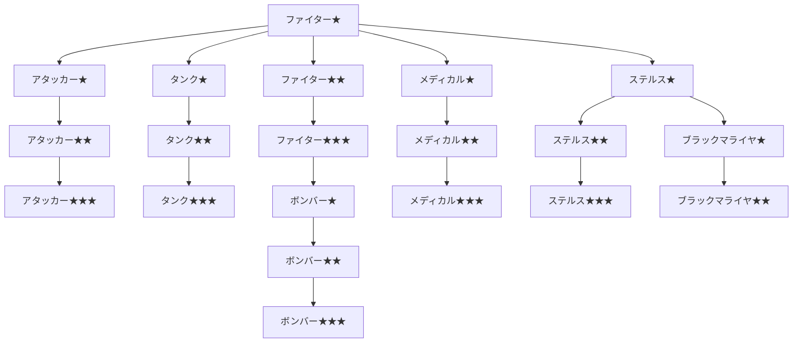

目次

* [召喚天導師の特徴](#召喚天導師の特徴)
* [召喚について](#召喚について)
* [スキルツリー](#スキルツリー)
    * [ＣＭＤスキル](#ＣＭＤスキル)
    * [召喚獣スキル](#召喚獣スキル)
    * [スキル入手方法](#スキル入手方法)

## 召喚天導師の特徴
----------

> _『召喚獣』を戦場に解き放つ！  
> 戦闘系びっくり箱！_

精霊魔法で召喚獣を召喚し、敵を攻撃し、味方をサポートする『召喚天導師』。  
多種多様なスキル、特性を持つ召喚獣が存在する。  
個々の召喚獣のスキル、特性を把握すれば活躍すること間違いなし！

召喚獣を一度戦場に解き放てば、意志を持ち行動する。  
上手く召喚すれば、きっと心強い味方になってくれるはずだ。  
『精霊魔導師』ならば、クラスチェンジして召喚獣を呼び出せ！

■下位ジョブ：[精霊魔導師](./spirit_mage.md)  
■サイドジョブ：[守護魔導師](./guardian_mage.md)　[黒印魔導師](./black_seal_magician.md)


## 召喚について
--------

ご提示いただいた内容を、読みやすいマークダウン形式（リスト形式）で出力します。

### 目標選択可能範囲

```text
■■■■■■■■■■■■■
 ■■■■■■■■■■■
  ■■■■■■■■■
   ■■■■■■■
    ■■■■■
     ■■■
      ■
      ↑

```

### 召喚について

* 召喚範囲は召喚獣によって違う。
* 目標は敵味方どちらも指定可能だが、味方を攻撃することはない。
* 範囲内に目標がいない場合は召喚できない。
* 召喚前に指定した対象が戦闘不能などで指定不能になった場合は召喚不発。
* 召喚後、対象が戦闘不能状態になると召喚獣から一番近い敵へ対象を自動的に変更。
* 味方や罠、ダメ床を避けて対象に向かおうとする（歩数は気まぐれ）。
* 味方や罠、ダメ床に囲まれるとさまよう。
* 移動で押し負けない（対オークまで確認・召喚獣同士はどちらかが押し負ける）。
* 指定した対象に辿り着いてない状態で別の敵が隣接するとその敵に攻撃する。
* 召喚後★6、★★7、★★★8ターンで消滅（召喚ターン含む）。
* ブラックマライヤのみ例外。召還後★16、★★26ターンで消滅（召還ターン含む）。


## スキルツリー
--------

<table><tbody><tr><td></td><td></td><td>ファイター★</td><td></td><td></td><td></td></tr><tr><td>┏</td><td>┳</td><td>╋</td><td>┳</td><td>┓</td><td></td></tr><tr><td>アタッカー★</td><td>タンク★</td><td>ファイター★★</td><td>メディカル★</td><td>ステルス★</td><td></td></tr><tr><td>┃</td><td>┃</td><td>┃</td><td>┃</td><td>┣</td><td>┓</td></tr><tr><td>アタッカー★★</td><td>タンク★★</td><td>ファイター★★★</td><td>メディカル★★</td><td>ステルス★★</td><td>ブラックマライヤ★</td></tr><tr><td>┃</td><td>┃</td><td>┃</td><td>┃</td><td>┃</td><td>┃</td></tr><tr><td>アタッカー★★★</td><td>タンク★★★</td><td>ボンバー★</td><td>メディカル★★★</td><td>ステルス★★★</td><td>ブラックマライヤ★★</td></tr><tr><td></td><td></td><td>┃</td><td></td><td></td><td></td></tr><tr><td></td><td></td><td>ボンバー★★</td><td></td><td></td><td></td></tr><tr><td></td><td></td><td>┃</td><td></td><td></td><td></td></tr><tr><td></td><td></td><td>ボンバー★★★</td><td></td><td></td><td></td></tr></tbody></table>





### ＣＭＤスキル

##### ファイター★

* 消費AP: 12 (毎ターン-1)
* スピード: D
* 妨害値: - | 耐久値: -
* HP: 6 | 歩数: 5
* 射程範囲: 上1・下1
```text
☆☆☆
☆☆☆
口↑口

```


* 入手法: 転職時に貰える / 権利書-地-☆

> 対象に向かい攻撃する獣を召喚します。

##### ファイター★★

* 消費AP: 14 (毎ターン-1)
* スピード: D
* 妨害値: - | 耐久値: -
* HP: 12 | 歩数: ?
* 射程範囲: 上1・下1
```text
☆☆☆
☆☆☆
口↑口

```


* 入手法: 権利書-地-☆ / [ハバネロ]

> 対象に向かい攻撃する獣を召喚します。
> ファイター★より強い。

##### ファイター★★★

* 消費AP: 16 (毎ターン-1)
* スピード: D
* 妨害値: - | 耐久値: -
* HP: 18 | 歩数: ?
* 射程範囲: 上1・下1
```text
☆☆☆
☆☆☆
口↑口

```


* 入手法: 権利書-地-☆☆ / [花]

> 対象に向かい攻撃する獣を召喚します。
> ファイター★★より強い。

##### ボンバー★

* 消費AP: 16 (毎ターン-1)
* スピード: D
* 妨害値: - | 耐久値: -
* HP: 4 | 歩数: ?
* 射程範囲: 上1・下1
```text
口☆☆☆口
☆口口口☆
☆口↑口☆
☆口口口☆
口☆☆☆口

```


* 入手法: 権利書-地-☆☆☆（レア）

> 消滅時に爆発する獣を召喚します。爆発範囲は前後左右
> 爆発のダメはアクアの４割程度

##### ボンバー★★

* 消費AP: 22 (毎ターン-1)
* スピード: D
* 妨害値: - | 耐久値: -
* HP: 6 | 歩数: ?
* 射程範囲: 上1・下1
```text
口☆☆☆口
☆口口口☆
☆口↑口☆
☆口口口☆
口☆☆☆口

```


* 入手法: 権利書-地-☆☆☆☆

> 消滅時に爆発する獣を召喚します。
> ★より爆発範囲が広い。注意!

##### ボンバー★★★

* 消費AP: 28 (毎ターン-1)
* スピード: D
* 妨害値: - | 耐久値: -
* HP: 8 | 歩数: ?
* 射程範囲: 上1・下1
```text
口☆☆☆口
☆口口口☆
☆口↑口☆
☆口口口☆
口☆☆☆口

```


* 入手法: 権利書-地-★(レア)

> 消滅時に爆発する獣を召喚します。
> ★より爆発範囲が広い。注意!

##### アタッカー★

* 消費AP: 14 (毎ターン-1)
* スピード: D
* 妨害値: - | 耐久値: -
* HP: 6 | 歩数: ?
* 射程範囲: 上1・下1
```text
☆☆☆
☆☆☆
口↑口

```


* 入手法: 権利書-地-☆(レア) / [ハバネロ]

> 対象に向かい攻撃する攻撃力の高い獣を召喚します。

##### アタッカー★★

* 消費AP: 18 (毎ターン-?)
* スピード: D
* 妨害値: - | 耐久値: -
* HP: 12 | 歩数: ?
* 射程範囲: 上1・下1
```text
☆☆☆
☆☆☆
口↑口

```


* 入手法: 権利書-地-☆☆(準レア) / [ハバネロ] / [花]

> 対象に向かい攻撃する攻撃力の高い獣を召喚します。

##### アタッカー★★★

* 消費AP: 22 (毎ターン-?)
* スピード: D
* 妨害値: - | 耐久値: -
* HP: 18 | 歩数: ?
* 射程範囲: 上1・下1
```text
☆☆☆
☆☆☆
口↑口

```


* 入手法: 権利書-地-☆☆☆☆

> 対象に向かい攻撃する攻撃力の高い獣を召喚します。

##### タンク★

* 消費AP: 14 (毎ターン-1)
* スピード: D
* 妨害値: - | 耐久値: -
* HP: 6 | 歩数: 2
* 射程範囲: 上1・下1
```text
☆☆☆
☆↑☆

```


* 入手法: 権利書-地-☆ / [ハバネロ]

> 対象に向かい攻撃する防御力の高い獣を召喚します。

##### タンク★★

* 消費AP: 18 (毎ターン-1)
* スピード: D
* 妨害値: - | 耐久値: -
* HP: 12 | 歩数: ?
* 射程範囲: 上1・下1
```text
☆☆☆
☆↑☆

```


* 入手法: 権利書-地-☆☆

> 対象に向かい攻撃する防御力の高い獣を召喚します。

##### タンク★★★

* 消費AP: 22 (毎ターン-1)
* スピード: D
* 妨害値: - | 耐久値: -
* HP: 18 | 歩数: ?
* 射程範囲: 上1・下1
```text
☆☆☆
☆↑☆

```


* 入手法: 権利書-地-☆☆☆

> 対象に向かい攻撃する防御力の高い獣を召喚します。

##### メディカル★

* 消費AP: 16 (毎ターン-1)
* スピード: D
* 妨害値: - | 耐久値: -
* HP: 6 | 歩数: 0
* 射程範囲: 上1・下1
```text
口口口口口口口
口口口■口口口
口口■口■口口
口■口↑口■口
口口■口■口口
口口口口口口口

```


* 入手法: 権利書-地-☆☆(レア) / [花]

> 仲間を回復する獣を召喚します。

##### メディカル★★

* 消費AP: 22 (毎ターン-1)
* スピード: D
* 妨害値: - | 耐久値: -
* HP: 12 | 歩数: 0
* 射程範囲: 上1・下1
```text
口口口口口口口
口口口■口口口
口口■口■口口
口■口↑口■口
口口■口■口口
口口口口口口口

```


* 入手法: 権利書-地-☆☆☆ / [花]

> 仲間を回復する獣を召喚します。
> メディカル★より回復量が多い。

##### メディカル★★★

* 消費AP: 28 (毎ターン-1)
* スピード: D
* 妨害値: - | 耐久値: -
* HP: 18 | 歩数: 0
* 射程範囲: 上1・下1
```text
口口口口口口口
口口口■口口口
口口■口■口口
口■口↑口■口
口口■口■口口
口口口口口口口

```


* 入手法: 権利書-地-☆☆☆☆（レア）

> 仲間を回復する獣を召喚します。
> メディカル★★より回復量が多い。

##### ステルス★

* 消費AP: 14 (毎ターン-1)
* スピード: D
* 妨害値: - | 耐久値: -
* HP: 4 | 歩数: ?
* 射程範囲: 上1・下1
```text
☆☆↑☆☆
☆☆☆☆☆
口☆☆☆口

```


* 入手法: 権利書-地-☆☆☆

> 姿を消す習性がある獣を召喚します。

##### ステルス★★

* 消費AP: 18 (毎ターン-1)
* スピード: D
* 妨害値: - | 耐久値: -
* HP: 6 | 歩数: ?
* 射程範囲: 上1・下1
```text
☆☆↑☆☆
☆☆☆☆☆
口☆☆☆口

```


* 入手法: 権利書-地-☆☆☆☆

> 姿を消す習性がある獣を召喚します。

##### ステルス★★★

* 消費AP: 22 (毎ターン-1)
* スピード: D
* 妨害値: - | 耐久値: -
* HP: 8 | 歩数: ?
* 射程範囲: 上1・下1
```text
☆☆↑☆☆
☆☆☆☆☆
口☆☆☆口

```


* 入手法: 権利書-地-★

> 姿を消す習性がある獣を召喚します。

##### ブラックマライヤ★

* 消費AP: 22 (毎ターン-2)
* スピード: D
* 妨害値: - | 耐久値: -
* HP: 28 | 歩数: ?
* 射程範囲: 上1・下1
```text
☆☆☆☆☆
☆☆☆☆☆
口☆☆☆口
口☆☆☆口
口口↑口口

```


* 入手法: 権利書-地-★

> 戦闘不能ユニットを消滅させる獣を召喚します。

##### ブラックマライヤ★★

* 消費AP: 28 (毎ターン-2)
* スピード: D
* 妨害値: - | 耐久値: -
* HP: 36 | 歩数: ?
* 射程範囲: 上1・下1
```text
☆☆☆☆☆
☆☆☆☆☆
口☆☆☆口
口☆☆☆口
口口↑口口

```


* 入手法: 権利書-地-★(準レア)

> 戦闘不能ユニットを消滅させる獣を召喚します。
> 移動量が多い。


### 召喚獣スキル

##### ファイターアタック

* AP: 8 | スピード: B
* 使用獣: ファイター系
* 範囲: 上1・下1
```text
口■口
■■■
■↑■

```


> 耳で殴りつけ、対象にダメージを与える

##### ファイターアタックⅡ

* AP: 16 | スピード: D
* 使用獣: ファイター系
* 範囲: 上?・下?
```text
■■■
口↑口

```


> 範囲内の敵にダメージを与える
> 味方も巻き込む

##### タンクアタック

* AP: 8 | スピード: D
* 使用獣: タンク系
* 範囲: 上?・下?
```text
口■口
■■■
■↑■

```


> 頭で殴りつけ、対象にダメージを与える

##### タンクアタックⅡ

* AP: 16 | スピード: D
* 使用獣: タンク系
* 範囲: 上?・下?
```text
口■口
口↑口

```


> １グリッド吹き飛ばし

##### メディカルポート

* AP: 10 | スピード: D
* 使用獣: メディカル系
* 範囲: 上?・下?
```text
口口■口口
口■■■口
■■↑■■
口■■■口
口口■口口

```


> 対象の体力を回復させる
> (転倒中でも回復できる)
> 対象はランダム
> (自分と仲間すべて対象)
> Mob戦回復量は★=60以上、★★=100以上、★★★=150以上
> 対人回復量は★=20、★★=30、★★★=50

##### ステルス

* AP: 20 | スピード: D
* 使用獣: ステルス系
* 範囲: 自己指定

> 透明状態になる(2T)

##### アタッカーアタック

* AP: ? | スピード: ?
* 使用獣: アタッカー系
* 範囲: ?

> 透明状態の敵にも攻撃可能

### スキル入手方法

| クエスト | よく出る | 普通 | 準レア | レア |
| --- | --- | --- | --- | --- |
| 地/空☆ | ファイター★ | ファイター★★ | タンク★ | アタッカー★ |
| 地/空☆☆ | タンク★★ | ファイター★★★ | アタッカー★★ | メディカル★ |
| 地/空☆☆☆ | ステルス★ | タンク★★★ | メディカル★★ | ボンバー★ |
| 地/空☆☆☆☆ | ボンバー★★ | ステルス★★ | アタッカー★★★ | メディカル★★★ |
| 地/空★ | ブラックマライヤ★ | ステルス★★★ | ブラックマライヤ★★ | ボンバー★★★ |
| ミニクエ(確率不明) |
| ハバネロ | ファイター★★ | タンク★ | アタッカー★ | アタッカー★★ |
| 花クエ | ファイター★★★ | アタッカー★★ | メディカル★ | メディカル★★ |
| クラゲ | タンク★★★ | メディカル★★ | ボンバー★ | アタッカー★★★ |
| 迷子 | ステルス★★ | アタッカー★★★ | メディカル★★★ | ブラックマライヤ★★ |

