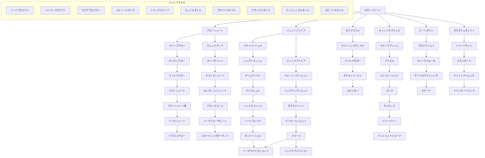

目次

* [盗賊の特徴](#盗賊の特徴)
* [スキル](#スキル)
    * [スキルツリー](#スキルツリー)
    * [スキルの説明](#スキルの説明)
    * [クエスト別入手スキル一覧](#クエスト別入手スキル一覧)
* [よくある質問](#よくある質問)


## 盗賊の特徴
-------

> 遠距離攻撃と変則的な行動を備え持つ、  
> 俊足のスナイパー！！

盗賊の特徴は、移動力の高さにあります。  
その豊富な移動量と遠距離武器を巧みに利用すれば、  
敵との距離を保ちながら  
自分だけが攻撃することも可能となります。

さらに盗賊のスキルの中には、  
他のジョブでは修得できないような  
特殊な行動が数多く存在するので、  
盗賊がいればパーティ全体の戦術の幅が  
大きく広がることでしょう。

■サイドジョブ:[黒印魔導師](./black_seal_magician.md) [戦士](./warrior.md)  
■上位ジョブ:[忍者](./ninja.md)


##スキル
-----

### スキルツリー

*   あるスキルを覚えるには、そのスキルの矢印の上流にあるスキルを覚えていないといけません  
（例：スリープアローを覚えるには、アローシュートを覚えている必要があります）

*   ビートダウンの列とポウチジェネレイトの列は、それぞれ戦士と黒印魔導師のサイドジョブのレベルが必要です（詳細は各スキルの説明で）  
また、メインジョブが戦士、黒印魔導師のキャラクターが、サイドジョブの盗賊の時には、スキルツリーに、これらの2列はありません。

*   PSVスキル(一番左の列)を覚えるには、他のスキルを覚えているかどうかは関係がありません。  
ただし、スキルによっては覚えるためにレベル制限がある場合があります。

<table><tbody><tr><td colspan="2">　</td><td colspan="7"><a href="#basic">ボディー<br class="spacer">ビート</a></td></tr><tr><td><a href="#psv">ソード<br class="spacer">プロテクト</a></td><td>┏</td><td><a href="#arrow_1">アロー<br class="spacer">シュート</a></td><td>┏</td><td><a href="#bullet_1">バレット<br class="spacer">ファイア</a></td><td><a href="#dagger">ダイアゴナル</a></td><td><a href="#special">キャット<br class="spacer">サプライズ</a></td><td><a href="#side1">ビート<br class="spacer">ダウン</a></td><td><a href="#side2">ポウチ<br class="spacer">ジェネレイト</a></td></tr><tr><td>ハンマー<br class="spacer">プロテクト</td><td><a href="#arrow_2">チェンジ<br class="spacer">アップ</a></td><td>スリープ<br class="spacer">アロー</td><td><a href="#bullet_2">クイック<br class="spacer">ファイア</a></td><td>ブラインド<br class="spacer">シェル</td><td>ライトニング<br class="spacer">ディルク</td><td>スケープ<br class="spacer">プッシュ</td><td>プロテク<br class="spacer">ション</td><td>バインド<br class="spacer">ネット</td></tr><tr><td>スピア<br class="spacer">プロテクト</td><td>スリー<br class="spacer">ポイント</td><td>ポイズン<br class="spacer">アロー</td><td>ウォーニング<br class="spacer">ショット</td><td>レッグ<br class="spacer">トラッシュ</td><td>ワイルド<br class="spacer">ダガー</td><td>ブリスル</td><td>スリー<br class="spacer">クウォータ</td><td>デス<br class="spacer">リガード</td></tr><tr><td>スティール<br class="spacer">ゲイズ</td><td>グランド<br class="spacer">シュート</td><td>ファイア<br class="spacer">アロー</td><td>バックアップ<br class="spacer">ショット</td><td>アーム<br class="spacer">クーパー</td><td>ボドキン<br class="spacer">バースト</td><td>コンフュー<br class="spacer">ジョン</td><td>サードオア<br class="spacer">ナッシング</td><td>ナイトメア<br class="spacer">ショック</td></tr><tr><td>トラップ<br class="spacer">スコープ</td><td>ロングレンジ<br class="spacer">シュート</td><td>パワー<br class="spacer">シュート</td><td>ダブル<br class="spacer">バレット</td><td>アイスシェル</td><td>カウンター</td><td>マシラ</td><td>カテーナ</td><td>トリッキートラップ</td></tr><tr><td>ヒット<br class="spacer">スタイル</td><td>アロー<br class="spacer">スコール</td><td>パワー<br class="spacer">シュート改</td><td>ピンホール<br class="spacer">ショット</td><td>ヘッド<br class="spacer">スマッシュ</td><td>　</td><td>ギャロップ</td><td>　</td><td>　</td></tr><tr><td>アボイド<br class="spacer">スタイル</td><td>リーチフォー<br class="spacer">ザムーン</td><td>ドリル<br class="spacer">シュート</td><td>バラージ</td><td>ハート<br class="spacer">ブレイク</td><td>　</td><td>ベリーベリー</td><td>　</td><td>　</td></tr><tr><td>アタック<br class="spacer">スタイル</td><td>フローティング<br class="spacer">ターゲット</td><td>ドラゴン<br class="spacer">アロー</td><td>┣</td><td>ボンバー<br class="spacer">シェル</td><td>　</td><td>ワンショットジョーク</td><td>　</td><td>　</td></tr><tr><td>ディフェンス<br class="spacer">スタイル</td><td rowspan="2"></td><td rowspan="2"></td><td>ミッドエア<br class="spacer">コリジョン</td><td>イーグルアイズ<br class="spacer">ショット</td><td>　</td><td>　</td><td>　</td><td>　</td></tr><tr><td>スピード<br class="spacer">スタイル</td><td></td><td></td><td>　</td><td>　</td><td>　</td><td>　</td></tr></tbody></table>




### スキルの説明

*   [基本スキル](#基本スキル)
*   [弓・ボウガン共通スキル](#弓ボウガン共通スキル)
*   [弓専用スキル](#弓専用スキル)
*   [銃・ボウガン共通スキル(メイン)](#銃ボウガン共通スキルメイン)
*   [銃・ボウガン共通スキル(派生)](#銃ボウガン共通スキル派生)
*   [ダガースキル](#ダガースキル)
*   [特殊スキル](#特殊スキル)
*   [サイドスキル(戦士)](#サイドスキル戦士)
*   [サイドスキル(黒印)](#サイドスキル黒印)
*   [PSVスキル](#PSVスキル)

- 直線系

経路上にキャラがいる場合、そのキャラに攻撃が当たる。  
また、２段上に居る対象を狙うことはできない。  
下段はほぼ無限？  
特殊な例として、経路上にキャラが居ても２段下の対象になら当たらずに目標に命中する。

- 曲線系

経路上にキャラがいても、そのキャラが自分と同じ高さ以下にいれば、攻撃は当たらない。  
経路上のキャラが、自分より１段以上高いところにいると、そのキャラに攻撃が当たる。

- 召喚系

分類名の通り、対象の足元(上空)から攻撃するため、経路の心配はいらない。

### 基本スキル

ボディービート

* タイプ: CMD | 消費AP: 3 | スピード: A
* 妨害値: - | 耐久値: - | 攻撃属性: 斬
* 範囲: 直線
```text
■■■
■↑■

```


* 入手法: 初期

> 体当たりをして標的を攻撃する。
> スマートな攻撃法ではないが、盗賊が装備できるすべての武器で使用可能。

### 弓・ボウガン共通スキル

* 弓・ボウガン装備時にのみ使用可能。

#### アローシュート

* タイプ: CMD | 消費AP: 6 | スピード: B
* 妨害値: - | 耐久値: - | 攻撃属性: 貫
* 範囲: 曲線
```text
口口■口口
口■■■口
口■口■口
口口口口口
口口↑口口

```


* 入手法: [☆]、初期、店売り

> 弓で矢を放ち、対象にダメージを与える。

#### スリープアロー

* タイプ: CMD | 消費AP: 22 | スピード: D
* 妨害値: - | 耐久値: - | 攻撃属性: 貫
* 範囲: 曲線
```text
口口■口口
口■■■口
口■口■口
口口↑口口

```


* 入手法: [☆☆]、店売り、旅立ちの決意

> 睡眠薬を塗った矢を放ち、対象にダメージを与える。
> [睡眠]効果(3T)

#### ポイズンアロー

* タイプ: CMD | 消費AP: 16 | スピード: D
* 妨害値: - | 耐久値: - | 攻撃属性: 貫
* 範囲: 曲線
```text
口口■口口
口■■■口
口■口■口
口口↑口口

```


* 入手法: [☆☆☆]

> 毒を塗った矢を放ち、対象にダメージを与える。
> [毒]効果(7T)

#### ファイアアロー

* タイプ: CMD | 消費AP: 16 | スピード: D
* 妨害値: - | 耐久値: - | 攻撃属性: 貫
* 範囲: 曲線
```text
口口■口口
口■■■口
口■口■口
口口↑口口

```


* 入手法: [☆☆☆☆]

> 火をつけた矢を放ち、対象にダメージを与える。
> 対象者が[オイルまみれ]状態の時、低確率で[炎上]効果

#### パワーシュート

* タイプ: CMD | 消費AP: 25 | スピード: D
* 妨害値: - | 耐久値: - | 攻撃属性: 貫
* 範囲: 直線
```text
口口■口口
口■■■口
口■■■口
口口■口口
口口■口口
口口↑口口

```


* 入手法: [★]

> 全力で弦を引いて矢を放ち、対象を２グリット吹き飛ばし＆攻撃する。

#### パワーシュート改

* タイプ: CMD | 消費AP: 45 | スピード: D
* 妨害値: - | 耐久値: - | 攻撃属性: 貫
* 範囲: 直線
```text
口口■口口
口口■口口
■口■口■
■■■■■
口■■■口
口口↑口口

```


* 入手法: [★☆]

> 全力で弦を引いて矢を放ち、対象までの全ユニットを１グリッド吹き飛ばし＆攻撃する。

#### ドリルシュート

* タイプ: CMD | 消費AP: 45 | スピード: D
* 妨害値: - | 耐久値: - | 攻撃属性: 貫
* 範囲: 召喚
```text
口口口■口口口
口口■口■口口
口■口口口■口
■口口↑口口■
口■口口口■口

```


* 入手法: [★☆☆]

> 地面に向けて矢を放ち地中から対象を攻撃する。

#### ドラゴンアロー

* タイプ: CMD | 消費AP: 100 | スピード: A
* 妨害値: - | 耐久値: - | 攻撃属性: 貫
* 範囲: 曲線
```text
口口■口口
口■■■口
口■口■口
口口↑口口

```


* 入手法: [★★☆] / ハーブ

> 竜のオーラを矢にまとわせて放ち、対象にダメージを与える。

### 弓専用スキル

*   2011年秋からすべて弓限定に変更。

#### チェンジアップ

* タイプ: CMD | 消費AP: 8 | スピード: D
* 妨害値: - | 耐久値: - | 攻撃属性: 貫
* 範囲: 曲線
```text
口口■口口
口■■■口
口■口■口
口口口口口
口口↑口口

```


* 入手法: [☆☆] / 蟹 / 地竜 / 焼肉 / 人形 / 球根

> 攻撃に対して身構えている対象に、効果を発揮する攻撃。

#### スリーポイント

* タイプ: CMD | 消費AP: 18 | スピード: D
* 妨害値: - | 耐久値: - | 攻撃属性: 貫
* 範囲: 曲線
```text
口口■口口
口■■■口
■■■■■
■■口■■
■口↑口■

```


* 入手法: [★] / [★★☆] / 焼肉 / 人形 / 球根 / パンダ / 種 / コボルト / ハチミツ

> 選択した３体の対象に攻撃する。

#### グランドシュート

* タイプ: CMD | 消費AP: 26 | スピード: D
* 妨害値: - | 耐久値: - | 攻撃属性: 貫
* 範囲: 直線
```text
■■■■■■■■■
口■■■■■■■口
口口■■■■■口口
口口口■■■口口口
口口口口↑口口口口

```


* 入手法: [★☆] / [★★☆☆] / 墓場 / ゴブリン / ゴーレム / スライム / 絵画

> 地面ギリギリに矢を放ち、対象にダメージを与え転倒させる。

#### ロングレンジシュート

* タイプ: CMD | 消費AP: 21 | スピード: D
* 妨害値: - | 耐久値: - | 攻撃属性: 貫
* 範囲: 曲線
```text
口口■口口
口■■■口
■■■■■
■■■■■
■■口■■
■口口口■
口口口口口
口口↑口口

```


* 入手法: [★☆☆] / [★★☆☆☆] / 種 / 目撃者 / 死神呪い / カエル / ハーブ

> 離れた対象に向かい矢を放ち、ダメージを与える。

#### アロースコール

* タイプ: CMD | 消費AP: 34 | スピード: D
* 妨害値: - | 耐久値: - | 攻撃属性: 貫
* 範囲: 召喚
```text
口口■口口
口■口■口
口口口口口
口口口口口
口口↑口口

```


* 入手法: [★☆☆☆] / メイド(強) / 指輪 / カエル / 山賊

> 上空に数本の矢を放ち、落下する矢で範囲内を攻撃する。
> 範囲は十字範囲。

#### リーチフォーザムーン

* タイプ: CMD | 消費AP: 54 | スピード: D
* 妨害値: - | 耐久値: - | 攻撃属性: 貫
* 範囲: 召喚
```text
口■■■口
口■■■口
口■■■口
口口口口口
口口口口口
口口↑口口

```


* 入手法: [★★(レア)] / 絵画 / 踊り子 / ハーブ

> 上空に矢を放ち、落下する矢で対象を攻撃する。

#### フローティングターゲット

* タイプ: CMD | 消費AP: 90 | スピード: D
* 妨害値: - | 耐久値: - | 攻撃属性: 貫
* 範囲: ？
```text
口■口
口↑口

```


* 入手法: [★★☆☆]

> 対象を蹴り上げて、空中の対象に矢を放ち攻撃する。
> 投射無効で無効化できる。物理無効は不可。
> (九連続攻撃、判定：初回、1グリッド飛)


### 銃・ボウガン共通スキル(メイン)

*   銃・ボウガン装備時のみ使用可能。直線系。

#### バレットファイア

* タイプ: CMD | 消費AP: 7 | スピード: C
* 妨害値: - | 耐久値: - | 攻撃属性: 貫
* 範囲: 直線
```text
■■■■■
口■■■口
口■■■口
口口■口口
口口■口口
口口↑口口

```


* 入手法: [☆] / フェレット / 仮面 / 球根

> 銃、ボウガンで弾を発射して、対象にダメージを与える。

#### ブラインドシェル

* タイプ: CMD | 消費AP: 21 | スピード: D
* 妨害値: - | 耐久値: - | 攻撃属性: 貫
* 範囲: 直線
```text
■■■■■
口■■■口
口■■■口
口口■口口
口口■口口
口口↑口口

```


* 入手法: [☆☆] / リョマ / フェレット / 焼肉 / 仮面 / 土鍋 / 墓場

> 目に沁みるガスを噴出する弾を発射して、対象を暗闇状態にする。
> 高確率で[暗闇]効果(5T)

#### レッグトラッシュ

* タイプ: CMD | 消費AP: 22 | スピード: D
* 妨害値: - | 耐久値: - | 攻撃属性: 貫
* 範囲: 直線
```text
■■■■■
口■■■口
口■■■口
口口■口口
口口■口口
口口↑口口

```


* 入手法: [☆☆☆] / フェレット / 焼肉 / 土鍋 / 目撃者

> 脚を目掛けて弾を発射して、対象にダメージを与える。
> 低確率で[移動不可]効果(1T)

#### アームクーパー

* タイプ: CMD | 消費AP: 22 | スピード: D
* 妨害値: - | 耐久値: - | 攻撃属性: 貫
* 範囲: 直線
```text
■■■■■
口■■■口
口■■■口
口口■口口
口口■口口
口口↑口口

```


* 入手法: [☆☆☆☆] / たこ焼き / 土鍋 / 墓場 / ゴブリン / ハチミツ

> 腕を目掛けて弾を発射して、対象にダメージを与える。
> 低確率で[物理攻撃力低下]効果(2T)

#### アイスシェル

* タイプ: CMD | 消費AP: 38 | スピード: C
* 妨害値: - | 耐久値: - | 攻撃属性: 貫
* 範囲: 直線
```text
■■■■■
口■■■口
口■■■口
口口■口口
口口■口口
口口↑口口

```


* 入手法: [★] / たこ焼き / 仮面 / 目撃者 / 死神呪い / スライム

> 氷の力を秘めた弾を発射して、対象にダメージを与える。
> 対象が[びしょぬれ]状態の時、低確率で[凍結]効果(3T)

#### ヘッドスマッシュ

* タイプ: CMD | 消費AP: 22 | スピード: D
* 妨害値: - | 耐久値: - | 攻撃属性: 貫
* 範囲: 直線
```text
■■■■■
口■■■口
口■■■口
口口■口口
口口■口口
口口↑口口

```


* 入手法: [★☆] / パンダ / 種 / メイド(弱) / 指輪

> 頭を目掛けて弾を発射して、対象にダメージを与える。
> 低確率で[命中力低下]効果(2T)

#### ハートブレイク

* タイプ: CMD | 消費AP: 22 | スピード: D
* 妨害値: - | 耐久値: - | 攻撃属性: 貫
* 範囲: 直線
```text
■■■■■
口■■■口
口■■■口
口口■口口
口口■口口
口口↑口口

```


* 入手法: [★☆☆] / メイド(弱) / 指輪 / 絵画 / 滝水 / 山賊 / コボルト

> 胸を目掛けて弾を発射して、対象にダメージを与える。
> 低確率で[麻痺]効果(1T)

#### ボンバーシェル

* タイプ: CMD | 消費AP: 77 | スピード: D
* 妨害値: - | 耐久値: - | 攻撃属性: 貫
* 範囲: 直線
```text
■■■■■
口■■■口
口■■■口
口口■口口
口口■口口
口口↑口口

```


* 入手法: [★★] / 滝水 / 石碑 / 海賊

> 爆発する弾を発射して、範囲内の全ユニットにダメージを与える。十字範囲。(投射無効・反射貫通)

#### イーグルアイズショット

* タイプ: CMD | 消費AP: 64 | スピード: D
* 妨害値: - | 耐久値: - | 攻撃属性: 貫
* 範囲: ？
```text
■■■■■
■■■■■
■■■■■
口■■■口
口■■■口
口■■■口
口口■口口
口口■口口
口口■口口
口口↑口口

```


* 入手法: [★★☆☆] / 海賊 / 踊り子

> 超遠距離から狙撃を行い、対象にダメージを与える。

#### ミッドエアコリジョン

* タイプ: CMD | 消費AP: 38 | スピード: S
* 妨害値: - | 耐久値: - | 攻撃属性: 直線
* 範囲: ？
* 入手法: [★★☆☆☆☆] / 海賊

> 投射スキルを、装備した武器で打ち落とせる状態で身構える。
> [投射攻撃無効]効果(3T)


### 銃・ボウガン共通スキル(派生)

*   銃・ボウガン装備時のみ使用可能。直線系。


#### クイックファイア

* タイプ: CMD | 消費AP: 12 | スピード: B
* 妨害値: - | 耐久値: - | 攻撃属性: 貫
* 範囲: 直線
```text
■■■■■
口■■■口
口■■■口
口口■口口
口口■口口
口口↑口口

```


* 入手法: [★☆☆☆]

> 素早い動作で銃・ボウガンを発射して、対象にダメージを与える。

#### ウォーニングショット

* タイプ: CMD | 消費AP: 12 | スピード: D
* 妨害値: - | 耐久値: - | 攻撃属性: −
* 範囲: 直線
```text
■■■■■
口■■■口
口■■■口
口口■口口
口口■口口
口口↑口口

```


* 入手法: [★☆☆☆☆]

> 足元を狙い弾を発射して、対象の移動力を減少させる。
> [移動力減少]効果(6T)

#### バックアップショット

* タイプ: CMD | 消費AP: 15 | スピード: B
* 妨害値: - | 耐久値: - | 攻撃属性: −
* 範囲: 直線
```text
■■■■■
口■■■口
口■■■口
口口■口口
口口■口口
口口↑口口

```


* 入手法: [★★] / 果実 / 海賊

> 気をそらす発砲を行い、対象の行動スピードを減少させる。
> [行動スピード減少]効果(6T)

#### ダブルバレット

* タイプ: CMD | 消費AP: 18 | スピード: D
* 妨害値: - | 耐久値: - | 攻撃属性: 貫
* 範囲: 直線
```text
■■■■■■■
口■■■■■口
口口■■■口口
口口口■口口口
口口口↑口口口

```


* 入手法: [★★☆] / 山賊 / 海賊

> 銃・ボウガンを連続で発射して、対象２体にダメージを与える。

#### ピンホールショット

* タイプ: CMD | 消費AP: 62 | スピード: D
* 妨害値: - | 耐久値: - | 攻撃属性: 貫
* 範囲: 直線
```text
■■■■■
口■■■口
口■■■口
口口■口口
口口■口口
口口↑口口

```


* 入手法: [★★☆] / 滝水 / 石碑 / 海賊 / 踊り子

> 連続して３回、銃・ボウガンを発射して対象にダメージを与える。

#### バラージ

* タイプ: CMD | 消費AP: 80 | スピード: D
* 妨害値: - | 耐久値: - | 攻撃属性: 貫
* 範囲: 直線
```text
■■■■■
口■■■口
口■■■口
口口■口口
口口■口口
口口↑口口

```


* 入手法: [★★☆☆☆]

> 連続して、銃・ボウガンを発射して対象にダメージを与える。
> (十連続攻撃、判定：初回、1グリッド飛)


### ダガースキル

*   ダガー装備時のみ使用可能。

#### ダイアゴナル

* タイプ: CMD | 消費AP: 4 | スピード: B
* 妨害値: - | 耐久値: - | 攻撃属性: 斬?
* 範囲: 直線
```text
口■口
■■■
口↑口

```


* 入手法: [☆☆☆]

> 片手剣・短剣で斜めに斬りつけて、対象にダメージを与える。

#### ライトニングディルク

* タイプ: CMD | 消費AP: 9 | スピード: A
* 妨害値: - | 耐久値: - | 攻撃属性: 斬
* 範囲: 直線
```text
口■口
■↑■

```


* 入手法: [☆☆☆☆] / 蟹

> 片手剣・短剣を高速で振りぬき、対象にダメージを与える

#### ワイルドダガー

* タイプ: CMD | 消費AP: 22 | スピード: C
* 妨害値: - | 耐久値: - | 攻撃属性: 斬
* 範囲: 直線
```text
■■■
■↑■
■■■

```


* 入手法: [★☆] / メイド(弱) / たこ焼き / 死神呪い / コボルト

> 短剣を振り回して、範囲内の全ユニットにダメージを与える。
> 全方位攻撃

#### ボドキンバースト

* タイプ: CMD | 消費AP: 25 | スピード: D
* 妨害値: - | 耐久値: - | 攻撃属性: 貫
* 範囲: 直線
```text
口■口
■↑■

```


* 入手法: [★☆☆☆]

> 片手剣・短剣を突き出して突進して、対象を吹き飛ばし攻撃する。
> 1マス吹き飛ばし効果。

#### カウンター

* タイプ: CMD | 消費AP: 16 | スピード: B
* 妨害値: - | 耐久値: - | 攻撃属性: ？
* 範囲: − (自分指定)
* 入手法: [★☆☆☆☆] / メイド(強) / 絵画 / 石碑

> 直接的な攻撃に対して、避けて攻撃が出来る体勢で身構える。
> 短剣装備時のみ使用可能。
> [カウンター]効果(0T)


### 特殊スキル

*   全ての武器で使用可能。

#### キャットサプライズ

* タイプ: CMD | 消費AP: 12 | スピード: C
* 妨害値: - | 耐久値: - | 攻撃属性: −
* 範囲: 直線
```text
口口■口口
口■■■口
■■↑■■

```


* 入手法: [☆]

> 驚かして対象を放心させる。
> [放心]効果(5T)
> 高低差1

#### スケーププッシュ

* タイプ: CMD | 消費AP: 12 | スピード: B
* 妨害値: - | 耐久値: - | 攻撃属性: −
* 範囲: 直線
```text
口■口
■↑■

```


* 入手法: [☆☆]

> 対象を押して、1グリッド吹き飛ばす。

#### ブリスル

* タイプ: CMD | 消費AP: 24 | スピード: D
* 妨害値: - | 耐久値: - | 攻撃属性: −
* 範囲: 直線
```text
口■口
■■■
■↑■

```


* 入手法: [☆☆☆] / 蟹 / 地竜 / 人形 / たこ焼き / パンダ / 墓場

> 暴言を連発して対象を激怒させる。
> [激怒]効果(4T)

#### コンフュージョン

* タイプ: CMD | 消費AP: 26 | スピード: C
* 妨害値: - | 耐久値: - | 攻撃属性: −
* 範囲: 直線
```text
口■口
■■■
■↑■

```


* 入手法: [★★]

> 難解な言葉を連発して対象を混乱させる。
> [混乱]効果(8T)

#### マシラ

* タイプ: CMD | 消費AP: 13 | スピード: A
* 妨害値: - | 耐久値: - | 攻撃属性: −
* 範囲: − (自分指定)
* 入手法: [★★☆]

> 高速の見かわし術で、高確率で回避できる体勢で身構える。
> [超見切り]効果(0T)

#### ギャロップ

* タイプ: CMD | 消費AP: 20 | スピード: A
* 妨害値: - | 耐久値: - | 攻撃属性: −
* 範囲: − (自分指定)
* 入手法: [★★☆☆]

> 行動スピードを犠牲に、移動力を高めた状態で身構える。

#### ベリーベリー

* タイプ: CMD | 消費AP: 18 | スピード: A
* 妨害値: - | 耐久値: - | 攻撃属性: −
* 範囲: − (自分指定)
* 入手法: [★★☆☆☆] / 海賊

> 自ら伏せることで、攻撃の対象にはならないようにする。

#### ワンショットジョーク

* タイプ: CMD | 消費AP: 77 | スピード: S
* 妨害値: - | 耐久値: - | 攻撃属性: -
* 範囲: ？
```text
■■■■■■■■■■■■■■■■■■■■■
■■■■■■■■■■■■■■■■■■■■■
■■■■■■■■■■■■■■■■■■■■■
■■■■■■■■■■■■■■■■■■■■■
■■■■■■■■■■■■■■■■■■■■■
■■■■■■■■■■■■■■■■■■■■■
■■■■■■■■■■■■■■■■■■■■■
■■■■■■■■■■■■■■■■■■■■■
■■■■■■■■■■■■■■■■■■■■■
■■■■■■■■■■■■■■■■■■■■■
■■■■■■■■■■◆■■■■■■■■■■
■■■■■■■■■■■■■■■■■■■■■
■■■■■■■■■■■■■■■■■■■■■
■■■■■■■■■■■■■■■■■■■■■
■■■■■■■■■■■■■■■■■■■■■
■■■■■■■■■■■■■■■■■■■■■
■■■■■■■■■■■■■■■■■■■■■
■■■■■■■■■■■■■■■■■■■■■
■■■■■■■■■■■■■■■■■■■■■
■■■■■■■■■■■■■■■■■■■■■
■■■■■■■■■■■■■■■■■■■■■

```


(上3段)
* 入手法: [★★☆☆☆☆]

> 一発ギャグを女神が判定。何が起こるか誰にもわからない。


### サイドスキル(戦士)

*   この系列のスキルを覚えるには、サイドジョブ戦士が一定レベルになっている必要があります
*   この系列は、盗賊がメインジョブのキャラクターしか覚えられません

#### ビートダウン

* タイプ: CMD | 消費AP: 12 | スピード: B
* 妨害値: - | 耐久値: - | 攻撃属性: −
* 範囲: − (自分指定)
* 入手法: [☆☆☆☆] / 人形 / 地竜 / 種 / 仮面 / パンダ / 目撃者

> 武器を風車の様に使用して、投射スキルを打ち落とす体勢で身構える。
> ダガー装備時のみ使用可能。
> サイドジョブ（戦士、Lv5）が必要。
> [投射攻撃無効]効果(0T)

#### プロテクション

* タイプ: CMD | 消費AP: 6 | スピード: A
* 妨害値: - | 耐久値: - | 攻撃属性: −
* 範囲: − (自分指定)
* 入手法: [★☆☆] / メイド(強) / スライム / ゴーレム / 果実

> 攻撃に対してダメージを軽減できる体勢で身構える。
> 全ての武器で使用可能。
> サイドジョブ（戦士、Lv10）が必要。
> [ガード]効果(0T)

#### スリークウォータ

* タイプ: CMD | 消費AP: 24 | スピード: C
* 妨害値: - | 耐久値: - | 攻撃属性: −
* 範囲: 直線
```text
口■口
■↑■

```


* 入手法: [★☆☆☆☆] / 死神呪い / 山賊 / 踊り子

> 急所を狙い武器を振って、対象のHPを3/4にする。成功率は低い。１段差でもあると撃てない。
> サイドジョブ（戦士、Lv15）が必要。

#### サードオアナッシング

* タイプ: CMD | 消費AP: 54 | スピード: D
* 妨害値: - | 耐久値: - | 攻撃属性: −
* 範囲: 直線
* 入手法: [★★☆☆☆]

> 急所を狙い武器を振って、対象のHPを1/3にする。成功率は低い。
> サイドジョブ（戦士、Lv20）が必要。

#### カテーナ

* タイプ: CMD | 消費AP: 52 | スピード: D
* 妨害値: - | 耐久値: - | 攻撃属性: −
* 範囲: 直線
* 入手法: > 刀身を突き刺し、斬り上げて対象にダメージを与えます。

> サイドジョブ（戦士、Lv25）が必要。
> (二連続攻撃、判定：初回)

### サイドスキル(黒印)

*   この系列のスキルを覚えるには、サイドジョブ黒印が一定レベルになっている必要があります
*   この系列は、盗賊がメインジョブのキャラクターしか覚えられません

#### ポウチジェネレイト

* タイプ: CMD | 消費AP: 0 | スピード: D
* 妨害値: - | 耐久値: - | 攻撃属性: ？
* 範囲:
```text
口口口■口口口
口口■口■口口
口■口口口■口
■口口↑口口■
口■口口口■口

```


* 入手法: [★☆☆☆] / ゴブリン / 果実 / 石碑

> 呪動黒印１つ選択して発動させる。
> サイドジョブ（黒印、Lv5）が必要。
> [気合いため]後、発動

#### バインドネット

* タイプ: CMD | 消費AP: 30 | スピード: D
* 妨害値: - | 耐久値: - | 攻撃属性: −
* 範囲:
```text
口口■口口
口■■■口
■■↑■■
口■■■口
口口■口口

```


* 入手法: [★] / メイド(弱) / たこ焼き / 土鍋 / ゴブリン / 指輪

> 巨大な蜘蛛の巣を出現させて、効果範囲内ユニットを移動不可にする。
> サイドジョブ（黒印、Lv10）が必要。
> [気合いため]後、効果範囲内全員(自分含む)に[移動不可]効果(3T)

#### デスリガード

* タイプ: CMD | 消費AP: 30 | スピード: D
* 妨害値: - | 耐久値: - | 攻撃属性: −
* 範囲: − (自分指定)
* 入手法: [★★]

> 自分の周りに結界を出現させて、周りから見えないようにする。
> サイドジョブ（黒印、Lv15）が必要。
> [気合いため]後、[透明]効果(2T)

#### ナイトメアショック

* タイプ: CMD | 消費AP: 35 | スピード: D
* 妨害値: - | 耐久値: - | 攻撃属性: 物理(貫)
* 範囲: 召喚
```text
■■■
■↑■

```


(段差：上×　下？)
* 入手法: [★★☆☆] / 海賊

> 悪夢を見せてダメージを与える。これで攻撃すると起きる。
> サイドジョブ（黒印、Lv20）が必要。

#### トリッキートラップ

* タイプ: CMD | 消費AP: 15 | スピード: D
* 妨害値: - | 耐久値: - | 攻撃属性: ？
* 範囲:
```text
口■口
■■■
■↑■

```


(上3?・下3?)
* 入手法: [★★☆☆☆]

> 踏んでみるまで何が起きるかわからない自動黒印を書く。
> サイドジョブ（黒印、Lv25）が必要。


### PSVスキル

*   PSVスキルはCMDスキルと違いデッキにセットする際、PSV専用の欄が必要になります。

| スキル名 | 詳細 | 入手法 |
| --- | --- | --- |
| ソードプロテクト | 集中力を高めて、斬撃に対しての防御力を少しだけ上昇させる。  
(斬撃20％減少) | ★ |
| ハンマープロテクト | 集中力を高めて、衝撃に対しての防御力を少しだけ上昇させる。  
(衝撃20％減少) | ★☆ |
| スピアプロテクト | 集中力を高めて、貫通に対しての防御力を少しだけ上昇させる。  
(貫通20％減少) | ★☆☆ |
| スティールゲイズ | 範囲内にいる敵の詳細情報を見ることができる状態にする。  
(盗賊、Lv20)が必要。  
スティールゲイズ効果 | ★☆☆☆  
メイド(強)/ゴーレム/滝水/コボルト/ハーブ |
| トラップスコープ | 範囲内にある敵が描いた黒印を見ることができる。  
(盗賊、Lv20)が必要。  
トラップスコープ効果 | ★☆☆☆☆  
ゴーレム/カエル/滝水 |
| ヒットスタイル | 集中力を高めて、命中力を少しだけ上昇させる。  
命中力上昇効果 | ★☆☆☆☆ |
| アボイドスタイル | 集中力を高めて、回避力を少しだけ上昇させる。  
回避力上昇効果 | ☆ |
| アタックスタイル | 集中力を高めて、攻撃力を少しだけ上昇させる。(5％上昇)  
攻撃力上昇効果 | ☆☆  
リョマ |
| ディフェンススタイル | 集中力を高めて、防御力を少しだけ上昇させる。(10％減少)  
防御力上昇効果 | ☆☆☆  
フェレット/球根/ハチミツ |
| スピードスタイル | 集中力を高めて、行動スピードを少しだけ上昇させる。  
行動スピード上昇効果 | ☆☆☆☆  
蟹/地竜 |


### クエスト別入手スキル一覧

| 権利書 | よく出る | ＜＜＜普通＞＞＞ | 準レア | レア |
| --- | --- | --- | --- | --- |
| ☆ | アローシュート | キャットサプライズ | アボイドスタイル | バレットファイア | スピードスタイル |
| ☆☆ | スリープアロー | スケーププッシュ | アタックスタイル | ブラインドシェル | チェンジアップ |
| ☆☆☆ | ポイズンアロー | ダイアゴナル | ディフェンススタイル | レッグトラッシュ | ブリスル |
| ☆☆☆☆ | ファイアアロー | スピードスタイル | ライトニングディルク | アームクーパー | ビートダウン |
| ★ | パワーシュート | ソードプロテクト | スリーポイント | アイスシェル | バインドネット |
| ★☆ | パワーシュート改 | ハンマープロテクト | グランドシュート | ヘッドスマッシュ | ワイルドダガー |
| ★☆☆ | ドリルシュート | ロングレンジシュート | スピアプロテクト | ハートブレイク | プロテクション |
| ★☆☆☆ | ボドキンバースト | スティールゲイズ | クイックファイア | ポウチジェネレイト | アロースコール |
| ★☆☆☆☆ | ヒットスタイル | スリークォータ | ウォーニングショット | トラップスコープ | カウンター |
| ★★ | デスリガード | コンフュージョン | バックアップショット | ボンバーシェル | リーチフォーザムーン |
| ★★☆ | スリーポイント | マシラ | ダブルバレット | ピンホールショット | ドラゴンアロー |
| ★★☆☆ | グランドシュート | ギャロップ | ナイトメアショック | イーグルアイズショット | フローティングターゲット |
| ★★☆☆☆ | ロングレンジシュート | サードオアナッシング | トリッキートラップ | ベリーベリー | バラージ |
| ★★☆☆☆☆ | バックアップショット | ボンバーシェル | カテーナ | ミッドエアコリジョン | ワンショットジョーク |
| ミニクエ(確率不明) |
| 決意 | スリープアロー |  |  |  |  |
| リョマ | アタックスタイル | ブラインドシェル |  |  |  |
| 蟹 | チェンジアップ | ライトニングディルク | ブリスル | スピードスタイル |  |
| ネギ | ディフェンススタイル | バレットファイア | レッグトラッシュ | ブラインドシェル |  |
| 地竜 | スピードスタイル | ビートダウン | ブリスル | チェンジアップ |  |
| 焼肉 | ブラインドシェル | スリーポイント | チェンジアップ | レッグトラッシュ |  |
| 球根 | バレットファイア | チェンジアップ | ディフェンススタイル | スリーポイント |  |
| 人形 | ブリスル | スリーポイント | チェンジアップ | ビートダウン |  |
| 仮面 | ビートダウン | バレットファイア | アイスシェル | ブラインドシェル |  |
| 土鍋 | バインドネット | レッグトラッシュ | ブラインドシェル |  |  |
| パンダ | ブリスル | スリーポイント | ヘッドスマッシュ | ビートダウン |  |
| たこ焼き | アイスシェル | ブリスル | バインドネット |  |  |
| 種 | ビートダウン | ヘッドスマッシュ | スリーポイント | ロングレンジシュート |  |
| メイド(弱) | ハートブレイク | ワイルドダガー | バインドネット | ヘッドスマッシュ |  |
| メイド(強) | プロテクション | カウンター | スティールゲイズ | アロースコール |  |
| コボルト | スリーポイント | スティールゲイズ | ワイルドダガー | ハートブレイク |  |
| ハチミツ | ディフェンススタイル | アームクーパー |  |  |  |
| 墓場 | ブリスル | グランドシュート | ブラインドシェル | アームクーパー |  |
| 呪い | アイスシェル | ワイルドダガー | スリークウォータ | ロングレンジシュート |  |
| ゴーレム | グランドシュート | トラップスコープ |  |  |  |
| スライム | アイスシェル | プロテクション | グランドシュート |  |  |
| 指輪 | アロースコール | バインドネット | ハートブレイク | ヘッドスマッシュ |  |
| 果実 | プロテクション | バックアップショット | ポウチジェネレイド |  |  |
| カエル | ロングレンジシュート | アロースコール | トラップスコープ |  |  |
| 絵画 | ハートブレイク | グランドシュート | カウンター | リーチフォーザムーン |  |
| 山賊 | アロースコール | スリークウォータ | ダブルバレット | ハートブレイク |  |
| 石碑 | ポウチジェネレイト | カウンター | ボンバーシェル | ピンホールショット |  |
| 海賊 | ベリーベリー | ナイトメアショック | ダブルバレット | イーグルアイズショット | ピンホールショット |
| ボンバーシェル |  |  |  |  |
| 踊り子 | スリークウォータ | リーチフォーザムーン | ピンホールショット | イーグルアイズショット |  |
| ハーブ | ロングレンジシュート | スティールゲイズ | リーチフォーザムーン | ドラゴンアロー |  |
| 復讐 | スティールゲイズ | バックアップショット |  |  |  |
| 王家の墓 | ポウチジェネレイト | トラップスコープ | ドラゴンアロー | フローティングターゲット |  |
| 邪教 | トラップスコープ | リーチフォーザムーン | ダブルバレット | ベリーベリー |  |

## よくある質問
--------

*   ボウガンで弓スキルは全部使えるんですか？
    *   使えないものもあります。

