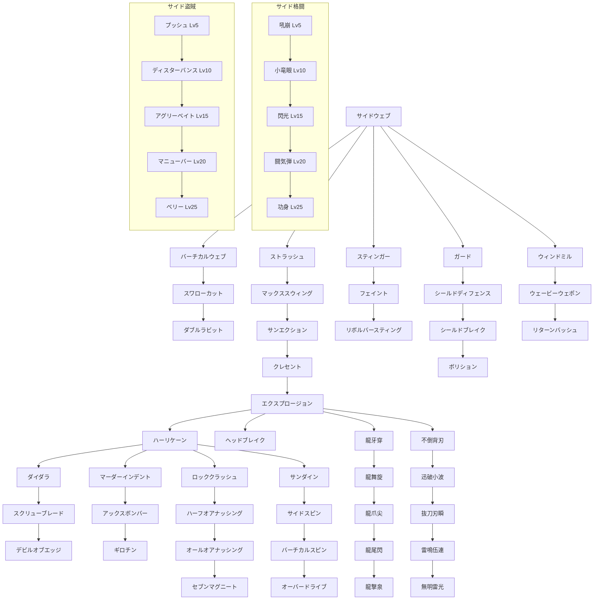

目次

* [戦士の特徴](#戦士の特徴)
* [装備](#装備)
  * [武器](#武器)
  * [防具](#防具)
* [スキル](#スキル)
  * [スキルツリー](#スキルツリー)
  * [防具](#CMDスキル)
  * [PSVスキル](#PSVスキル)
  * [入手クエスト](#入手クエスト)

## 戦士の特徴
-------

> 多彩な武器と強固な防具に身を包む、  
> 近距離戦闘のエキスパート！

全ジョブ中で唯一重装備を許された戦士は、  
たとえ最前線に立ってもその圧倒的な防御力で  
仲間を守る盾となり、活躍することが可能な職業です。

ただし重装備時の移動量は全ジョブ中最少値のため、  
単独の戦いで敵を追い詰めるにはそれなりの経験と  
勘が必要になってくるでしょう。

■サイドジョブ:盗賊 [格闘士](./fighter.md)  
■上位ジョブ:[騎士](./knight.md)


## 装備
----


### 武器

武器は９つの種類がある。武器の種類によっては相性が良いスキル・悪いスキルがあるので、スキルを使いわけると良いだろう。  
専用スキルはその武器を装備していないと使用できない。

<table><tbody><tr><td>　</td><td>片手</td><td>両手</td><td>相性の良いスキル／専用スキル</td></tr><tr><td>剣系</td><td>片手剣</td><td>両手剣</td><td>[片手剣]<br class="spacer">（特に相性が良いスキルはないが刀系・槍系のスキルがやや良）<br class="spacer">[専]デビルオブエッジ、ハーリケーン、ダイダラ<br class="spacer"><br class="spacer">[両手剣]<br class="spacer">（刀系および斧系の得意スキル）<br class="spacer">[専]ハーリケーン、サイドスピン、バーチカルスピン、オーバードライブ</td></tr><tr><td>斧系</td><td>片手斧</td><td>両手斧</td><td>マックススウィング、エクスプロージョン、サンエクション<br class="spacer">[専]マーダーインデント、アックスボンバー、ギロチン</td></tr><tr><td>棍棒系</td><td>棍棒</td><td>−</td><td>（特に相性が良いスキルはないが斧系のスキルがやや良）<br class="spacer">[専]ヘッドブレイク、ロッククラッシュ、ハーフオアナッシング、オールオアナッシング、セブンマグニート</td></tr><tr><td>刀系</td><td>−</td><td>刀</td><td>サイドウェブ、バーチカルウェブ、ストラッシュ、クレセント<br class="spacer">[専]不倒背刃、迅破小波、抜刀刃瞬、雷鳴伍連、無明雷光</td></tr><tr><td>槍系</td><td>−</td><td>槍</td><td>スティンガー、リボルバースティング<br class="spacer">[専]龍牙穿、龍舞旋、龍爪尖、龍尾閃、龍撃泉</td></tr><tr><td>ポールウェポン系</td><td>−</td><td>ポールウェポン</td><td>[専]ヘッドブレイク、ロッククラッシュ、ハーフオアナッシング、オールオアナッシング、セブンマグニート</td></tr><tr><td>短剣系</td><td>短剣</td><td>−</td><td>なし</td></tr><tr><td>特殊</td><td>杖</td><td>弓、銃、ボウガン</td><td><span style="color:red">F/G装備によりこれらを装備した場合、使用が制限されるスキルが存在します</span><br class="spacer">エクスプロージョン、サンエクション、クレセント</td></tr></tbody></table>


### 防具

防具は重さの違いで３種類に分かれる。  
防具のLvが同じ場合、重量の物ほど防御力が高いが移動力や移動可能段数などで制約を受ける。

<table><tbody><tr><td>　</td><td>軽量</td><td>中量</td><td>重量</td><td>説明</td></tr><tr><td>鎧(上)</td><td>重さ：122<br class="spacer">移動力：5.0(前進４歩)</td><td>重さ：142<br class="spacer">移動力：4.0(前進３歩)</td><td>重さ：162<br class="spacer">移動力：3.0(前進２歩)</td><td>移動力（歩数）に影響する</td></tr><tr><td>鎧(下)</td><td>重さ：58<br class="spacer">上２段<br class="spacer">下２段</td><td>重さ：68<br class="spacer">上１段<br class="spacer">下２段</td><td>重さ：78<br class="spacer">上１段<br class="spacer">下１段</td><td>移動できる段数に影響する</td></tr><tr><td>兜</td><td>重さ：30</td><td>−</td><td>重さ：40</td><td>　</td></tr><tr><td>篭手</td><td>重さ：30</td><td>重さ：35</td><td>重さ：50</td><td>敵への攻撃命中率に影響する（？）<br class="spacer">軽量の物ほど命中率が高い</td></tr><tr><td>ブーツ</td><td>重さ：30</td><td>重さ：35</td><td>重さ：50</td><td>自分への攻撃回避率に影響する（？）<br class="spacer">軽量の物ほど回避率が高い</td></tr><tr><td>盾</td><td>重さ：20</td><td>重さ：25</td><td>重さ：30</td><td>重量の盾は防御範囲も広く防御力も高い</td></tr></tbody></table>


## スキル
-----


### スキルツリー

※ツリーの右側2列はサイドジョブのレベルを上げないと覚えることができない

<table><tbody><tr><td><span style="color:#FFFAFF">──────</span><br class="spacer">ＰＳＶ<br class="spacer"><span style="color:#FFFAFF">──────</span></td><td></td><td>サイドウェブ</td><td></td><td></td><td></td><td></td><td><span style="color:#FFFAFA">─</span><br class="spacer">サイド格闘<br class="spacer">レベル5</td><td><span style="color:#FAEEFF">─</span><br class="spacer">サイド盗賊<br class="spacer">レベル5</td></tr><tr><td>スラッシュ<br class="spacer">デュラブル</td><td><span style="color:#FFEEEE">──</span>┏━━<br class="spacer">バーチカル<br class="spacer">ウェブ</td><td>━━╋━━<br class="spacer">ストラッシュ<br class="spacer"><span style="color:#EEFFEE">│</span></td><td>━━┳━━<br class="spacer">スティンガー<br class="spacer"><span style="color:#FAFAFF">─</span></td><td>━━┳━━<br class="spacer">ガード<br class="spacer"><span style="color:#EEFFFF">│</span></td><td>━━━━━<br class="spacer"><span style="color:#FAFFFA">─</span><br class="spacer"><span style="color:#FAFFFA">─</span></td><td>━━━━━<br class="spacer"><span style="color:#FFFFEE">─</span><br class="spacer"><span style="color:#FFFFEE">─</span></td><td>━━┳━━<br class="spacer">吼崩<br class="spacer"><span style="color:#FFFAFA">│</span></td><td>━━┓<span style="color:#FFEEFF">──</span><br class="spacer">プッシュ<br class="spacer"><span style="color:#FFEEFF">│</span></td></tr><tr><td>ショック<br class="spacer">デュラブル</td><td>┃<br class="spacer">スワロー<br class="spacer">カット</td><td>┃<br class="spacer">マックス<br class="spacer">スウィング</td><td>┃<br class="spacer">フェイント<br class="spacer"><span style="color:#FAFFFF">｜</span></td><td><span style="color:#EEFFFF">──</span>┣━━<br class="spacer">シールド<br class="spacer">ディフェンス</td><td>━━┓<span style="color:#FAFFFA">──</span><br class="spacer">ウィンドミル<br class="spacer"><span style="color:#FAFFFA">─</span></td><td></td><td><span style="color:#FFFAFA">L10</span>┃L10<br class="spacer">小竜眼<br class="spacer"><span style="color:#FFFAFA">│</span></td><td><span style="color:#FFEEFF">L10</span>┃L10<br class="spacer">ディス<br class="spacer">ターバンス</td></tr><tr><td>ピアス<br class="spacer">デュラブル</td><td>┃<br class="spacer">ダブル<br class="spacer">ラビット</td><td>┃<br class="spacer">サン<br class="spacer">エクション</td><td>┃<br class="spacer">リボルバー<br class="spacer">スティング</td><td>┃<br class="spacer">シールド<br class="spacer">ブレイク</td><td>┃<br class="spacer">ウェービー<br class="spacer">ウェポン</td><td></td><td><span style="color:#FFFAFA">L15</span>┃L15<br class="spacer">閃光<br class="spacer"><span style="color:#FFFAFA">│</span></td><td><span style="color:#FFEEFF">L15</span>┃L15<br class="spacer">アグリー<br class="spacer">ベイト</td></tr><tr><td>ヒート<br class="spacer">デュラブル</td><td></td><td>┃<br class="spacer">クレセント<br class="spacer"><span style="color:#EEFFEE">│</span></td><td></td><td>┃<br class="spacer">ボリション<br class="spacer"><span style="color:#EEFFFF">─</span></td><td>┃<br class="spacer">リターン<br class="spacer">バッシュ</td><td></td><td><span style="color:#FFFAFA">L20</span>┃L20<br class="spacer">闘気弾<br class="spacer"><span style="color:#FFFAFA">│</span></td><td><span style="color:#FFEEFF">L20</span>┃L20<br class="spacer">マニューバー<br class="spacer"><span style="color:#FFEEFF">│</span></td></tr><tr><td>コールド<br class="spacer">デュラブル</td><td></td><td><span style="color:#EEFFEE">──</span>┣━━<br class="spacer">エクス<br class="spacer">プロージョン</td><td>━━┳━━<br class="spacer">ヘッド<br class="spacer">ブレイク</td><td>━━━━━<br class="spacer"><span style="color:#EEFFFF">─</span><br class="spacer"><span style="color:#EEFFFF">─</span></td><td>━━┳━━<br class="spacer">龍牙穿<br class="spacer"><span style="color:#FAFFFA">｜</span></td><td>━━┓<span style="color:#FFFFEE">──</span><br class="spacer">不倒背刃<br class="spacer"><span style="color:#FFFFEE">｜</span></td><td><span style="color:#FFFAFA">L25</span>┃L25<br class="spacer">功身<br class="spacer"><span style="color:#FFFAFA">─</span></td><td><span style="color:#FFEEFF">L25</span>┃L25<br class="spacer">ベリー<br class="spacer"><span style="color:#FFEEFF">─</span></td></tr><tr><td>エレキ<br class="spacer">デュラブル</td><td><span style="color:#FFEEEE">──</span>┏━━<br class="spacer">マーダー<br class="spacer">インデント</td><td>━━┫<span style="color:#EEFFEE">──</span><br class="spacer">ハーリケーン<br class="spacer"><span style="color:#EEFFEE">｜</span></td><td><span style="color:#FAFFFF">──</span>┣━━<br class="spacer">ロック<br class="spacer">クラッシュ</td><td>━━┓<span style="color:#EEFFFF">──</span><br class="spacer">サンダイン<br class="spacer"><span style="color:#EEFFFF">｜</span></td><td>┃<br class="spacer">龍舞旋<br class="spacer"><span style="color:#FAFFFA">｜</span></td><td>┃<br class="spacer">迅破小波<br class="spacer"><span style="color:#FFFFEE">｜</span></td><td></td><td></td></tr><tr><td>ポイズン<br class="spacer">デュラブル</td><td>┃<br class="spacer">アックス<br class="spacer">ボンバー</td><td>┃<br class="spacer">ダイダラ<br class="spacer"><span style="color:#EEFFEE">│</span></td><td>┃<br class="spacer">ハーフオア<br class="spacer">ナッシング</td><td>┃<br class="spacer">サイドスピン<br class="spacer"><span style="color:#EEFFFF">｜</span></td><td>┃<br class="spacer">龍爪尖<br class="spacer"><span style="color:#FAFFFA">｜</span></td><td>┃<br class="spacer">抜刀刃瞬<br class="spacer"><span style="color:#FFFFEE">｜</span></td><td></td><td></td></tr><tr><td>メンタル<br class="spacer">デュラブル</td><td>┃<br class="spacer">ギロチン<br class="spacer"><span style="color:#FFEEEE">─</span></td><td>┃<br class="spacer">スクリュー<br class="spacer">ブレード</td><td>┃<br class="spacer">オールオア<br class="spacer">ナッシング</td><td>┃<br class="spacer">バーチカル<br class="spacer">スピン</td><td>┃<br class="spacer">龍尾閃<br class="spacer"><span style="color:#FAFFFA">｜</span></td><td>┃<br class="spacer">雷鳴伍連<br class="spacer"><span style="color:#FFFFEE">｜</span></td><td></td><td></td></tr><tr><td>ホーリー<br class="spacer">デュラブル</td><td></td><td>┃<br class="spacer">デビル<br class="spacer">オブエッジ</td><td>┃<br class="spacer">セブン<br class="spacer">マグニート<br class="spacer"></td><td>┃<br class="spacer">オーバー<br class="spacer">ドライブ</td><td>┃<br class="spacer">龍撃泉<br class="spacer"><span style="color:#FAFFFA">─</span></td><td>┃<br class="spacer">無明雷光<br class="spacer"><span style="color:#FFFFEE">─</span></td><td></td><td></td></tr><tr><td>ダーク<br class="spacer">デュラブル</td><td><span style="color:#FFEEEE">──────</span><br class="spacer"><span style="color:#FFEEEE">──────</span><br class="spacer"><span style="color:#FFEEEE">──────</span></td><td><span style="color:#EEFFEE">──────</span></td><td><span style="color:#FAFFFF">──────</span></td><td><span style="color:#EEFFFF">──────</span></td><td><span style="color:#FAFFFA">──────</span></td><td><span style="color:#FFFFEE">──────</span></td><td><span style="color:#FFFAFA">──────</span></td><td><span style="color:#FFEEFF">──────</span></td></tr></tbody></table>





### CMDスキル

サイドウェブ

* AP: 3 | 速度: A | 妨害耐久: 10
* 必須装備: なし
* 射程: 上1・下1
```text
口■■■口
■■↑■■

```


* 効果範囲: 選択対象のみ
* 入手: 初期所持

> 大地に対して水平に武器を振り抜き、目標を攻撃する戦士の基本攻撃。

---

### バーチカルウェブ列

バーチカルウェブ

* AP: 6 | 速度: B | 妨害耐久: 10
* 必須装備: なし
* 射程: 上2・下2
```text
口■口
■■■
■↑■

```


* 効果範囲: 選択対象のみ
* 入手: ★☆

> 大地に対して垂直に武器を振り下ろして目標に叩きつける攻撃。

スワローカット

* AP: 12 | 速度: C | 妨害耐久: 10
* 必須装備: なし
* 射程: 上2・下2
```text
■■■
■↑■

```


* 効果範囲: 選択対象のみ
* 入手: ★☆☆

> 連続した2回の攻撃で、対象に2回ダメージを与える。(二連続攻撃、判定：毎回)

ダブルラビット

* AP: 14 | 速度: B | 妨害耐久: 10
* 必須装備: なし
* 射程: 上1・下1
```text
口口■口口
口■■■口
■■↑■■
口■口■口

```


* 効果範囲: 選択対象2体
* 入手: ★☆☆☆

> 連続した2回の攻撃で、対象2体にダメージを与える。

---

### ストラッシュ列

ストラッシュ

* AP: 12 | 速度: B | 妨害耐久: 6
* 必須装備: なし
* 射程: 自分 / 上1・下1
```text
■■■
口↑口

```


* 効果範囲: 範囲内にいる全ユニット
* 入手: 初期所持 / 店売り:300 / ☆

> 闘気を込めて武器を振り、範囲内にいる全ユニットを攻撃する。

マックススウィング

* AP: 18 | 速度: D | 妨害耐久: 6
* 必須装備: なし
* 射程: 上1・下1
```text
口■口
口↑口

```


* 効果範囲: 選択対象のみ
* 入手: 店売り:600 / ☆☆

> 武器を力一杯振って、対象にダメージを与え吹き飛ばす。(1グリッド飛)

サンエクション

* AP: 22 | 速度: C | 妨害耐久: 10
* 必須装備: なし
* 射程: 自分 / 上1・下1
```text
■■■
■↑■

```


* 効果範囲: 範囲内の全対象
* 入手: ☆☆☆

> 闘気を込めて武器を振り、範囲内の全対象にダメージを与える。

クレセント

* AP: 32 | 速度: D | 妨害耐久: 10
* 必須装備: なし
* 射程: 上1・下∞
```text
口口■口口
口■口■口
■口口口■
口口↑口口

```


* 効果範囲: 選択対象のみ
* 入手: ☆☆☆☆

> 闘気を込めて武器を振り衝撃波を飛ばして、対象にダメージを与える。(直射)

エクスプロージョン

* AP: 21 | 速度: D | 妨害耐久: 4
* 必須装備: なし
* 射程: 上1・下1
```text
口口■口口
口口口口口
■口↑口■

```


* 効果範囲: 選択対象のみ
* 入手: ★

> 闘気を込めた武器を振り、爆発を起こして対象吹き飛ばし攻撃する。(3グリッド飛)

---

### スティンガー列

スティンガー

* AP: 8 | 速度: B | 妨害耐久: 10
* 必須装備: なし
* 射程: 上1・下1
```text
■
■
■
↑

```


* 効果範囲: 選択対象まで
* 入手: ☆☆☆☆

> 手にした武器を突き出して、対象と対象までの全ユニットを攻撃する。

フェイント

* AP: 7 | 速度: C | 妨害耐久: 10
* 必須装備: なし
* 射程: 上1・下1
```text
口口■口口
口■■■口
■■↑■■

```


* 効果範囲: 選択対象のみ
* 入手: ★

> 攻撃に対して身構えている対象に、効果を発揮する攻撃。(フェイント攻撃)

リボルバースティング

* AP: 25 | 速度: C | 妨害耐久: 10
* 必須装備: なし
* 射程: 上1・下1
```text
■
■
■
■
↑

```


* 効果範囲: 選択対象まで
* 入手: ★☆☆☆レア / メイド(強) / ゴーレム / 滝水 / コボルト / ハーブ (DROP:エーコ)

> 武器に回転を加え突き出し、対象と対象までの全ユニットを攻撃する。

---

### ガード列

ガード

* AP: 4 | 速度: A
* 必須装備: なし
* 射程: 自分
* 効果範囲: 選択対象のみ
* 入手: ☆

> 攻撃に対してダメージを軽減できる体勢で身構える。(防御状態0T)

シールドディフェンス

* AP: 7 | 速度: A
* 必須装備: 盾
* 射程: 自分
* 効果範囲: 選択対象のみ
* 入手: ☆☆

> 攻撃に対して盾を使用して、ダメージを軽減できる体勢で身構える。(シールドガード状態0T)

シールドブレイク

* AP: 15 | 速度: D | 妨害耐久: 6
* 必須装備: 盾
* 射程: 上1・下1
```text
口■口
■↑■

```


* 効果範囲: 選択対象のみ
* 入手: ☆☆☆

> 装備した盾で殴りつけて、対象を吹き飛ばす攻撃を行う。(2グリッド飛)

ボリション

* AP: 20 | 速度: S
* 必須装備: なし
* 射程: 自分
* 効果範囲: 選択対象のみ
* 入手: ★★☆☆☆☆

> そのフェイズの直接物理攻撃を全て自分に対しての攻撃にする。(ボリション状態0T)

---

### ウィンドミル列

ウィンドミル

* AP: 10 | 速度: B | 妨害耐久: 10
* 必須装備: 短剣以外の武器
* 射程: 自分
* 効果範囲: 自分のみ
* 入手: ★☆☆準レア / メイド(弱) / スライム / ゴーレム / 果実

> 武器を風車の様に使用して、投射スキルを打ち落とせる体勢で身構える(投射攻撃無効状態0T)

ウェービーウェポン

* AP: 15 | 速度: A | 妨害耐久: 10
* 必須装備: 短剣以外の武器
* 射程: 自分
* 効果範囲: 自分のみ
* 入手: ★☆☆☆☆ / 山賊 / 死神呪い / 踊り子

> 直接的な攻撃をされた場合、即座に反撃できる体勢で身構える。(直接攻撃反撃状態0T)

リターンバッシュ

* AP: 15 | 速度: B | 妨害耐久: 10
* 必須装備: 片手剣、片手斧、棍棒
* 射程: 自分
* 効果範囲: 自分のみ
* 入手: ★★☆レア / ハーブ

> 武器を巧みに使い、投射スキルを相手に打ち返せる体勢で身構える。(投射攻撃反射状態0T)

---

### 斧専用

マーダーインデント

* AP: 38 | 速度: D | 妨害耐久: 10
* 必須装備: 斧
* 射程: 上1・下1
```text
■■■
■↑■

```


* 効果範囲: 選択対象のみ
* 入手: ★☆☆☆☆ / メイド(強) / ゴーレム / カエル / 滝水 / 果実

> 殺意を込めて対象を恐怖させて、斧を振り下ろして攻撃する。(転倒対象にも発動、低確率混乱3T、カウンター貫通)

アックスボンバー

* AP: 24 | 速度: D | 妨害耐久: 6
* 必須装備: 斧
* 射程: 自分 / 上1・下1
```text
■■■
口■口
口↑口

```


* 効果範囲: 範囲内
* 入手: ★★レア / 絵画 / 踊り子 / ハーブ

> 斧に闘気を練り込み、爆発を発生させて範囲内を攻撃する。(2グリッド飛、カウンター貫通)

ギロチン

* AP: 48 | 速度: D | 妨害耐久: 4
* 必須装備: 斧
* 射程: 上0・下0
```text
口■口
■↑■

```


* 効果範囲: 選択対象のみ
* 入手: ★★☆準レア / 山賊 / 海賊

> 転倒状態の対象の首を狙って斧を振り下ろしダメージを与える。(条件：対象が転倒状態)

---

### ハーリケーン列

ハーリケーン

* AP: 34 | 速度: D | 妨害耐久: 10
* 必須装備: 短剣、片手剣、片手斧、棍棒
* 射程: 上2・下2
```text
口口■口口
口口口口口
■口↑口■

```


* 効果範囲: 選択対象のみ
* 入手: ★☆

> 剣で空を斬り竜巻を発生させて対象にダメージを与える。(召喚、特殊：転倒状態に発動可能)

ダイダラ

* AP: 45 | 速度: D | 妨害耐久: 4
* 必須装備: 短剣、片手剣
* 射程: 上0・下0
```text
口■口
口■口
■↑■

```


* 効果範囲: 選択対象のみ
* 入手: ★☆☆

> 刀身を突き刺し、斬り上げて対象にダメージを与え吹き飛ばす。(二連続攻撃、判定：初回)

スクリューブレード

* AP: 35 | 速度: D | 妨害耐久: 4
* 必須装備: 短剣、片手剣、片手斧
* 射程: 上1・下1
```text
■
↑

```


* 効果範囲: 選択対象のみ
* 入手: ★★☆☆☆

> 跳び上がり武器を回転させて落下し対象を攻撃する。剣と斧で使用可。(特殊：転倒状態に発動可能)

デビルオブエッジ

* AP: 90 | 速度: D | 妨害耐久: 4
* 必須装備: 短剣、片手剣
* 射程: 上0・下0
```text
■
↑

```


* 効果範囲: 選択対象のみ
* 入手: ★★☆☆☆☆レア

> 極限の連続攻撃で、対象にダメージを与える。(8連続攻撃、判定:毎回)

---

### 棍棒専用

ヘッドブレイク

* AP: 13 | 速度: D | 妨害耐久: 10
* 必須装備: 棍棒
* 射程: 上1・下1
```text
■■■
■↑■

```


* 効果範囲: 選択対象のみ
* 入手: ★☆☆☆ / ゴブリン / 果実 / 石碑

> 脳天を目掛けて棍棒を振り下ろし、対象を攻撃する。(頭部攻撃、低確率放心3T)

ロッククラッシュ

* AP: 42 | 速度: D | 妨害耐久: 6
* 必須装備: 棍棒
* 射程: 上?・下∞
```text
口口■口口
口■口■口
■口口口■
口口↑口口

```


* 効果範囲: 選択対象のみ
* 入手: ★★ / 蟹

> 地面を砕き岩石を飛ばして、対象にダメージを与える。(曲射)

ハーフオアナッシング

* AP: 72 | 速度: D
* 必須装備: 棍棒
* 射程: 上？・下？
* 効果範囲: 選択対象のみ
* 入手: ★★☆☆

> 力の限り棍棒を振り下ろして、対象のHPを1/2にする。

オールオアナッシング

* AP: 122 | 速度: D
* 必須装備: 棍棒
* 射程: 上？・下？
* 効果範囲: 選択対象のみ
* 入手: ★★☆☆レア

> 一か八かの大博打。棍棒を振り下ろして対象のHPを1にする。

セブンマグニート

* AP: 77 | 速度: B
* 必須装備: 棍棒
* 射程: 自己 / 上2・下2
```text
口口口■口口口
口口■■■口口
口■■■■■口
■■■↑■■■
口■■■■■口
口口■■■口口
口口口■口口口

```


* 効果範囲: 範囲内の全ユニット
* 入手: ★★☆☆☆☆準レア

> 地面を揺らして、範囲内の全ユニットを攻撃します。

---

### サンダイン列

サンダイン

* AP: 38 | 速度: C | 妨害耐久: 10
* 必須装備: 両手剣、片手剣
* 射程: 上2・下2
```text
口■口
■■■
■↑■

```


* 効果範囲: 選択対象のみ
* 入手: ★★ / 果実 / 海賊

> 雷を落とすと同時に斬り付けて、対象を攻撃します。(低確率麻痺1T、特殊：転倒状態に発動可能)発動時HP消費。

サイドスピン

* AP: 24 | 速度: D | 妨害耐久: 13
* 必須装備: 両手剣、両手斧
* 射程: 自分 / 上1・下1
```text
口口■口口
口口■口口
■■↑■■
口口■口口
口口■口口

```


* 効果範囲: 範囲内の全ユニット
* 入手: ★★☆

> 武器を振り回して、範囲内の全ユニットに吹き飛ばす攻撃を行う。(2グリッド飛)

バーチカルスピン

* AP: 55 | 速度: D | 妨害耐久: 13
* 必須装備: 両手剣、両手斧
* 射程: 上3・下3
```text
口口■口口
口■■■口
■■↑■■

```


* 効果範囲: 選択対象のみ
* 入手: ★★☆☆

> 上空に跳び上がり、武器重量を利用して回転落下して対象を攻撃する。

オーバードライブ

* AP: 80 | 速度: D | 妨害耐久: 13
* 必須装備: 両手剣、両手斧
* 射程: 上1・下1
```text
■■■
口↑口

```


* 効果範囲: 選択対象のみ
* 入手: ★★☆☆☆レア

> 武器の重量を利用した一撃で、対象を吹き飛ばす攻撃を行う。(5グリッド飛)

---

### 槍専用

龍牙穿

* AP: 32 | 速度: B | 妨害耐久: 6
* 必須装備: 槍
* 射程: 上1・下∞
```text
■
■
■
■

```


* 効果範囲: 選択対象まで
* 入手: ☆準レア / ☆☆準レア / リョマ / フェレット / 焼肉 / 人形 / 球根 / 墓場

> 槍に込めた闘気を放出して、対象と対象までの全ユニットを攻撃する。(直射)

龍舞旋

* AP: 70 | 速度: B | 妨害耐久: 6
* 必須装備: 槍
* 射程: 上2・下2
```text
口■口
■■■
■↑■

```


* 効果範囲: 選択対象のみ
* 入手: ★☆レア / 土鍋 / メイド(弱) / 死神呪い / コボルト

> 槍による高速連続攻撃で、対象にダメージを与える。(七連続攻撃、判定：初回)

龍爪尖

* AP: 38 | 速度: D | 妨害耐久: 6
* 必須装備: 槍
* 射程: 上2・下2
```text
口口■口口
口口■口口
口口■口口
■■口■■

```


* 効果範囲: 選択対象まで
* 入手: ☆☆☆準レア / ☆☆☆☆準レア / フェレット / 焼肉 / 土鍋 / 目撃者

> 槍を回転させ貫通力を高め、対象と経路上の全ユニットを攻撃します。(1グリッド飛)

龍尾閃

* AP: 30 | 速度: D | 妨害耐久: 4
* 必須装備: 槍
* 射程: 上2・下2
```text
口口口■口口口
口口■■■口口
口■■■■■口
■■■↑■■■
口■■口■■口
口口■口■口口

```


* 効果範囲: 選択対象3体
* 入手: ★準レア / ★☆準レア / 焼肉 / たこ焼き / 人形 / 仮面 / 土鍋 / パンダ / 種 / スライム / 死神呪い / 指輪 / 果実

> 槍による高速連続3段攻撃で、対象3体にダメージを与える。

龍撃泉

* AP: 100 | 速度: D | 妨害耐久: 1
* 必須装備: 槍
* 射程: 上2・下2
```text
■
■
↑

```


* 効果範囲: 選択対象のみ
* 入手: ★★☆☆☆☆

> 槍を突き刺し闘気を流し込み爆発させて、対象にダメージを与える。

---

### 刀専用

不倒背刃(フトウハイジン)

* AP: 12 | 速度: C | 妨害耐久: 10
* 必須装備: 刀
* 射程: 上1・下1
```text
■■■
口↑口

```


* 効果範囲: 選択対象のみ
* 入手: ★☆☆☆準レア / メイド(強) / スライム / 指輪 / カエル / 山賊

> 刀の峰の部分で強烈な一撃を加えて、対象にダメージを与える。(低確率麻痺1T)

迅破小波(ジンパサザナミ)

* AP: 18 | 速度: B | 妨害耐久: 10
* 必須装備: 刀
* 射程: 自分
* 効果範囲: 自分のみ
* 入手: ★☆☆☆☆レア / メイド(強) / 絵画 / 石碑

> 直接的な攻撃に対して、避けて攻撃ができる体勢で身構える。(カウンター状態0T)

抜刀刃瞬(バットウニンシャク)

* AP: 24 | 速度: S | 妨害耐久: 10
* 必須装備: 刀
* 射程: 上1・下1
```text
口■口
■■■
■↑■

```


* 効果範囲: 選択対象のみ
* 入手: ★★準レア / カエル / 石碑 / 海賊

> 超高速の踏み込みで刀を振り、対象にダメージを与える。

雷鳴伍連(ライメイゴレン)

* AP: 42 | 速度: D | 妨害耐久: 4
* 必須装備: 刀
* 射程: 上1・下1
```text
口■口
■↑■

```


* 効果範囲: 選択対象のみ
* 入手: ★★☆☆準レア / 踊り子

> 刀による連続5段攻撃で、対象に5回ダメージを与える。(五連続攻撃、判定：初回)

無明雷光(ムミョウライコウ)

* AP: 78 | 速度: C | 妨害耐久: 4
* 必須装備: 刀
* 射程: 上1・下1
```text
■
↑

```


* 効果範囲: 選択対象のみ
* 入手: ★★☆☆☆準レア

> 刀で上空に斬り上げた対象を、更に下から斬り上げて攻撃する。(七連続攻撃、判定：初回)

---

### 格闘サイド

吼崩

* AP: 42 | 速度: B | 妨害耐久: 6
* 必須装備: なし
* 射程: 自分 / 上3・下3
```text
■■■■■
口■■■口
口口■口口
口口↑口口

```


* 効果範囲: 範囲内の全ユニット
* 入手: ☆レア / フェレット / 蟹 / 地竜

> 戦いの叫び声を上げ、範囲内の全ユニットの行動を妨害します。(サイド格闘レベル5以上)

小竜眼

* AP: 8 | 速度: A | 妨害耐久: 10
* 必須装備: なし
* 射程: 自分
* 効果範囲: 選択対象のみ
* 入手: ☆☆☆レア / 蟹 / 地竜 / たこ焼き / 人形 / 仮面 / パンダ / 墓場

> 相手の動きを凝視し先読みして高確率で回避できる体勢で身構える。(見切り状態0T) (サイド格闘レベル10以上)

閃光

* AP: 20 | 速度: D | 妨害耐久: 6
* 必須装備: なし
* 射程: 自分 / 上2？・下2？
```text
■■■■■
口■■■口
口口■口口
口口↑口口

```


* 効果範囲: 範囲内の全ユニット
* 入手: ★レア / たこ焼き / 土鍋 / メイド(弱) / ゴブリン / 指輪

> 気功で身体を発光させて、範囲内の全ユニットを暗闇状態にする。(暗闇状態2T？) (サイド格闘レベル15以上)

闘気弾

* AP: 36 | 速度: D | 妨害耐久: 6
* 必須装備: 片手剣、片手斧、棍棒、爪(F装備)
* 射程: 上1・下∞
```text
■■■
■■■
口■口
口■口
口↑口

```


* 効果範囲: -
* 入手: ★★☆☆

> 体内で発生させた気功を弾に換えて発射、対象にダメージを与える。(直射) (サイド格闘レベル20以上)

---

### 盗賊サイド

プッシュ

* AP: 18 | 速度: C | 妨害耐久: 10
* 必須装備: なし
* 射程: 上1・下1
```text
口■口
■↑■

```


* 効果範囲: 選択対象のみ
* 入手: ☆☆レア / 蟹 / 地竜 / 人形 / 球根 / 焼肉

> 対象を押して、1グリッド吹き飛ばす。(1グリッド飛、特殊：失敗しない) (サイド盗賊レベル5以上)

ディスターバンス

* AP: 25 | 速度: C | 妨害耐久: 10
* 必須装備: なし
* 射程: 上1・下1
```text
■■■
口↑口

```


* 効果範囲: 選択対象のみ
* 入手: ☆☆☆☆レア / 地竜 / 人形 / 仮面 / パンダ / 種 / 目撃者

> 難解な言葉を連発して対象を混乱させる。(高確率混乱状態2T、特殊：妨害性能有) (サイド盗賊レベル10以上)

アグリーベイト

* AP: 25 | 速度: C | 妨害耐久: 10
* 必須装備: なし
* 射程: 上1・下1
```text
■
■
↑

```


* 効果範囲: 選択対象のみ
* 入手: ★☆☆☆☆

> 暴言を連発して対象を激怒させる。(高確率激怒状態2T、特殊：妨害性能有) (サイド盗賊レベル15以上)

マニューバー

* AP: 22 | 速度: A | 妨害耐久: 10
* 必須装備: なし
* 射程: 自分
* 効果範囲: 選択対象のみ
* 入手: ★★☆ / 滝水 / 石碑 / 踊り子

> 行動スピードを犠牲に、移動力を高めた状態で身構える。(行動スピード減少状態2T、移動力上昇状態2T) (サイド盗賊レベル20以上)

ベリー

* AP: 24 | 速度: B | 妨害耐久: 10
* 必須装備: なし
* 射程: 自分
* 効果範囲: 選択対象のみ
* 入手: ★☆☆準レア / パンダ / 種 / ハチミツ / 指輪 / 絵画 / 山賊 / コボルト / 海賊

> 自ら伏せることで、攻撃の対象にならないようにする。(転倒状態0T) (サイド盗賊レベル25以上)

### PSVスキル

| スキル名 | 詳細 | 発生効果 | 入手法 |
| --- | --- | --- | --- |
| スラッシュデュラブル | 肉体に気合を込め、斬撃に対しての防御力を少しだけ上昇させる。(要：戦士Lv5) | 斬撃防御力上昇(30%) | ☆  
種 |
| ショックデュラブル | 肉体に気合を込め、衝撃に対しての防御力を少しだけ上昇させる。(要：戦士Lv5) | 衝撃防御力上昇(30%) | ☆☆  
リョマ |
| ピアスデュラブル | 肉体に気合を込め、貫通に対しての防御力を少しだけ上昇させる。(要：戦士Lv5) | 貫通防御力上昇(30%) | ☆☆☆  
フェレット/球根/ハチミツ |
| ヒートデュラブル | 肉体に気合を込め、火熱に対しての防御力を少しだけ上昇させる。(要：戦士Lv10) | 炎熱防御力上昇(30%) | ☆☆☆☆  
墓場/ゴブリン/ハチミツ |
| コールドデュラブル | 肉体に気合を込め、冷気に対しての防御力を少しだけ上昇させる。(要：戦士Lv10) | 冷気防御力上昇(30%) | ★  
球根/ハチミツ/目撃者/コボルト |
| エレキデュラブル | 肉体に気合を込め、電撃に対しての防御力を少しだけ上昇させる。(要：戦士Lv10) | 電撃防御力上昇(30%) | ★☆  
墓場/スライム/ゴブリン/ゴーレム/絵画 |
| ポイズンデュラブル | 肉体に気合を込め、毒に対しての防御力を少しだけ上昇させる。(要：戦士Lv10) | 毒防御力上昇(30%) | ★☆☆  
メイド(弱)/目撃者/死神呪い/カエル/ハーブ |
| メンタルデュラブル | 肉体に気合を込め、心に対しての防御力を少しだけ上昇させる。 | 精神防御力上昇(30%) | ★☆☆☆ |
| ホーリーデュラブル | 肉体に気合を込め、光に対しての防御力を少しだけ上昇させる。 | 神聖防御力上昇(30%) | ★☆☆☆☆ |
| ダークデュラブル | 肉体に気合を込め、闇に対しての防御力を少しだけ上昇させる。 | 暗黒防御力上昇(30%) | ★★ |
| 功身 | 体内に眠る力を集めて、常時攻撃力を上げる。(要：戦士Lv50、格闘Lv25) | 物理攻撃力上昇(5%) | ★★☆☆☆ |

↑

### 入手クエスト

| 権利書 | よく出る | ＜＜＜普通＞＞＞ | 準レア | レア |
| --- | --- | --- | --- | --- |
| ☆ | ストラッシュ | スラッシュデュラブル | ガード | 龍牙穿 | 吼崩 |
| ☆☆ | マックススウィング | ショックデュラブル | シールドディフェンス | 龍牙穿 | プッシュ |
| ☆☆☆ | サンエクション | ピアスデュラブル | シールドブレイク | 龍爪尖 | 小竜眼 |
| ☆☆☆☆ | クレセント | スティンガー | ヒートデュラブル | 龍爪尖 | ディスターバンス |
| ★ | エクスプロージョン | コールドデュラブル | フェイント | 龍尾閃 | 閃光 |
| ★☆ | ハーリケーン | エレキデュラブル | バーチカルウェブ | 龍尾閃 | 龍舞旋 |
| ★☆☆ | ダイダラ | ポイズンデュラブル | スワローカット | ベリー | ウィンドミル |
| ★☆☆☆ | ヘッドブレイク | メンタルデュラブル | ダブルラビット | 不倒背刃 | リボルバースティング |
| ★☆☆☆☆ | アグリーベイト | マーダーインデント | ホーリーデュラブル | ウェービーウェポン | 迅破小波 |
| ★★ | ダークデュラブル | ロッククラッシュ | サンダイン | 抜刀刃瞬 | アックスボンバー |
| ★★☆ | サイドスピン | ヘッドブレイク | マニューバー | ギロチン | リターンバッシュ |
| ★★☆☆ | ハーフオアナッシング | バーチカルスピン | 闘気弾 | 雷鳴五連 | オールオアナッシング |
| ★★☆☆☆ | スクリューブレード | ベリー | 功身 | 無明雷光 | オーバードライブ |
| ★★☆☆☆☆ | マーダーインデント | ボリション | 龍撃泉 | セブンマグニート | デビルオブエッジ |
| ミニクエ(確率不明) |
| 決意 | マックススウィング |  |  |  |  |
| リョマ | ショックデュラブル | 龍牙穿 |  |  |  |
| 蟹 | 小竜眼 | プッシュ | ロッククラッシュ | 吼崩 |  |
| ネギ | 龍牙穿 | ピアスデュラブル | 龍爪尖 | 吼崩 |  |
| 地竜 | 吼崩 | プッシュ | ディスターバンス | 小竜眼 |  |
| 焼肉 | プッシュ | 龍尾閃 | 龍牙穿 | 龍爪尖 |  |
| 球根 | コールドデュラブル | プッシュ | 龍牙穿 | ピアスデュラブル |  |
| 人形 | 龍尾閃 | ディスターバンス | プッシュ | 龍牙穿 | 小竜眼 |
| 仮面 | 小竜眼 | ディスターバンス | 龍尾閃 |  |  |
| 土鍋 | 龍爪尖 | 龍尾閃 | 龍舞旋 |  |  |
| パンダ | ベリー | 龍尾閃 | 小竜眼 | ディスターバンス |  |
| たこ焼き | 小竜眼 | 龍舞旋 | 閃光 | 龍尾閃 |  |
| 種 | スラッシュデュラブル | ディスターバンス | ベリー | 龍尾閃 |  |
| メイド(弱) | 閃光 | ウィンドミル | 龍舞旋 | ポイズンデュラブル |  |
| メイド(強) | リボルバースティング | マーダーインデント | 迅破小波 | 不倒背刃 |  |
| コボルト | ベリー | コールドデュラブル | リボルバースティング | 龍舞旋 |  |
| ハチミツ | ピアスデュラブル | ヒートデュラブル | コールドデュラブル |  |  |
| 墓場 | 小竜眼 | 龍牙穿 | ヒートデュラブル | エレキデュラブル |  |
| 呪い | ポイズンデュラブル | ウェービーウェポン | 龍舞旋 | 龍尾閃 |  |
| ゴーレム | エレキデュラブル | ウインドミル | リボルバースティング | マーダーインデント |  |
| スライム | ウィンドミル | 不倒背刃 | エレキデュラブル | 龍尾閃 |  |
| 指輪 | 不倒背刃 | 龍尾閃 | ベリー | 閃光 |  |
| 果実 | 龍尾閃 | サンダイン | ウィンドミル | マーダーインデント | ヘッドブレイク |
| カエル | ポイズンデュラブル | 不倒背刃 | マーダーインデント | 抜刀刃瞬 |  |
| 山賊 | ベリー | ギロチン | ウェービーウェポン | 不倒背刃 |  |
| 絵画 | ベリー | エレキデュラブル | 迅破小波 | アックスボンバー |  |
| 石碑 | ヘッドブレイク | 迅破小波 | 抜刀刃瞬 | マニューバー |  |
| 海賊 | ギロチン | サンダイン | ベリー |  |  |
| 　 |  |  |  |  |
| 踊り子 | ウェービーウェポン | アックスボンバー | マニューバー | 雷鳴五連 |  |
| ハーブ | ポイズンデュラブル | リボルバースティング | アックスボンバー | リターンバッシュ |  |
| 復讐 | リボルバースティング | 迅破小波 | ハーフオアナッシング |  |  |
| 王家の墓 | ヘッドブレイク | マーダーインテント | リターンバッシュ | オールオアナッシング |  |
| 邪教 | マーダーインデント | アックスボンバー | ギロチン | 無明雷光 |  |

